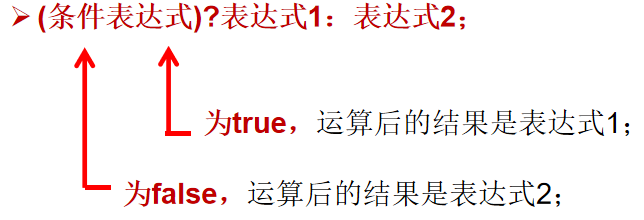
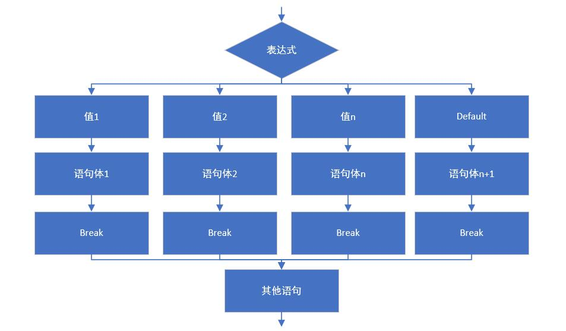

# day03 运算符和分支流程

## 1、复习

### ①项目架构


### ②在类的方法中写代码等于做饭


> 死记硬背：应对有限、可穷举的情况
>
> 理解底层逻辑：应对不断变化的情况

### ③语法规则

- 注释的语法规则
- 关键字语法规则
- 标识符命名规则
- 标识符命名规范
- Java数据类型
- 变量
  - 名称
  - 类型
  - 值
- 数据类型
  - 数据类型种类和存储空间
  - 基本数据类型转换
    - 自动类型转换：小进大自然而然没问题
    - 强制类型转换：大进小强制转换有风险

## 2、运算符

### ①算术运算符

#### [1]列表

| 运算符 | 运算                                                   | 范例                     | 结果                       |
| ------ | ------------------------------------------------------ | ------------------------ | -------------------------- |
| +      | 正                                                     | +3                       | 3                          |
| -      | 负                                                     | b=4;-b                   | -4                         |
| +      | 加                                                     | 5+5                      | 10                         |
| -      | 减                                                     | 6-4                      | 2                          |
| *      | 乘                                                     | 3*4                      | 12                         |
| /      | 除                                                     | 5/5                      | 1                          |
| %      | 取模（取余）                                           | 10%3                     | 1                          |
| ++     | 自增（前）：先运算后取值<br />自增（后）：先取值后运算 | a=2;b=++a<br />a=2;b=a++ | a是3，b是3<br />a是3，b是2 |
| --     | 自减（前）：先运算后取值<br />自减（后）：先取值后运算 | a=2;b=--a<br />a=2;b=a-- | a是1，b是1<br />a是1，b是2 |
| +      | 字符串连接                                             | "He"+"llo"               | "Hello"                    |

#### [2]注意事项

- 除法：两个整数做除法，如果不能整除，会自动舍弃小数部分
- 除法：除数不能为0，如果除数为0，程序运行时会抛出数学异常
- 取模结果是正是负：和被模数的正负一致，和模数无关
- 模运算的结果也有可能是小数


### ②赋值运算符

- 赋值运算符：=
- 运算的方向：从右往左计算


一个特殊情况：

```java
int n = 10;

// 按照基本语法推测
// 第一步：取n的值，用来做加法			[10 + ?]
// 第二步：++n先加再取值，n变成了11		[10 + 11]
// 第三步：执行加法，得到21
// 第四步：计算+=操作 n = n + 21		[11 + 21]
// 第五步：计算n++里面的自增1，n从32变成33
n += (n++) + (++n);

// 根据前面推理的结果这里应该是33
// 但是实际运行的结果是32
System.out.println(n);

```

这个问题需要借助字节码文件的分析：

> D:\record-video-original\day03\code><span style="color:blue;font-weight:bold;">javap -c Demo07GiveOperatorExercise.class</span>
> Compiled from "Demo07GiveOperatorExercise.java"
> public class Demo07GiveOperatorExercise {
>   public Demo07GiveOperatorExercise();
>     Code:
>        0: aload_0
>        1: invokespecial #1                  // Method java/lang/Object."<init>":()V
>        4: return
>
>   public static void main(java.lang.String[]);
>     Code:
>        0: bipush        10
>        2: istore_1
>        3: iload_1
>        4: iload_1
>        5: iinc          1, 1
>        8: iinc          1, 1
>       11: iload_1
>       12: iadd
>       13: iadd
>       14: istore_1
>       15: getstatic     #2                  // Field java/lang/System.out:Ljava/io/PrintStream;
>       18: iload_1
>       19: invokevirtual #3                  // Method java/io/PrintStream.println:(I)V
>       22: return
> }

分析的步骤：

```java
// 根据反编译字节码文件，看到实际执行过程后，每一步推理如下：
// 0: bipush        10 准备常量10
// 2: istore_1		   将10赋值给n
int n = 10;

// 3: iload_1		   读取变量n的值	[10 + ?]
// 4: iload_1		   读取变量n的值	[10 + 10]
// 5: iinc          1, 1	执行自增1	n从10变成11
// 8: iinc          1, 1	执行自增1	n从11变成12
// 11: iload_1		   读取变量n的值，现在是12
// 12: iadd			   执行加法10 + 10等于20
// 13: iadd			   执行加法12 + 20等于32
// 14: istore_1		   把最后一个加法的结果32赋值给n
n += (n++) + (++n);

// 最后n是32
System.out.println(n);
```

<span style="color:blue;font-weight:bold;">注意</span>：具体JVM为什么会这样计算不必深究，对我们来说，重要的是不要写类似这样有歧义的代码。

### ③比较运算符

#### [1]列表

| 运算符     | 运算               | 范例                      | 结果  |
| ---------- | ------------------ | ------------------------- | ----- |
| ==         | 是否相等           | 4==3                      | false |
| !=         | 是否不相等         | 4!=3                      | true  |
| <          | 是否小于           | 4<3                       | false |
| >          | 是否大于           | 4>3                       | true  |
| <=         | 是否小于或等于     | 4<=3                      | false |
| >=         | 是否大于或等于     | 4>=3                      | true  |
| instanceof | 检查是否是类的对象 | "Hello" instanceof String | true  |

#### [2]注意事项

- “<span style="color:blue;font-weight:bold;">==</span>”是比较运算符，比较两个数值是否相等；“<span style="color:blue;font-weight:bold;">=</span>”是赋值运算符，执行赋值操作。


### ④逻辑运算符

#### [1]列表

| a     | b     | a&b   | a&&b  | a \| b | a \|\| b | !a    | a^b   |
| ----- | ----- | ----- | ----- | ------ | -------- | ----- | ----- |
| true  | true  | true  | true  | true   | true     | false | false |
| true  | false | false | false | true   | true     | false | true  |
| false | true  | false | false | true   | true     | true  | true  |
| false | false | false | false | false  | false    | true  | false |

#### [2]注意事项

| 符号 | 效果                                                         |
| ---- | ------------------------------------------------------------ |
| &    | 不带短路效果：前面即使判断出结果，后面还会执行               |
| &&   | 带短路效果：只要前面的表达式为false，整体就是false，后面不执行 |
| \|   | 不带短路效果：前面即使判断出结果，后面还会执行               |
| \|\| | 带短路效果：只要前面的表达式为true，整体就是true，后面不执行 |


### ⑤位运算符[了解]

#### [1]列表

| 运算符 | 运算       | 范例  | 运算结果 |
| ------ | ---------- | ----- | -------- |
| <<     | 左移       | 3<<2  | 12       |
| >>     | 右移       | 4>>1  | 2        |
| >>>    | 无符号右移 | 3>>>1 | 1        |
| &      | 按位与     | 6&3   | 2        |
| \|     | 按位或     | 6\|3  | 7        |
| ^      | 按位异或   | 6^3   | 5        |
| ~      | 按位取反   | ~6    | -7       |

#### [2]运算细节

| 运算符 | 运算方式                                                     |
| ------ | ------------------------------------------------------------ |
| <<     | 空位补0，被移除的高位丢弃，空缺位补0。                       |
| >>     | 当最高位是0，右移后，空缺位补0<br />当最高位是1，空缺位补1。 |
| >>>    | 被移位二进制最高位无论是0或者是1，空缺位都用0补。            |
| &      | 二进制位进行&运算，只有1&1时结果是1，否则是0;                |
| \|     | 二进制位进行 \| 运算，只有0 \| 0时结果是0，否则是1;          |
| ^      | 二进制位相同是0<br />二进制位不同是1                         |
| ~      | 按补码取反                                                   |


### ⑥三元运算符



## 3、流程控制

### ①顺序结构

使用Scanner对象从控制台读取数据（暂时的）。具体用法参见下面的代码：

```java
// 导入Scanner类
import java.util.Scanner;

public class Demo16Scanner {
	
	public static void main(String[] args){
		
		// 1.创建Scanner对象
		Scanner scanner = new Scanner(System.in);
		
		// 2.读取int类型数据
		System.out.print("请输入一个整数：");
		
		// 调用scanner对象的nextInt()方法
		int age = scanner.nextInt();
		
		System.out.println("age="+age);
		
		// 3.读取boolean类型数据
		System.out.print("请输入一个布尔值：");
		boolean flag = scanner.nextBoolean();
		
		System.out.println("flag="+flag);
		
		// 4.读取字符串
		System.out.print("请输入一个字符串：");
		
		// next()方法会因为空格而终止读取
		String strValue = scanner.next();
		System.out.println("strValue="+strValue);
		
		// 建议使用：
		// nextLine()方法不会因为空格而终止读取
		strValue = scanner.nextLine();
		System.out.println("strValue="+strValue);
		
	}
	
}
```


### ②分支结构

#### [1]if语句


```java
// 创建Scanner对象
Scanner scanner = new Scanner(System.in);

System.out.print("请输入i：");
int i = scanner.nextInt();

System.out.print("请输入j：");
int j = scanner.nextInt();

// 测试使用单独的if语句
// 当if(判断条件)为true时执行{}中的语句
if (i > j){
	System.out.println("i 比 j 大");
}

// 不建议这么做
// 如果if语句块中只有一条语句，可以省略{}
if (i < j)
	System.out.println("i 比 j 小");

System.out.println("后续操作");

// 读取一个布尔值
System.out.print("请输入flag：");
boolean flag = scanner.nextBoolean();

// 没有必要写flag == true
if (flag) {
	System.out.println("flag是真的");
}

```


#### [2]if...else


```java
// 创建Scanner对象
Scanner scanner = new Scanner(System.in);

System.out.print("请输入i：");
int i = scanner.nextInt();

System.out.print("请输入j：");
int j = scanner.nextInt();

if (i > j){
	System.out.println("i 比 j 大");
} else {
	System.out.println("i 小于 或 等于 j");
}

```


#### [3]if...else if...else语句


```java
// 创建Scanner对象
Scanner scanner = new Scanner(System.in);

System.out.print("请输入i：");
int i = scanner.nextInt();

System.out.print("请输入j：");
int j = scanner.nextInt();

if (i > j){								// 执行条件判断①
	System.out.println("i 比 j 大");	// ①为true时执行
} else if (i < j) {						// ①为false继续执行下一个条件判断②
	System.out.println("i 比 j 小");	// ②为true时执行
} else {								
	System.out.println("i 和 j 相等");	// ②为false时执行
}

```


#### [4]if...else嵌套

```java
if (i > j){								// 执行条件判断①
	System.out.println("i 比 j 大");	// ①为true时执行
} else if (i < j) {						// ①为false继续执行下一个条件判断②
	System.out.println("i 比 j 小");	// ②为true时执行
} else {								
	System.out.println("i 和 j 相等");	// ②为false时执行
	
	// 嵌套在其他if...else结构内的if
	if (m > n){
		System.out.println("m 比 n 大");
	}
}

```


#### [5]switch...case语句

字面意思：『切换』不同的『情况』。切换需要有依据，这就是我们在switch后面的括号要指定的数据。



```java
import java.util.Scanner;

public class Demo18SwitchCase {
	
	public static void main(String[] args){
		
		// 创建Scanner对象
		Scanner scanner = new Scanner(System.in);

		System.out.print("请输入季节：");
		String season = scanner.nextLine();
		
		// 使用season变量的值和后面的case依次进行比较
		// 遇到一个满足条件的case，那么后面的都会被执行，包括default分支
		// 除非在某个case中使用了break关键字，停止了case的执行。
		switch(season){
			case "spring":
				System.out.println("我喜欢春天");
				
				// break ;
			case "summer":
				System.out.println("我喜欢夏天");
				
				// break ;
			case "autumn":
				System.out.println("我喜欢秋天");
				
				// break ;
			case "winter":
				System.out.println("我喜欢冬天");
				
				// break ;
				
			// 当前面每一个case都不匹配时执行default分支（默认分支）
			default:
				System.out.println("我喜欢梅雨季节");
		}
		
	}
	
}
```

