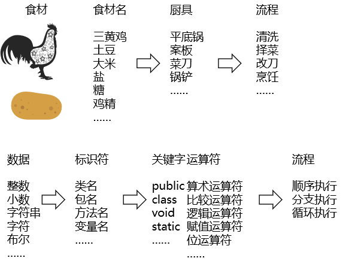

[TOC]

# day04 循环

## 0、复习



## 1、switch补充

### ①switch(表达式)中表达式的可选值类型

- byte
- short
- int
- char
- 枚举（JDK1.5）
- String（JDK1.7）

### ②case子句

- case子句中指定的值必须是常量，不能是变量或不确定的表达式的值
- 同一个switch语句中所有case子句中的常量值必须互不相同

### ③default子句

- default子句是可选的
- default子句的位置是灵活的

## 2、分支结构练习

### 第一题

> 岳小鹏参加Java考试，他和父亲岳不群达成承诺：
>
> | 成绩    | 奖励          |
> | ------- | ------------- |
> | 100     | BMW           |
> | (80,99] | iphone xs max |
> | [60,80] | ipad          |
> | 其它    | 无            |
>
> 请从键盘输入岳小鹏的期末成绩，并加以判断

```java
// 1.导入Scanner这个类，告诉JVM现在用的类从哪来
import java.util.Scanner;

public class Exercise01 {
	
	public static void main(String[] args){
		
		// 一、用户输入成绩数据
		// 2.创建Scanner对象
		Scanner scanner = new Scanner(System.in);
		
		// 3.打印提示信息
		System.out.print("请输入小鹏的成绩：");
		
		// 4.读取整数
		int score = scanner.nextInt();
		
		System.out.println("小鹏的成绩是："+score);
		
		// 二、按照100、(80,99]、[60,80]的顺序检查输入的成绩数据
		// 在各个分支内打印对应的奖励
		// 1.判断成绩是否等于100
		if (score == 100) {
			
			// 如果满足条件，则打印BMW奖励
			System.out.println("奖励是：BMW");
			
		} 
		// 2.判断成绩是否在(80,99]区间
		else if (score > 80 && score <= 99) {	

			System.out.println("奖励是：iphone xs max");
		
		}
		// 3.判断成绩是否在[60,80]区间
		else if (score >= 60 && score <= 80) {
			
			System.out.println("奖励是：ipad");
			
		}
		// 4.判断成绩是否在[0,60)区间
		else if (score >= 0 &&score < 60) {
			
			System.out.println("再接再厉，争取下次及格");
			
		}
		
		// 5.如果上面的条件都不满足，说明成绩大于100或小于0
		else{
			
			System.out.println("成绩数据不合法");
			
		}
	}
	
}
```


### 第二题

> 由键盘输入三个整数分别存入变量num1、num2、num3，对它们进行排序，并且从小到大输出。

```java
import java.util.Scanner;

/**
由键盘输入三个整数分别存入变量num1、num2、num3，对它们进行排序(使用 if-else if-else)，并且从小到大输出。
*/
public class Exercise02 {
	
	public static void main(String[] args){
		
		Scanner scanner = new Scanner(System.in);
		
		// 1.读取num1
		System.out.print("请输入num1：");
		int num1 = scanner.nextInt();
		
		// 2.读取num2
		System.out.print("请输入num2：");
		int num2 = scanner.nextInt();
		
		// 3.读取num3
		System.out.print("请输入num3：");
		int num3 = scanner.nextInt();
		
		// 4.声明一个变量用于交换数据
		int swap = 0;
		
		// 5.比较num1和num2
		if (num1 > num2) {
			
			// 6.交换num1和num2
			// [1]先把num2的值暂存swap中
			swap = num2;
			
			// [2]把num1的值赋值给num2
			num2 = num1;
			
			// [3]把swap中的数据赋值给num1
			num1 = swap;
			
		}
		
		// 7.比较num2和num3
		if (num2 > num3) {
			
			// 8.交换num2和num3
			swap = num3;
			num3 = num2;
			num2 = swap;
		
			// 9.如果2和3进行了交换，就再比较一下1和2（新的）
			if (num1 > num2){
				
				swap = num2;
				num2 = num1;
				num1 = swap;
				
			}
		}
		
		// 10.打印三个数值
		System.out.println("num1="+num1);
		System.out.println("num2="+num2);
		System.out.println("num3="+num3);
	}
	
}
```


### 第三题

> 对下列代码，若有输出，指出输出结果。
> int x = 4;
> int y = 1;
> if (x > 2) {
>        if (y > 2) 
>                 System.out.println(x + y);
>        System.out.println("atguigu");
> } else
>        System.out.println("x is " + x);

输出结果：

> atguigu

### 第四题

> boolean b = true;
> //如果写成if(b=false)能编译通过吗？如果能，结果是？
> if(b == false) 	
> 	System.out.println("a");
> else if(b)
> 	System.out.println("b");
> else if(!b)
> 	System.out.println("c");
> else
> 	System.out.println("d");

当采用b == false时输出结果是：

> b

当前采用b = false时输出结果是：

> c

### 第五题

> 编写程序，声明2个int型变量并赋值。判断两数之和，如果大于等于50，打印“hello world!”

```java
int i = 50;
int j = 10;

int sum = i + j;

if (sum >= 50) {
	System.out.println("hello world!");
}

```


### 第六题

> 编写程序，声明2个double型变量并赋值。判断第一个数大于10.0，且第2个数小于20.0，打印两数之和。否则，打印两数的乘积。

```java
double m = 66.66;
double n = 11.11;

if (m > 10.0 && n < 20.0) {
	
	System.out.println(m + n);
	
} else {
	
	System.out.println(m * n);
	
}

```


### 第七题

> 我家的狗5岁了，5岁的狗相当于人类多大呢？其实，狗的前两年每一年相当于人类的10.5岁，之后每增加一年就增加四岁。那么5岁的狗相当于人类多少年龄呢？应该是：10.5 + 10.5 + 4 + 4 + 4 = 33岁。
> 编写一个程序，获取用户输入的狗的年龄，通过程序显示其相当于人类的年龄。如果用户输入负数，请显示一个提示信息。

```java
import java.util.Scanner;

/**
我家的狗5岁了，5岁的狗相当于人类多大呢？其实，狗的前两年每一年相当于人类的10.5岁，之后每增加一年就增加四岁。那么5岁的狗相当于人类多少年龄呢？应该是：10.5 + 10.5 + 4 + 4 + 4 = 33岁。
编写一个程序，获取用户输入的狗的年龄，通过程序显示其相当于人类的年龄。如果用户输入负数，请显示一个提示信息。
*/
public class Exercise07 {
	
	public static void main(String[] args){
		
		Scanner scanner = new Scanner(System.in);
		
		// 1.读取用户输入的狗狗年龄
		System.out.print("请输入狗狗的年龄：");
		double dogAge = scanner.nextInt();
		
		// 2.判断狗狗年龄是否小于等于2
		
		if (dogAge <= 0) {
			
			System.out.println("你讨厌啦！狗狗年龄不能小于等于0！");
			
		} else if (dogAge <= 2) {
			
			System.out.println("你家狗狗相当于人的" + (dogAge * 10.5) + "岁了");
			
		} else {
			
			// 3.先算前两年的数值
			double twoYearsAge = 2 * 10.5;
			
			// 4.算出来狗狗年龄比2大的部分是多少
			double moreThanTwoYearDogAge = dogAge - 2;
			
			// 5.计算多余2年部分的数值
			double moreThanTwoYearPersonAge = moreThanTwoYearDogAge * 4;
			
			// 6.将前两年的换算结果和后面换算结果加起来
			double finalAgeValue = twoYearsAge + moreThanTwoYearPersonAge;
			
			// 7.打印结果
			System.out.println("你家狗狗相当于人的" + finalAgeValue + "岁了");
		}
		
	}
	
}
```


### 第八题

> 假设你想开发一个玩彩票的游戏，程序随机地产生一个两位数的彩票中奖号码，提示用户输入一个两位数，然后按照下面的规则判定用户是否能赢。
> 1)如果用户输入的数匹配彩票的实际顺序，奖金10 000美元。
> 2)如果用户输入的所有数字匹配彩票的所有数字，但顺序不一致，奖金 3 000美元。
> 3)如果用户输入的一个数字仅满足顺序情况下匹配彩票的一个数字，奖金1 000美元。
> 4)如果用户输入的一个数字仅满足非顺序情况下匹配彩票的一个数字，奖金500美元。
> 5)如果用户输入的数字没有匹配任何一个数字，则彩票作废。
>
> 提示：使用(int)(Math.random() * 90  + 10)产生随机数。
> Math.random() : [0,1)  * 90 [0,90) + 10 [10,100)  [10,99]

```java
import java.util.Scanner;

public class Exercise08 {
	
	public static void main(String[] args){
		
		Scanner scanner = new Scanner(System.in);
		
		// 1.使用Math.random()生成随机数
		double randomDouble = Math.random();
		
		// 2.将随机数乘以100，再舍弃小数部分从而得到两位整数形式的随机数作为中奖号码
		int randomInt = (int)(randomDouble * 100);
		
		// 测试时使用一个固定值，下面是测试用例
		// 输入：56，输出：一等奖
		// 输入：65，输出：二等奖
		// 输入：52，输出：三等奖
		// 输入：36，输出：三等奖
		// 输入：61，输出：四等奖
		// 输入：23，输出：没中奖
		// 输入：10，输出：没中奖
		// 输入：99，输出：没中奖
		// 输入：120，输出：超出范围
		// 输入：-10，输出：超出范围
		// int randomInt = 56;
		
		// 3.获取中奖号码的十位数
		int tenValue = randomInt / 10;
		
		// 4.获取中奖号码的个位数
		int singleValue = randomInt % 10;

		// 5.读取用户输入数据
		System.out.print("请输入你选号的数值：");
		int userNumber = scanner.nextInt();
				
		// 6.首先排除不合法数据范围
		if (userNumber >= 10 && userNumber <= 99){
			
			// 7.在用户数据在正确范围内时，取十位和个位
			int userTenValue = userNumber / 10;
			int userSingleValue = userNumber % 10;
			
			System.out.println("开奖信息：");
			System.out.println("用户号码："+userNumber);
			System.out.println("中奖号码："+randomInt);
			
			// 8.检查是否匹配一等奖：数字和顺序完全一致
			if (userNumber == randomInt) {
				
				System.out.println("哇塞！恭喜您中了一等奖！奖金10000美元！");
				
			}// 9.检查是否匹配二等奖：数字一致，顺序颠倒
			else if (userTenValue == singleValue && userSingleValue == tenValue) {
				
				System.out.println("哇塞！恭喜您中了二等奖！奖金3000美元！");
				
			}// 10.检查是否匹配三等奖：数字有一个一致，顺序一致（十位比十位，个位比个位）
			else if (userTenValue == tenValue || userSingleValue == singleValue) {
				
				System.out.println("哇塞！恭喜您中了三等奖！奖金1000美元！");
				
			}// 11.检查是否匹配四等奖：数字有一个一致，顺序不一致（十位比个位或个位比十位）
			else if (userTenValue == singleValue || userSingleValue == tenValue) {
				
				System.out.println("哇塞！恭喜您中了四等奖！奖金500美元！");
				
			}// 12.其他所有请求都是没中奖
			else {
				System.out.println("抱歉，这次没有中，下次加油！【正常没中】");
			}
			
		} else {
			
			System.out.println("抱歉，这次没有中，下次加油！【超出[10,99]区间】");
			
		}
	}
	
}
```


### 第九题

> 大家都知道，男大当婚，女大当嫁。那么女方家长要嫁女儿，当然要提出一定的条件：高：180cm以上；富：财富1千万以上；帅：是。
> 如果这三个条件同时满足，则：“我一定要嫁给他!!!”
> 如果三个条件有为真的情况，则：“嫁吧，比上不足，比下有余。”
> 如果三个条件都不满足，则：“不嫁！”

```java
System.out.print("请输入你的身高：");
int height = scanner.nextInt();

System.out.print("请输入你的财富：");
int money = scanner.nextInt();

System.out.print("请输入你的颜值：");
boolean face = scanner.nextBoolean();

// 如果这三个条件同时满足，则：“我一定要嫁给他!!!”
if (height >= 180 && money >= 1000 && face) {
	
	System.out.println("我一定要嫁给他!!!");
	
}
// 如果三个条件有为真的情况，则：“嫁吧，比上不足，比下有余。”
else if (height >= 180 || money >= 1000 || face) {
	
	System.out.println("嫁吧，比上不足，比下有余。");
	
}
// 如果三个条件都不满足，则：“不嫁！”
else {
	
	System.out.println("不嫁！");
	
}
```


### 第十题

> 针对用户输入的英文字母，遇到a、b、c、e、f则转换为大写输出，其他直接输出“other”。
> 提示：String word = scan.next();  char c = word.charAt(0); switch(c){}

```java
Scanner scanner = new Scanner(System.in);

// 读取用户输入的数据
String userInput = scanner.nextLine();

// 从输入数据中获取第一个字符
char userInputChar = userInput.charAt(0);

// 进入分支结构
switch(userInputChar){
	case 'a':
		System.out.println("A");
		break;
	case 'b':
		System.out.println("B");
		break;
	case 'c':
		System.out.println("C");
		break;
	case 'e':
		System.out.println("E");
		break;
	case 'f':
		System.out.println("F");
		break;
	default:
		System.out.println("other");
}
```


### 第十一题

> 对学生成绩大于60分的，输出“合格”。低于60分的，输出“不合格”。

```java
import java.util.Scanner;

// 对学生成绩大于60分的，输出“合格”。低于60分的，输出“不合格”。
public class Exercise11 {
	
	public static void main(String[] args){
		
		Scanner scanner = new Scanner(System.in);
		
		// 读取学生成绩
		int score = scanner.nextInt();
		
		// 检查成绩数据是否合法
		if (score >= 0 && score <= 100){
		
			// 将成绩除以60
			int divResult = score / 60;
			
			// 进入分支结构
			switch(divResult){
				
				case 1:
					System.out.println("及格");
					break;
				case 0:
					System.out.println("不及格");
					break;
			}
			
		}else{
			
			System.out.println("检查成绩数据不合法");
			
		}
		
	}
	
}
```


### 第十二题

> 从键盘输入“年、月、日”，判断这一天是当年的第几天。
>
> 判断闰年的标准：『可以被4整除但不能被100整除』或『可以被400整除』

```java
import java.util.Scanner;
// 从键盘输入“年、月、日”，判断这一天是当年的第几天。
// 判断闰年的标准：『可以被4整除但不能被100整除』或『可以被400整除』
public class Exercise13 {
	
	public static void main(String[] args){
		
		Scanner scanner = new Scanner(System.in);
		
		System.out.print("year=");
		int year = scanner.nextInt();
		
		System.out.print("month=");
		int month = scanner.nextInt();
		
		System.out.print("day=");
		int day = scanner.nextInt();
		
		// 声明变量保存最终结果
		int finalResult = 0;
		
		// 声明变量用来保存当前year是否是闰年
		boolean runYear = false;
		
		// 判断当前year是否是闰年
		if ((year % 4 == 0 && year % 100 != 0) || year % 400 == 0) {
			
			// 如果是闰年，那就设置runYear为true
			runYear = true;
			
		}
		
		switch(month){
				case 12:
					
					if (day >= 1 && day <= 31){
						finalResult += day;
					}else{
						System.out.println("day不合法");
						break;
					}
					
				case 11:
					
					if (day >= 1 && day <= 30){
						
						// 判断当月累加操作中，是加整月还是加day
						if (month == 11) {
							finalResult += day;
						}else{
							finalResult += 30;
						}
												
					}else{
						System.out.println("day不合法");
						break;
					}
				case 10:
					
					if (day >= 1 && day <= 31){
						
						// 判断当月累加操作中，是加整月还是加day
						if (month == 10) {
							finalResult += day;
						}else{
							finalResult += 31;
						}
												
					}else{
						System.out.println("day不合法");
						break;
					}
				case 9:
					
					if (day >= 1 && day <= 30){
						
						// 判断当月累加操作中，是加整月还是加day
						if (month == 9) {
							finalResult += day;
						}else{
							finalResult += 30;
						}
												
					}else{
						System.out.println("day不合法");
						break;
					}
				case 8:
					
					if (day >= 1 && day <= 31){
						
						// 判断当月累加操作中，是加整月还是加day
						if (month == 8) {
							finalResult += day;
						}else{
							finalResult += 31;
						}
												
					}else{
						System.out.println("day不合法");
						break;
					}
				case 7:
					
					if (day >= 1 && day <= 31){
						
						// 判断当月累加操作中，是加整月还是加day
						if (month == 7) {
							finalResult += day;
						}else{
							finalResult += 31;
						}
												
					}else{
						System.out.println("day不合法");
						break;
					}
				case 6:
					
					if (day >= 1 && day <= 30){
						
						// 判断当月累加操作中，是加整月还是加day
						if (month == 6) {
							finalResult += day;
						}else{
							finalResult += 30;
						}
												
					}else{
						System.out.println("day不合法");
						break;
					}
				case 5:
					
					if (day >= 1 && day <= 31){
						
						// 判断当月累加操作中，是加整月还是加day
						if (month == 5) {
							finalResult += day;
						}else{
							finalResult += 31;
						}
												
					}else{
						System.out.println("day不合法");
						break;
					}
				case 4:
					
					if (day >= 1 && day <= 30){
						
						// 判断当月累加操作中，是加整月还是加day
						if (month == 4) {
							finalResult += day;
						}else{
							finalResult += 30;
						}
												
					}else{
						System.out.println("day不合法");
						break;
					}
				case 3:
					
					if (day >= 1 && day <= 31){
						
						// 判断当月累加操作中，是加整月还是加day
						if (month == 3) {
							finalResult += day;
						}else{
							finalResult += 31;
						}
												
					}else{
						System.out.println("day不合法");
						break;
					}
				case 2:
					
					int twoMonthDay = (runYear)?29:28;
					
					if (day >= 1 && day <= twoMonthDay){
						
						// 判断当月累加操作中，是加整月还是加day
						if (month == 2) {
							finalResult += day;
						}else{
							finalResult += twoMonthDay;
						}
												
					}else{
						System.out.println("day不合法");
						break;
					}
				case 1:
					
					if (day >= 1 && day <= 31){
						
						// 判断当月累加操作中，是加整月还是加day
						if (month == 1) {
							finalResult += day;
						}else{
							finalResult += 31;
						}
			
						System.out.println(year + "年" + month + "月" + day + "日 是第" +finalResult + "天");
												
					}else{
						System.out.println("day不合法");
						break;
					}
					break;
				default:
					System.out.println("输入的month不合法");
			}
		
	}
	
}
```


## 3、循环结构概述


## 4、for循环

### ①for循环结构


语法规则：

- 循环结构中判断条件部分必须是布尔类型，当判断条件部分的表达式计算结果为false时，循环结束。
- 初始化部分可以声明多个变量，但必须是同一个类型，用逗号分隔
- 可以有多个变量更新，用逗号分隔

### ②for循环使用示例

#### [1]打印10次Hello

```java
// for (声明循环变量;循环过程中的判断条件;循环变量累加) {
for ( int i = 1 ;  i <= 10 ; i++ ) {
	
	// 循环体：希望重复执行的代码
	System.out.println("Hello " + i);
	
}
```


#### [2]打印1~5

```java
for ( int i = 1 ; i <= 5; i++ ){
	
	System.out.println(i);
	
}
```


#### [3]打印5~1

```java
for ( int i = 5 ; i >= 1; i-- ){
	
	System.out.println(i);
	
}
```


#### [4]1~5求和

```java
// 做累加操作时用于累加的变量要声明到循环体外面
int sum = 0;

for ( int i = 1 ; i <= 5; i++ ){
	
	// 在循环体中，把每一个i累加到sum中
	sum += i;
}
	
System.out.println(sum);
```


#### [5]1~100偶数求和

```java
// 1~100偶数求和
sum = 0;

for ( int i = 1 ; i <= 100 ; i++ ) {
	
	// 判断当前的i是否是偶数
	// 偶数的判断标准：对2取模，结果为0
	if (i % 2 == 0){
		
		sum += i;
		
	}
	
}
```


### ③for循环练习

#### 第一题

> 编写程序从1循环到150，并在每行打印一个值，另外在每个3的倍数行上打印出“foo”,在每个5的倍数行上打印“biz”,在每个7的倍数行上打印输出“baz”。

```java
// 打印1~150
for ( int i = 1; i <= 150; i++){
	
	System.out.print("i="+i);
	
	if (i % 3 == 0){
		System.out.print(" foo");
	}
	
	if (i % 5 == 0){
		System.out.print(" biz");
	}
	
	if (i % 7 == 0){
		System.out.print(" baz");
	}
	
	// 本次循环结束时打印换行
	System.out.println();
}
```


#### 第二题

> 输出所有的水仙花数，所谓水仙花数是指一个3位数，其各个位上数字立方和等于其本身。
>
> 例如： 153 = 111 + 333 + 555

```java
for (int i = 100; i <= 999; i++){
	
	// 找到当前数值的百位数
	int hundredValue = i / 100;
	
	// 找到当前数值的十位数
	int tenValue = (i % 100) / 10;
	
	// 找到当前数值的个位数
	int singleValue = i % 10;
	
	int hundredTotal = hundredValue*hundredValue*hundredValue;
	int tenTotal = tenValue*tenValue*tenValue;
	int singleTotal = singleValue*singleValue*singleValue;
	
	int sum = hundredTotal + tenTotal + singleTotal;
	
	if (sum == i) {
		System.out.println("水仙花数=" + i);
	}
}
```


## 5、while循环

### ①while循环结构


```java
Scanner scanner = new Scanner(System.in);

// 读取用户输入，如果用户输出的是5，我们就打印“你傻啊？”
// 如果用户输入的不是5，我们就打印“我不和你玩”程序结束
System.out.print("请输入数字：");
int userInput = scanner.nextInt();

while (userInput == 5){
	
	System.out.println("你傻啊？");
	
	System.out.print("请输入数字：");
	userInput = scanner.nextInt();
	
}

System.out.println("我不和你玩");
```


### ②while循环练习

#### 第一题

> 世界最高山峰是珠穆朗玛峰，它的高度是8844.43米，假如我有一张足够大的纸，它的厚度是0.1毫米。
>
> 请问，我折叠多少次，可以折成珠穆朗玛峰的高度?

```java
// 将两个数值统一一下单位
double height = 88444300;
double paper = 1.0;

// 声明一个变量用于统计折纸的次数
int count = 0;

// 声明一个变量用于保存纸折叠后的厚度
// 初始值是纸没有折叠时的厚度
double thickness = paper;

// 只要纸的厚度还没有超过山的高度就一直循环
while(thickness <= height){
	
	// 每折一次，厚度会翻倍
	thickness *= 2;
	
	// 每循环一次就代表折叠了一次
	count++;
}

System.out.println("最终纸的厚度=" + thickness);
System.out.println("最终折叠的次数=" + count);
```


#### 第二题

> 从键盘读入个数不确定的整数，并判断读入的正数和负数的个数，输入为0时结束程序。

```java
Scanner scanner = new Scanner(System.in);

// 请用户输入整数
System.out.print("请用户输入整数：");
int userInput = scanner.nextInt();

// 声明变量用于保存正数的个数
int positiveCount = 0;

// 声明变量用于保存负数的个数
int negativeCount = 0;

while(userInput != 0){
	
	// 判断当前用户输入的是正数还是负数
	if (userInput > 0) {
		positiveCount++;
	}
	if (userInput < 0) {
		negativeCount++;
	}
	
	// 让用户输入新的数据：
	System.out.print("请用户输入整数：");
	userInput = scanner.nextInt();
}

System.out.println("正数的个数："+positiveCount);
System.out.println("负数的个数："+negativeCount);
System.out.print("程序结束");
```


## 6、do...while循环

### ①do..while循环结构


### ②do...while循环练习

```java
import java.util.Scanner;

// 从键盘读入个数不确定的整数，并判断读入的正数和负数的个数，输入为0时结束程序。
public class DoWhileExersice {
	
	public static void main(String[] args){
		
		Scanner scanner = new Scanner(System.in);
		
		System.out.print("请输入一个整数：");
		int userInput = scanner.nextInt();
		
		int positiveCount = 0;
		int negativeCount = 0;
		
		do {
			
			if (userInput > 0){
				
				positiveCount++;
				
			}
			
			if (userInput < 0){
				
				negativeCount++;
				
			}

			System.out.println("正数的个数："+positiveCount);
			System.out.println("负数的个数："+negativeCount);
			
			System.out.print("请输入一个整数：");
			userInput = scanner.nextInt();
			
		}while(userInput != 0);
		
	}
	
}
```

