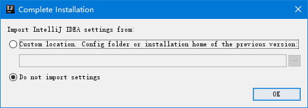
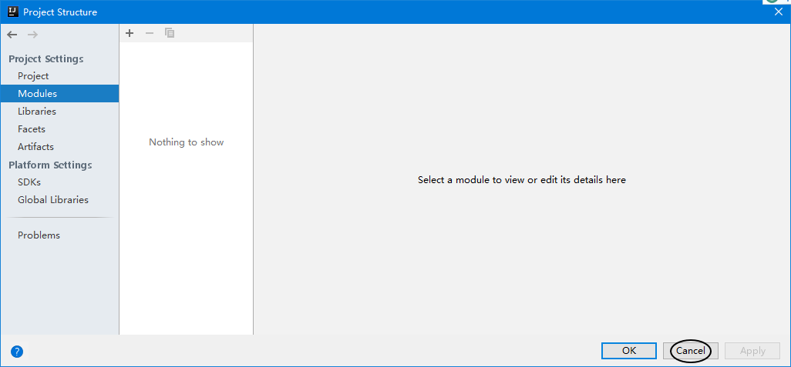

[TOC]

# day05 循环 数组

## 1、循环控制语句

### ①break

#### [1]基本用法

结束本层循环

```java
System.out.println("循环执行开始了");

for (int i = 1; i <= 10; i++){
	
	if ( i == 5 ){
		
		// 将整个本层的循环结束
		break;
	}
	
	System.out.println("i="+i);
}

System.out.println("循环执行结束了");
```

即使break放在嵌套循环中，也只能结束本层循环：

```java
System.out.println("外层循环执行开始了");

for (int k = 1; k <= 10; k++){
	
	System.out.println("内层循环执行开始了");
	
	for (int i = 1; i <= 10; i++){
		
		if ( i == 5 ){
			
			// 将整个本层的循环结束
			break;
		}
		
		System.out.println("k = " + k + " i = " + i);
	}

	System.out.println("内层循环执行结束了");
	
}

System.out.println("外层循环执行结束了");
```

#### [2]使用规则

- break只能用在switch或循环结构中
- break语句后面，不能紧挨着写任何其他语句，因为任何其他语句都没法执行到
- 当一个switch语句出现在循环中，switch里面使用break只能对switch有效，对循环无效

### ②continue

#### [1]基本用法

```java
for (int i = 1; i <= 10; i++){
	
	System.out.println();
	
	System.out.print(i);
	System.out.print("*");
	System.out.print("*");
	
	if (i == 6) {
		
		// 提前结束本次循环，继续执行下一次循环
		continue;
	}
	
	System.out.print("*");
}
```

#### [2]使用规则

- 只能用于循环结构
- continue语句后面，不能紧挨着写任何其他语句，因为任何其他语句都没法执行到

### ③return

本质上不是控制循环的语句，是用来结束一个函数（方法）的。但是当函数结束时，哪怕还有循环操作没有结束，那也执行不了了。

```java
public static void main(String[] args){
	
	for (int i = 1; i <= 10; i++){
	
		System.out.println("i="+i);
		
		if (i == 6){
			return ;
		}
		
	}
	
	// 由于整个函数结束了，所以这里的代码不会被执行到
	System.out.println("循环后面的代码");
	
}
```

## 2、练习

查找100以内的素数：

```java
// 外层循环：列出从2开始到100的所有的数字
for (int i = 2; i <= 100; i++){
	
	// 声明一个变量，用来保存当前数字是否为素数
	// 默认情况：先设置为true，后面再使用内层循环进行排除
	boolean primeFlag = true;
	
	// 内层循环验证i变量中保存的这个数是不是素数
	// 验证方式：用i对『从2到i/2』的所有数取模
	// 如果发现能够整除，那么说明i这个数不是素数
	for (int j = 2; j <= i/2; j++){
		
		if (i % j == 0){
			// 发现i能够被j整除时，说明i不是素数，所以直接将primeFlag变量设置为false
			primeFlag = false;
			
			// 由于i只要能被任何一个j整除，就足矣判断i不是素数，所以后面j后面的值不必再试，这里使用break结束内层循环
			
			break;
		}
		
	}
	
	// 如果i真的是素数，那么它就应该在通过上面内层循环的层层考验后还是true
	if (primeFlag){
		System.out.println("i="+i);
	}
	
}
```

## 3、家庭收支记账软件

### ①介绍Utility工具类

这个类使用时：和主体程序放在同一个目录即可

| 方法调用方式                    | 方法作用                     |
| ------------------------------- | ---------------------------- |
| Utility.readMenuSelection()     | 读取菜单序号：1、2、3、4     |
| Utility.readNumber()            | 读取金额数值                 |
| Utility.readString()            | 读取文字                     |
| Utility.readConfirmSelection()  | 读取确认是否退出时输入的y或n |
| Utility.readKeyBoard(int limit) | 从键盘读取limit个字符        |

### ②创建主体程序类

```java
public class Demo09FamilyAccount {
	
	public static void main(String[] args){
		
	}
	
}
```

Utility工具类和Demo09FamilyAccount类要放在一起：


### ③完整代码

```java
public class Demo09FamilyAccount {
	
	public static void main(String[] args){
		
		// 初始化：用户记账金额的初始值设置为10000元
		int balance = 10000;
		
		// 初始化：显示收支明细时使用的表头信息（将来在表头字符串后面附加表格详细内容）
		String table = "收支\t账户金额\t收支金额\t说    明\n";
		
		// 界面：为了避免用户执行一个菜单项之后就直接退出，所有操作要放在一个死循环中
		// （在测试过程中，还没有编写退出功能，使用Ctrl+c强制结束程序）
		while (true) {
		
			// 界面：标题
			System.out.println("-----------------家庭收支记账软件-----------------");
			
			// 界面：菜单选项
			System.out.println("\t\t1 收支明细");
			System.out.println("\t\t2 登记收入");
			System.out.println("\t\t3 登记支出");
			System.out.println("\t\t4 退    出");
			
			// 界面：提示用户输入菜单项的序号：
			System.out.print("请输入菜单项的序号：");
			
			// 读取：用户输入的菜单项序号
			char menuSelection = Utility.readMenuSelection();
			
			// 系统内部运算：根据用户输入的菜单项，执行对应操作
			switch(menuSelection){
				case '1':
				
					System.out.println(table);
					
					break;
				case '2':
					
					// 界面：提示用户输入收入金额
					System.out.print("请输入收入金额：");
					int income = Utility.readNumber();
					
					// 界面：提示用户输入收入说明
					System.out.print("请输入收入说明：");
					String incomeDescription = Utility.readString();
					
					// 测试：System.out.print("收入金额：" + income + " 收入说明：" + incomeDescription);
					
					// 系统内部运算：将收入金额累加到总余额中
					balance = balance + income;
					
					// 系统内部运算：将新的收入明细信息附加到表格中
					table = table + "收入\t" + balance + "\t\t" + income + "\t\t" + incomeDescription + "\n";
					
					System.out.println("已保存收入登记信息");
					
					break;
				case '3':
					
					// 界面：提示用户输入支出金额
					System.out.print("请输入支出金额：");
					int outcome = Utility.readNumber();
					
					// 界面：提示用户输入支出说明
					System.out.print("请输入支出说明：");
					String outcomeDescription = Utility.readString();
					
					// 测试：System.out.print("支出金额：" + outcome + " 支出说明：" + outcomeDescription);
					
					// 系统内部运算：将支持金额从总金额中减去
					balance = balance - outcome;
					
					// 系统内部运算：将新的支出明细信息附加到表格中
					table = table + "支出\t" + balance + "\t\t" + outcome + "\t\t" + outcomeDescription + "\n";
					
					System.out.println("已保存支出登记信息");
					break;
				case '4':
				
					// 界面：打印信息提示用户输入确认是否退出的字符
					System.out.print("确认是否退出(Y/N)：");
					char confirmWord = Utility.readConfirmSelection();
					
					// 系统内部运算：如果用户输入的是Y，那么整个程序停止执行即可
					if (confirmWord == 'Y') {
						return ;
					}
				
					break;
			}
			
		}
	}
	
}
```

## 4、安装IDEA


## 5、破解IDEA

### ①添加jar包

把JetbrainsIdesCrack-3.4-release-enc.jar包放在刚才IDEA安装目录下的bin目录下。

### ②修改VM选项


把下面的一行配置加入到vmoptions文件的最后一行：

> -javaagent:<span style="color:blue;font-weight:bold;">D:/software/JetBrains2018/bin</span>/JetbrainsIdesCrack-3.4-release-enc.jar

上面只是示例代码，蓝色的部分是IDEA实际安装的目录，也就是刚才添加了JetbrainsIdesCrack-3.4-release-enc.jar包的目录。这里根据自己安装时候的实际情况要修改一下。

③

## 6、设置IDEA

### ①不导入设置



### ②选择主题风格


### ③选择默认插件


### ④选择功能插件


### ⑤最后一步


## 7、使用IDEA

### ①概念

- project：工程
- module：模块


### ②创建工程





### ③创建module


## 8、在IDEA中编写代码

### ①创建类

进入IDEA开发后，最好把类都放在包中。

> 公司或组织域名的倒序.项目名称.模块名称.具体包名.类名
>
> com.atguigu.mall.product.service.ProductService


### ②设置字体


### ③快捷键

| 按键         | 功能                                             |
| ------------ | ------------------------------------------------ |
| psvm         | 生成main方法                                     |
| sout         | 生成System.out.println();                        |
| soutp        | 生成对方法参数的打印                             |
| soutv        | 生成对前面已声明变量的打印                       |
| fori         | 生成带循环变量的for循环结构                      |
| ifn          | 生成判断某个变量是否为null的if语句               |
| inn          | 生成判断某个变量是否非null的if语句               |
| Ctrl+Alt+l   | 格式化代码                                       |
| Ctrl+d       | 复制行                                           |
| Ctrl+x       | 剪切行                                           |
| Ctrl+v       | 粘贴                                             |
| Ctrl+y       | 删除行                                           |
| Ctrl+/       | 添加或去除单行注释                               |
| shift+F6     | 重命名类或变量                                   |
| shift+Alt+↑  | 向上移动当前行代码                               |
| shift+Alt+↓  | 向下移动当前行代码                               |
| shift+enter  | 即使光标在行的中间，也能直接去下一行开始继续输入 |
| Ctrl+n       | 搜索类                                           |
| Ctrl+F12     | 显示类的成员                                     |
| Ctrl+shift+U | 切换大小写                                       |


生成变量的更直接方法：Ctrl+Alt+v


显示方法形参提示：


弹出常用代码模板选择菜单：


## 9、导入别的module

建议：自己新建module，把别人的代码粘过来


把想导入的module复制到当前project目录下


## 10、运行程序


## 11、数组

### ①概念

一组相同类型数据的容器。

- 相同类型：Java语言要求存入数组的数据类型必须一致
- 容器：类似于生活中存放物品的容器，在编程的世界中，『容器』可以用来存放数据
- 一组：容器中可以存放多个数据

### ②声明数组变量

```java
int[] ageArray;
String[] nameArray;
double salaryArray [];
```

虽然[]也可以放在变量名的后面，但是还是建议放在类型的后面。

```java
        // 声明数组时不能在方括号中指定数组长度
        char[5] tipArray;
```

### ③创建数组对象

#### [1]动态创建数组

```java
ageArray = new int[5];
```

#### [2]静态创建数组

此时[]中不能写数字指定长度

```java
nameArray = new String[]{"foo", "bar", "biz"};
```

也可以这么写：

```java
int[] numberArray = {5, 7, 11, 13, 17, 19};
```


### ④将数据存入数组

```java
ageArray[0] = 10;
ageArray[1] = 11;
ageArray[2] = 12;
ageArray[3] = 13;
ageArray[4] = 14;
        
nameArray[0] = "aaa";
nameArray[1] = "bbb";
nameArray[2] = "ccc";
```

### ⑤从数组中读取数据

```java
System.out.println("ageArray[0] = " + ageArray[0]);
System.out.println("ageArray[1] = " + ageArray[1]);
System.out.println("ageArray[2] = " + ageArray[2]);
System.out.println("ageArray[3] = " + ageArray[3]);
System.out.println("ageArray[4] = " + ageArray[4]);

System.out.println("nameArray[0] = " + nameArray[0]);
System.out.println("nameArray[1] = " + nameArray[1]);
System.out.println("nameArray[2] = " + nameArray[2]);
```

### ⑥遍历数组

```java
// 6.遍历数组（通过循环依次读取数组中的每一个值）
// 遍历数组的起点：数组下标0
// 遍历数组的终点：数组长度-1
for (int i = 0; i < ageArray.length; i++) {

    // 在遍历过程中，使用i作为数组下标访问每一个数组元素
    int age = ageArray[i];
    System.out.println("age = " + age);
}
```

PS：生成遍历数组的for循环模板的快捷键是数组变量名.fori

### ⑦数组必须创建对象再访问元素


### ⑧数组中元素默认值

系统创建数组对象后，必须分配和数组长度匹配的空间，此时每一个数组元素都会被系统分配默认值。

