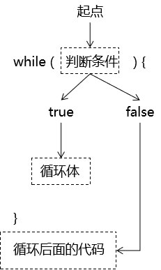
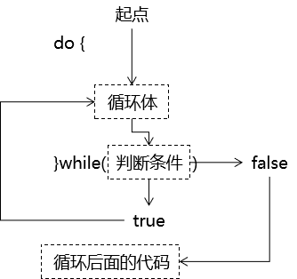
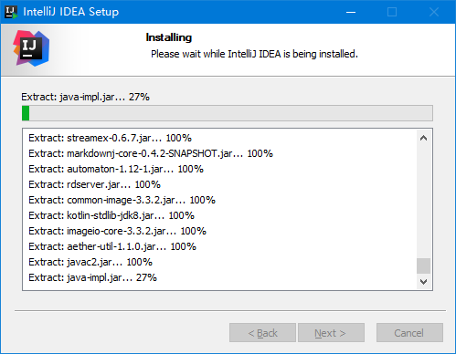
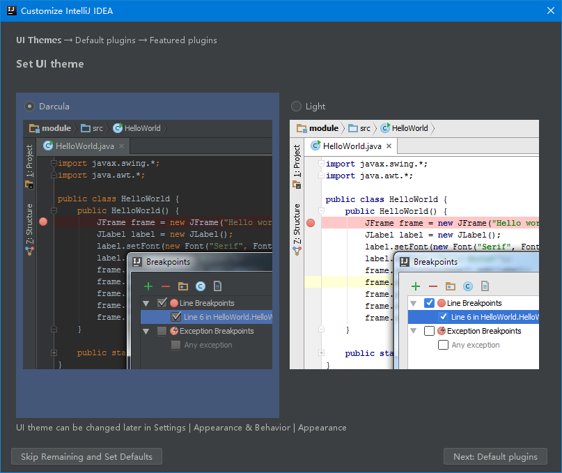

[TOC]

# day06 数组

## 1、内存分析

### ①声明基本数据类型变量

```java
int a = 10;
```


### ②创建对象

```java
Scanner scanner = new Scanner(System.in);
```


### ③创建数组对象


### ④将数据写入数组

```java
ageArray[1] = 5;
```



### ⑤多声明一个数组变量

```java
int[] otherArray = ageArray;
```



### ⑥通过另一个变量访问数组元素

```java

```


### ⑦数组变量指向新数组对象

```java
otherArray = new int[2];
```


### ⑧给新数组元素赋值

```java
otherArray[1] = 33;
```



## 2、数组练习

### 练习1

升景坊单间短期出租4个月，550元/月（水电煤公摊，网费35元/月），空调、卫生间、厨房齐全。屋内均是IT行业人士，喜欢安静。所以要求来租者最好是同行或者刚毕业的年轻人，爱干净、安静。

```java
public class ArrayTest {
      public static void main(String[] args) {
      int[] arr = new int[]{8,2,1,0,3};
      int[] index = new int[]{2,0,3,2,4,0,1,3,2,3,3};
      String tel = "";
      for(int i = 0;i < index.length;i++){
            tel += arr[index[i]];
      }
      System.out.println("联系方式：" + tel);
      }
}
```

解题思路：在遍历index数组的过程中，index数组中的每一个元素作为arr数组的下标，从arr数组中读取数据。

### 练习2

分析以下需求，并用代码实现：

（1）在编程竞赛中，有10位评委为参赛的选手打分，分数分别为：5，4，6，8，9，0，1，2，7，3

（2）求选手的最后得分（去掉一个最高分和一个最低分后其余8位评委打分的平均值）

```java
        // 创建数组对象用来保存评委打分成绩
        int[] scoreArray = {5,4,6,8,9,0,1,2,7,3};

        // 声明两个变量，用于保存打分数据中的最大值和最小值
        // maxScore和minScore的初始值应该是数组中的某一个元素
        // 以minScore为例，如果初始值为0，原始数组中所有数值都比0大，则无法正确找到真正的最小值
        int maxScore = scoreArray[0];
        int minScore = scoreArray[0];

        // 遍历数组，获取每一个具体的分数
        for (int i = 0; i < scoreArray.length; i++) {

            // 获取每一个数组元素
            int score = scoreArray[i];

            // 拿当前遍历得到的元素和maxScore进行比较
            if (score > maxScore) {

                // 如果当前元素大于maxScore，则将当前元素赋值给maxScore
                maxScore = score;
            }

            // 拿当前遍历得到的元素和minScore进行比较
            if (score < minScore) {

                // 如果当前元素小于minScore，则将当前元素赋值给minScore
                minScore = score;
            }
        }

        System.out.println("minScore = " + minScore);
        System.out.println("maxScore = " + maxScore);

        // 声明变量用来保存累加的结果
        int sum = 0;

        // 为了求平均值，需要再遍历一次
        for (int i = 0; i < scoreArray.length; i++) {

            int score = scoreArray[i];

            // 如果遇到最高分或最低分就跳过累加，那么就会将所有最高分跳过
            // 极限情况下，所有分数都是最高分时，所有分数都会跳过，
            // 最终的平均值就是0，这个结果显然是错误的
            // 最低分同理
            // 结论：不能无脑跳过
//            if (score == maxScore) {
//                continue;
//            }
//
//            if (score == minScore) {
//                continue;
//            }

            sum = sum + score;

        }

        // 根据评分规则，最高分和最低分分别只去掉一个，所以在上面全部分数累加结果中把最高分和最低分减去即可
        // 累加结果除以8得到平均值
        double average = (sum - maxScore - minScore) / 8.0;

        System.out.println("average = " + average);
```


### 练习3

已知：一年12个月每个月的总天数是：{ 31, 28, 31, 30, 31, 30, 31, 31, 30, 31, 30,31}，从键盘输入年，月，日后，计算这一天是这一年的第几天。

提示：考虑闰年

```java
// 创建数组保存每个月的天数
int[] dayOfMonthArray = {31, 28, 31, 30, 31, 30, 31, 31, 30, 31, 30, 31};

// 创建Scanner对象
Scanner scanner = new Scanner(System.in);

// 读取用户输入的年
System.out.print("请输入四位年份：");
int year = scanner.nextInt();

// 读取用户输入的月
System.out.print("请输入月份（1~12）：");
int month = scanner.nextInt();

if (month < 1 || month > 12) {
    System.out.print("亲，你这样就让我为难啦！");
    return ;
}

// 读取用户输入的日
System.out.print("请输入日期（1~31）：");
int dayUser = scanner.nextInt();

if (dayUser < 1 || dayUser > 31) {
    System.out.print("亲，你这样就让我为难啦！");
    return ;
}

// 声明一个变量用来保存天数累加的总结果
int sum = 0;

// 在计算天数总和的时候，要分成两部分考虑
// 第一部分：已经经过的整月（如果用指定的是1月，那么前面没有经过的整月）
// 第二部分：用户指定的当前月

// 通过循环遍历的方式计算『第一部分』
// 声明一个变量代表经过经历过的整月
int pastMonth = month - 1;

for (int i = 0; i < pastMonth; i++) {

    // 如果能够进入这个循环体说明需要累加已经经过的整月
    // 此时循环变量 i 正好就是dayOfMonthArray数组下标
    // 用 i 作为数组下标，从dayOfMonthArray数组中取出对应月份的天数
    int dayMonth = dayOfMonthArray[i];

    // 累加月份天数
    sum = sum + dayMonth;
}

// 通过条件判断计算『第二部分』
// 从dayOfMonthArray数组中取出用户指定的月份的总天数
int dayMonth = dayOfMonthArray[month - 1];

// 如果用户输入的是2月28日（包括28号）前的日期，则不需要考虑闰年
if (month == 1 || (month == 2 && dayUser <= 28) ) {

    // 将当月用户指定的日期累加到最后结果中
    sum = sum + dayUser;

}else {

    // 判断当前年份是否为闰年
    if ((year % 4 == 0 && year % 100 != 0) || year % 400 == 0) {

        if (month == 2) {
            // 如果当前年份是闰年，而且当前用户指定的是2月，2月应有的天数需要+1
            dayMonth = dayMonth +1;
        } else {

            // 用户指定的日期在2月29日以后，而且当年是闰年，最终结果+1
            sum = sum + 1;

        }

    }

    if (dayUser > dayMonth) {
        System.out.print("亲，这个月没有这一天！");
        return ;
    }

    // 将当月用户指定的日期累加到最后结果中
    sum = sum + dayUser;

}

// 打印总天数
System.out.println("sum = " + sum);
```


### 练习4

用一个数组，保存星期一到星期天的7个英语单词，从键盘输入1-7，显示对应的单词

| 中文   | 英文      |
| ------ | --------- |
| 星期一 | Monday    |
| 星期二 | Tuesday   |
| 星期三 | Wednesday |
| 星期四 | Thursday  |
| 星期五 | Friday    |
| 星期六 | Saturday  |
| 星期日 | Sunday    |

```java
        // 1.创建数组保存星期N的英语单词
        String[] weekArray = new String[7];
        weekArray[0] = "Monday";
        weekArray[1] = "Tuesday";
        weekArray[2] = "Wednesday";
        weekArray[3] = "Thursday";
        weekArray[4] = "Friday";
        weekArray[5] = "Saturday";
        weekArray[6] = "Sunday";

        // 2.读取用户的键盘输入
        Scanner scanner = new Scanner(System.in);

        System.out.print("请输入1~7数字：");
        int number = scanner.nextInt();

        // 3.根据用户输入的数字从数组中取值
        // 注意：用户输入的数字-1是数组下标
        String week = weekArray[number - 1];
        System.out.println("week = " + week);
```


### 练习5

用一个数组存储26个英文字母的小写形式，并遍历显示小写字母以及它对应的大写字母，例如：a->A

提示：ASCII码表

```java
// 通过把字符类型的数据强转成int类型可以查看字符底层的编码值
// System.out.println((int)'a');

// 创建字符数组用来保存26个英文字母
char[] wordArray = new char[26];

// 从0~25遍历数组，给数组元素赋值
for (int i = 0; i <= 25; i++) {
    wordArray[i] = (char) (i + 97);
    // System.out.println("wordArray["+i+"] = " + wordArray[i]);
}

// ---------------------------------
// 遍历字母数组，显示当前元素的同时还打印它对应的大写字母
for (int i = 0; i <= 25; i++) {
    char word = wordArray[i];

    // 将当前字符-32得到对应的大写字母
    char upperWord = (char) (word - 32);

    System.out.println("小写字母：" + word + " 大写字母：" + upperWord);
}
```


### 练习6

1、从键盘输入本组学员人数

2、声明两个数组，一个存储本组学员的姓名，一个存储本组学员的成绩

3、从键盘输入每一个人的姓名和成绩，分别存到两个数组中

4、找出最高分和最低分的学员的姓名


### 练习7

有如下代码，请画出 i 等于3时的内存图

```java
int[] arr2 = new int[5];
for(int i=0; i<arr2.length; i++){
	arr[i] = i+1;
}
```


### 练习8

从键盘读入学生成绩，找出最高分，并输出学生成绩等级。
成绩>=最高分-10    等级为’A’  
成绩>=最高分-20    等级为’B’
成绩>=最高分-30    等级为’C’   
其余                        等级为’D’

提示：先读入学生人数，根据人数创建int数组，存放学生成绩。


```java
// 一、根据用户输入的数据创建数组对象
// 1.创建Scanner对象
Scanner scanner = new Scanner(System.in);

// 2.读取用户输入的学生人数
System.out.print("请输入学生人数：");
int studentCount = scanner.nextInt();

// 3.根据用户输入的学生人数创建数组对象（以学生人数作为数组长度）
int[] scoreArray = new int[studentCount];

// 4.将用户输入的学生成绩保存到数组中
for (int i = 0; i < studentCount; i++) {

    // 5.读取用户输入
    System.out.print("请输入第" + (i + 1) + "位学生成绩：");
    int score = scanner.nextInt();

    // 6.将学生成绩存入数组下标对应的位置
    scoreArray[i] = score;

}

// 二、查找已输入数据中的最大值
// 1.声明一个变量用来存储最大值
// 为什么最大值变量的初始值设置为scoreArray[0]？
// 假设成绩是：-10,-20,-30
// 假设maxScore是：0
// 最大值是：0
int maxScore = scoreArray[0];

// 2.遍历成绩数组
for (int i = 0; i < scoreArray.length; i++) {

    // 3.获取当前成绩数据
    int score = scoreArray[i];

    // 4.检查当前成绩是否大于maxScore
    if (score > maxScore) {

        // 5.如果当前成绩大于maxScore，就把maxScore设置为当前成绩
        maxScore = score;
    }
}

System.out.println("maxScore = " + maxScore);

// 三、按照等级打印学生成绩
// 1.遍历学生成绩数组
for (int i = 0; i < scoreArray.length; i++) {

    // 2.获取当前成绩数据
    int score = scoreArray[i];

    // 3.逐级判断当前成绩数据属于哪个等级
    if (score > maxScore - 10) {

        System.out.println("第" + (i+1) + "位学生的成绩" + score + "是A级");

    } else if (score > maxScore - 20) {

        System.out.println("第" + (i+1) + "位学生的成绩" + score + "是B级");

    } else if (score > maxScore - 30) {

        System.out.println("第" + (i+1) + "位学生的成绩" + score + "是C级");

    } else {

        System.out.println("第" + (i+1) + "位学生的成绩" + score + "是D级");

    }

}
```

## 3、多维数组

### ①概念[逻辑角度]

#### [1]一维数组

一维数组是线性的结构，通俗来说就是一条线


#### [2]二维数组

二维数组通俗来说就是一个面


#### [3]三维数组

三维数组就是一个立体的空间结构了



### ②多维数组的底层内存存储结构


### ③语法层面

#### [1]创建二维数组格式一

```java
// 格式1：动态初始化——创建数组对象时就指定了两个维度的数组长度
int[][] arr2d01 = new int[3][2];
arr2d01[0][0] = 100;
arr2d01[0][1] = 101;
arr2d01[1][0] = 102;
arr2d01[1][1] = 103;
arr2d01[2][0] = 104;
arr2d01[2][1] = 105;
```


#### [2]创建二维数组格式二

```java
// 格式2：动态初始化——仅指定第一个维度的数组长度
int[][] arr2d02 = new int[3][];

// Java中多维数组不必都是规则矩阵形式
arr2d02[0] = new int[]{3, 5, 7};
arr2d02[1] = new int[]{14, 21, 66, 89};
arr2d02[2] = new int[]{90, 100};
```


#### [3]创建二维数组格式三

```java
// 格式3：静态初始化——在创建对象时将数据填充
// 此时如果某个元素位置设置为null不会编译报错，但是访问这个位置时还是要先初始化
int[][] arr2d03 = new int[][]{{1,2,3}, {4,5}, null, {6,7,8}};

// 前面设置null的地方，需要初始化才可以访问
arr2d03[2] = new int[]{12,24};
arr2d03[2][0] = 5;
```


#### [4]创建二维数组格式四[不建议]

```java
// 格式4：声明变量时，两层[]没在一起
int[] x[] = new int[][]{{1,2,3}, {4,5}, {6,7,8}};
```


### ④访问二维数组元素

```java
// 二、访问二维数组元素（读、写）
int[][] arr2d05 = new int[2][2];

// 向数组元素写入数据
arr2d05[1][0] = 10;

// 读取数组元素
System.out.println("arr2d05[1][0] = " + arr2d05[1][0]);
```

### ⑤遍历二维数组

```java
// 三、遍历二维数组：需要使用双层嵌套的循环
int[][] arr2d06 = new int[][]{{1,2,3},{4,5,6},{7,8,9}};

// 先遍历第一个维度：取出每一个一维数组
for (int i = 0; i < arr2d06.length; i++) {

    int[] intArr = arr2d06[i];

    for (int j = 0; j < intArr.length; j++) {
        int intValue = intArr[j];
        System.out.println("intValue["+i+"]["+j+"] = " + intValue);
    }

}
```

### ⑥杨辉三角练习


```java
// 1.创建二维数组，第一维长度为10
int[][] yanghuiArr = new int[10][];

// 2.通过双层for循环给二维数组填充数据
for (int i = 0; i < yanghuiArr.length; i++) {

    // 3.创建一维数组，对yanghuiArr下标i位置进行初始化
    yanghuiArr[i] = new int[ i + 1 ];

    // 4.遍历一维数组，填充数据
    for (int j = 0; j <= i; j++) {

        // 5.一头（一维数组的下标0元素）一尾（一维数组的下标长度-1元素）固定就是1
        // 一维数组中最后一个元素的下标正好就是现在外层循环变量：i
        if (j == 0 || j == i) {

            yanghuiArr[i][j] = 1;

        } else {

            // 6.非头尾的元素，由上一行中两个元素相加得到
            // 第一个值的下标：[i-1][j-1]
            // 第二个值的下标：[i-1][j]
            yanghuiArr[i][j] = yanghuiArr[i-1][j-1] + yanghuiArr[i-1][j];

        }

    }

}

// 7.遍历填充数据的二维数组
for (int i = 0; i < yanghuiArr.length; i++) {

    int[] yanghuiValueArr = yanghuiArr[i];

    for (int j = 0; j < yanghuiValueArr.length; j++) {

        System.out.print(yanghuiValueArr[j] + "\t");

    }

    System.out.println();

}
```

