# day08 面向对象-上

# 1、方法相关练习

> 定义类Student，包含三个属性：学号number(int)，年级state(int)，成绩score(int)。 创建20个学生对象，学号为1到20，年级和成绩都由随机数确定。
> 问题一：打印出3年级(state值为3）的学生信息。
> 问题二：使用冒泡排序按学生成绩排序，并遍历所有学生信息
>
> 提示：
> 1) 生成随机数：Math.random()，返回值类型double;  
> 2) 四舍五入取整：Math.round(double d)，返回值类型long。

### ①声明Student类

```java
public class Student {

    int number;
    int state;
    int score;

    // 用于每次打印Student对象的信息，代码复用，不必每次想打印时都再写一遍
    public void showMyInfo() {
        System.out.println("number=" + number + "\tstate=" + state + "\tscore=" + score);
    }

}
```

### ②创建Student数组

```java
Student[] studentArr = new Student[20];
```

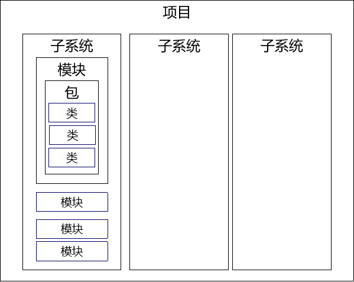

### ③循环创建Student对象并存入数组

```java
// 循环20次创建20个Student对象并存入Student数组
for (int i = 0; i < 20; i++) {
    Student student = new Student();
    studentArr[i] = student;
}
```

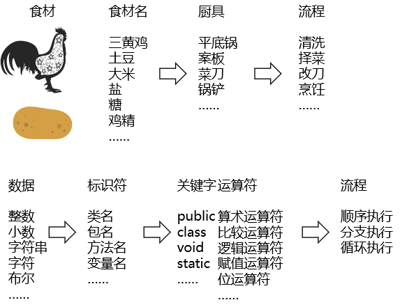

### ④在循环创建Student对象时设置属性

```java
// 循环20次创建20个Student对象并存入Student数组
for (int i = 0; i < 20; i++) {

    // 创建Student对象
    Student student = new Student();

    // 给Student对象设置number属性
    student.number = i + 1;

    // 给Student对象设置state属性
    student.state = (int) (Math.random() * 10) + 1;

    // 给Student对象设置score属性
    student.score = (int) (Math.random() * 100);

    // 将Student对象存入数组
    studentArr[i] = student;
}
```

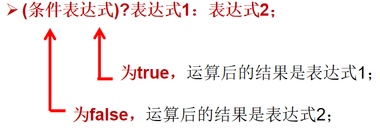

### ⑤打印年级为3的Student

```java
// 循环20次创建20个Student对象并存入Student数组
for (int i = 0; i < 20; i++) {

    // 创建Student对象
    Student student = new Student();

    // 给Student对象设置number属性
    student.number = i + 1;

    // 给Student对象设置state属性
    student.state = (int) (Math.random() * 10) + 1;

    // 给Student对象设置score属性
    student.score = (int) (Math.random() * 100);

    // 将Student对象存入数组
    studentArr[i] = student;

    // 判断当前Student对象的state属性是否为3
    if (student.state == 3) {
        student.showMyInfo();
    }
}
```

### ⑥根据成绩冒泡排序

#### [1]冒泡排序算法


- 外层循环：i（0~length-1）
  - 数组的长度是多少，外层就循环多少次
- 内层循环：j（0~j-i-1）
  - 执行范围
    - 当前元素：0~数组长度-i-1（减 i 是因为外层每执行一次，最后一个元素就不用考虑了；减1是为了避免j+1造成数组下标越界）
    - 下一个元素：1~数组长度-i
  - 拿当前元素和下一个元素进行比较
  - 如果当前元素比下一个元素要大，那就两个元素交换位置
  - 内层循环执行完能够把最大的元素移动到数组的末尾

#### [2]代码

```java
// 对数组中的元素进行冒泡排序
// 外层循环：控制『冒泡』次数
for (int i = 0; i < 20; i++) {

    // 内层循环：负责执行『冒泡』
    // 每冒泡一次就是把当前范围最大的元素移动到最后
    // 减 i 是因为已经排序好的元素不用动
    // 减 1 是因为避免j+1找下一个元素时数组下标越界
    for (int j = 0; j < (20 - i - 1) ; j++) {

        // 将『当前学生的分数』和『下一个学生的分数』进行比较
        if (studentArr[j].score > studentArr[j+1].score) {

            // 交换：需要借助中间变量
            Student swap = studentArr[j];

            studentArr[j] = studentArr[j+1];

            studentArr[j+1] = swap;

        }

    }

}
```

### ⑦再次遍历排序后的数组

```java
// 遍历Student数组
for (int i = 0; i < studentArr.length; i++) {

    Student student = studentArr[i];

    student.showMyInfo();

}
```

### ⑧有可能出现的问题

#### [1]仅使用几个变量来执行交换

代码按下面这样写不会真正实现交换。因为数组中对应位置的元素没有被触及。

```java
Student stuCurrent = studentArr[j];
Student stuNext = studentArr[j+1];

// 将『当前学生的分数』和『下一个学生的分数』进行比较
if (studentArr[j].score > studentArr[j+1].score) {

    // 交换：需要借助中间变量
    Student swap = stuCurrent;

    stuCurrent = stuNext;

    stuNext = swap;

}
```

下面是正确代码：

```java
// 交换：需要借助中间变量
Student swap = studentArr[j];

studentArr[j] = studentArr[j+1];

studentArr[j+1] = swap;
```

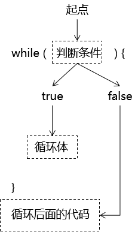

#### [2]内层循环的终点没有-1

错误代码：

```java
for (int j = 0; j < (20 - i) ; j++) {

    // 将『当前学生的分数』和『下一个学生的分数』进行比较
    if (studentArr[j].score > studentArr[j+1].score) {

        // 交换：需要借助中间变量
        Student swap = studentArr[j];

        studentArr[j] = studentArr[j+1];

        studentArr[j+1] = swap;

    }

}
```

抛出的异常：

> Exception in thread "main" java.lang.ArrayIndexOutOfBoundsException: 20
> 	at com.atguigu.object.exer.StudentTest.main(StudentTest.java:48)

异常的原因：

studentArr[j+1].score中 j 是19，j+1是20，导致数组下标越界。

### ⑨StudentTest全部代码

```java
package com.atguigu.object.exer;

public class StudentTest {

    public static void main(String[] args) {

        // 声明一个Student类型的数组，来存放循环创建的20个Student对象
        Student[] studentArr = new Student[20];

        // 循环20次创建20个Student对象并存入Student数组
        for (int i = 0; i < 20; i++) {

            // 创建Student对象
            Student student = new Student();

            // 给Student对象设置number属性
            student.number = i + 1;

            // 给Student对象设置state属性
            student.state = (int) (Math.random() * 10) + 1;

            // 给Student对象设置score属性
            student.score = (int) (Math.random() * 100);

            // 将Student对象存入数组
            studentArr[i] = student;

            // 判断当前Student对象的state属性是否为3
//            if (student.state == 3) {
//                student.showMyInfo();
//            }

            // 开发过程中，为了看到全部数据的情况，逐个打印
            student.showMyInfo();
        }

        // 对数组中的元素进行冒泡排序
        // 外层循环：控制『冒泡』次数
        for (int i = 0; i < 20; i++) {

            // 内层循环：负责执行『冒泡』
            // 每冒泡一次就是把当前范围最大的元素移动到最后
            // 减 i 是因为已经排序好的元素不用动
            // 减 1 是因为避免j+1找下一个元素时数组下标越界
            for (int j = 0; j < (20 - i - 1) ; j++) {

                // 将『当前学生的分数』和『下一个学生的分数』进行比较
                if (studentArr[j].score > studentArr[j+1].score) {

                    // 交换：需要借助中间变量
                    Student swap = studentArr[j];

                    studentArr[j] = studentArr[j+1];

                    studentArr[j+1] = swap;

                }

            }

        }

        // 打印分割线
        System.out.println("=================================");

        // 遍历Student数组
        for (int i = 0; i < studentArr.length; i++) {

            Student student = studentArr[i];

            student.showMyInfo();

        }

    }

}
```

## 2、方法重载

### ①需求

计数器类中已有方法：做两个int类型的加法

```java
public int add(int a, int b)
```

想要增加新的方法：做两个double类型的加法

```java
public double add(double a, double b)
```

为了满足更多使用情况，还想有更多方法：

```java
public int add(int a, int b, int c)
```

小结：在一个类中，很可能会有很多类似的需求，为了满足这些需求，我们会声明很多相似的方法。同时为了让方法的调用者体验更好、更容易找到所需方法，这些功能相近的方法最好使用『同一个方法名』。

### ②前提

- 同一个类中
- 同名的方法

### ③方法重载的好处

- 没有重载不方便：让方法调用者，在调用方法的时候，不必为了相似的功能而查阅文档，查找各种不同的方法名，降低学习成本，提高开发效率。
- 有了重置很方便：在调用一系列重载的方法时，感觉上就像是在调用同一个方法。对使用者来说，只需要知道一个方法名就能够应对各种不同情况。

### ④规则限制

限制的来源：本质上只要让系统能够区分清楚我们具体要调用哪一个方法。

- 在同一个类中，如果两个方法的方法名一致，那么参数列表必须不同。
- 参数列表区分
  - 要么是参数个数不同
  - 要么是参数类型不同

### ⑤重载方法举例

#### [1]参数个数不同

```java
public int add(int a, int b)
public int add(int a, int b, int c)
```

#### [2]参数类型不同

```java
public int add(int a, int b)
public double add(double a, double b)
```

或：

```java
public double add(int a, double b)
public double add(double a, int b)
```

## 3、方法可变参数

### ①需求

在实际开发过程中，确实有一些情况不确定在调用方法时传入几个参数。所以为了让调用方法时能够弹性传参，JavaSE5.0标准增加了可变参数功能。

### ②声明和调用

```java
// 能够计算任意个数整数之和的加法
// 使用String ... args来声明可变参数
public String add(String ... args) {

    System.out.println("暗号：可变参数");

    String sum = "";

    // 在方法体内，可变参数按照数组形式来处理
    for (int i = 0; i < args.length; i++) {
        sum = sum + args[i];
    }

    return sum;
}
```

测试代码：

```java
String addResultStr = calculator.add("a");
System.out.println("addResultStr = " + addResultStr);

addResultStr = calculator.add("a", "b");
System.out.println("addResultStr = " + addResultStr);

addResultStr = calculator.add("a", "b", "c");
System.out.println("addResultStr = " + addResultStr);

addResultStr = calculator.add();
System.out.println("addResultStr = " + addResultStr);
```

### ③语法规则

- 可变参数必须在整个参数列表的最后

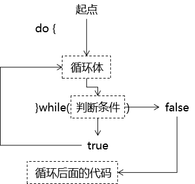

- 当调用方法时实际传入的参数既匹配可变参数列表方法，又匹配一个具体的参数列表方法，那么系统会优先调用具体的参数列表方法

> 举例：调用方法add(5, 3)
>
> 可变参数方法：add(int ... args)
>
> 具体参数方法：add(int i, int j)【系统会调用这个方法】

- 一个方法只能声明一个可变参数

## 4、方法参数值传递

### ①基本数据类型


### ②引用数据类型

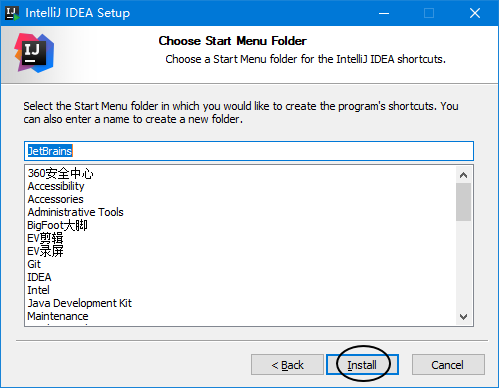

## 5、递归

### ①概念

方法自己调用自己。使用递归想要达到的目的是让方法中的代码重复执行，而且往往是在上一次执行的结果的基础上，再进一步执行。

### ②代码示例

#### [1]计算1~N的和

```java
// 计算1~N之间的总和：使用递归
public int sumOperationRecursion(int number) {

    if (number == 1) {

        return 1;

    }else{

        return number + sumOperationRecursion(number - 1);

    }
}
```

#### [2]没有退出机制的递归调用

```java
// 没有退出机制的递归调用
public void recursionToDie() {
    recursionToDie();
}
```


> Exception in thread "main" java.lang.StackOverflowError
> 	at com.atguigu.object.test.MethodRecursion.recursionToDie(MethodRecursion.java:35)
> 	at com.atguigu.object.test.MethodRecursion.recursionToDie(MethodRecursion.java:35)
> 	at com.atguigu.object.test.MethodRecursion.recursionToDie(MethodRecursion.java:35)
> 	at com.atguigu.object.test.MethodRecursion.recursionToDie(MethodRecursion.java:35)
> 	at com.atguigu.object.test.MethodRecursion.recursionToDie(MethodRecursion.java:35)
> 	at com.atguigu.object.test.MethodRecursion.recursionToDie(MethodRecursion.java:35)

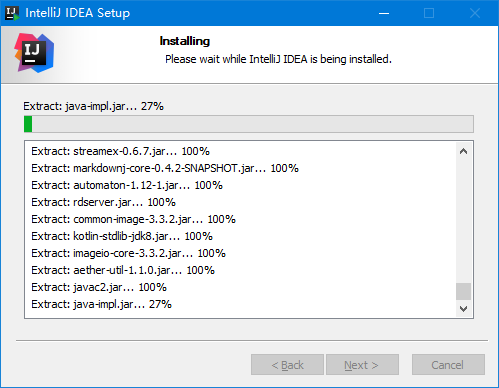

内存耗尽的原因：方法每一次开始执行时都会向系统申请栈内存中的一块空间用来存放局部变量。方法结束时释放这块空间。而没有退出机制的递归调用会不断申请新空间，而完全不释放。

> 栈：stack
>
> 堆：heap

#### [3]用递归实现阶乘

5!=5×4×3×2×1

```java
// 声明一个方法用来实现阶乘
public int factorial(int i) {

    if (i == 1) {

        return 1;

    } else {

        return i * factorial(i - 1);

    }

}
```

## 6、封装

### ①含义

将对象中数据或代码逻辑隐藏起来。对数据的操作在类的内部完成，对外界隐藏实现的细节。

### ②好处

- 对象（或组件）内部代码实现的细节可以对外隐藏。
- 简化外部使用对象时的操作难度。外部使用对象时，调用对象暴露出来的方法即可。
- 让整个系统的开发组件化、模块化程度更高，更有利于实现：高内聚、低耦合。

### ③示例

```java
public class MarryObject {

    // 将属性的权限修饰符设置为私有，不允许外部直接访问
    private int age;

    // 对外暴露的获取数据的getXxx()方法
    public int getAge() {
        return age;
    }

    // 对外暴露的设置数据的setXxx()方法
    public void setAge(int ageOutter) {

        // 在方法内部，根据内部的逻辑，对外界数据进行修正
        if (ageOutter < 20) {

            age = 20;

        } else if (ageOutter > 60) {

            age = 60;

        } else {

            age = ageOutter;

        }

    }

}
```

### ④权限修饰符

| 修饰符名称 | 含义   | 本类 | 同包其他类 | 子类 | 同工程其他类 |
| ---------- | ------ | ---- | ---------- | ---- | ------------ |
| private    | 私有   | √    | ×          | ×    | ×            |
| default    | 缺省   | √    | √          | ×    | ×            |
| protected  | 受保护 | √    | √          | √    | ×            |
| public     | 公共   | √    | √          | √    | √            |

> PS：对class的权限修饰符只有public和缺省两种
>
> - public：表示这个类可以在工程中任意位置访问（开发中实际使用的方式）
> - 缺省：表示这个类只能在同一个包内访问（实际开发不会使用这种方式）

## 7、构造器

<span style="color:blue;font-weight:bold;">注意：</span>构造器和方法是两码事，各是各的。

### ①构造器引入

当我们使用new关键字创建一个类的对象时，就是在使用这个类的构造器了：

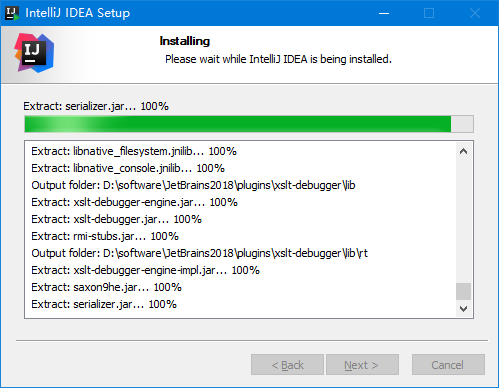

如果我们没有明确声明构造器，那么系统回给类分配一个隐式的构造器。


### ②构造器的作用

- 作用1：创建对象。
- 作用2：在创建对象的过程中，对类进行初始化操作。这些操作写在构造器的大括号中。
  - 初始化操作放到构造器里面，由构造器自动完成，程序员就不必在创建对象后还想着对这对象做初始化操作。

### ③构造器的组成部分

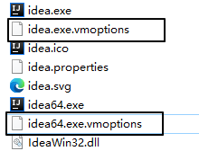

### ④构造器的参数

#### [1]有一个参数构造器例子

```java
public class Soldier {

    private String soldierName;

    public Soldier(String soldierName) {
        this.soldierName = soldierName;
    }

}
```

<span style="color:blue;font-weight:bold;">注意：</span>当类中声明了有参构造器之后，系统将不再给这个类分配无参的构造器。

#### [2]一个类可以有多个构造器

根据参数列表不同，多个构造器之间是重载关系。规则和方法重载一致：

- 要么参数个数不同
- 要么参数类型不同

```java
public class Soldier {

    private int age;
    private String soldierName;
    private String weapon;
    private String gender;

    public Soldier() {
        
    }
    
    public Soldier(int age) {
        this.age = age;
    }

    public Soldier(String soldierName) {
        this.soldierName = soldierName;
    }
    
    public Soldier(String soldierName, String weapon) {
        this.soldierName = soldierName;
        this.weapon = weapon;
    }
    
    public Soldier(String soldierName, String weapon, String gender) {
        this.soldierName = soldierName;
        this.weapon = weapon;
        this.gender = gender;
    }
    
    public Soldier(int age, String soldierName, String weapon, String gender) {
        this.gender = gender;
        this.weapon = weapon;
        this.soldierName = soldierName;
        this.age = age;
    }

}
```

### ⑤构造器相关语法规则

- Java语言中，每个类都至少有一个构造器
- 默认构造器的修饰符与所属类的修饰符一致
- 一旦显式定义了构造器，则系统不再提供默认构造器
- 一个类可以创建多个重载的构造器
- 父类的构造器不可被子类继承

### ⑥相关快捷键

#### [1]唤出快捷菜单

Alt+Insert

> 有的电脑需要按住Fn键，再按Insert才能生效

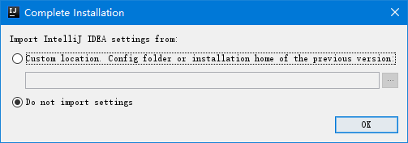

#### [2]声明无参构造器

当快捷菜单中选中的是Constructor时，回车，弹出下面窗口：

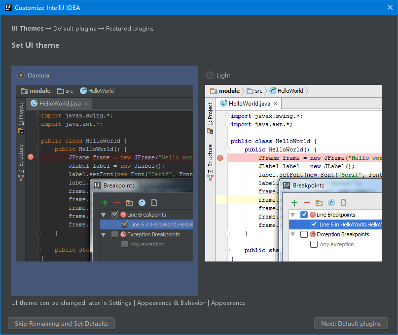

#### [3]声明全部参数构造器


#### [4]在快捷菜单输入字符匹配菜单项

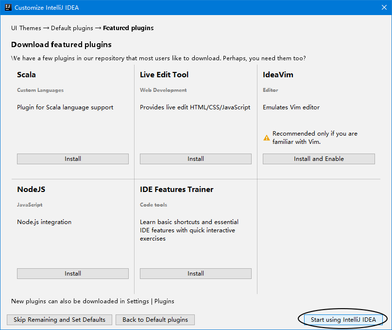

输入gets就可以直接匹配到菜单项：Getter and Setter

#### [5]生成getter和setter方法

通常针对所有属性生成getter、setter方法


#### [6]生成toString()方法


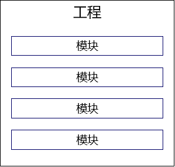

### ⑦类的属性赋值的顺序

- 系统根据这个属性的类型来设置默认值。

```java
private int age;
```

- 显示初始化

```java
private int age = 6;
```

- 构造器初始化

```java
public Person(int age) {
    this.age = age;
}
```

- 调用方法或直接给属性赋值

```java
person.setAge(5);
```

或

```java
person.age = 18;
```

## 8、JavaBean

### ①实际项目开发中用到的类

- JavaBean
  - 用来描述现实世界中的具体数据：Book、Employee、Department、Product、……
  - 也有其他名称：domain（领域模型）、POJO（Plain old Java Object普通的传统的Java对象）、entity（实体类）
- 功能性组件：用来执行具体代码逻辑对应的操作
  - BookServlet
  - BookService
  - BookDao
- 工具类：通常用来把某个特定操作封装到工具方法中。工具类通常是用类名来直接调用方法。
  - Aarrys.sort()

### ②JavaBean的要求

必须有的组成部分：

- 私有的属性
- 针对私有属性设置的公共的getter()、setter()方法
- 无参构造器

### ③getter()和setter()方法的规则

属性声明：

```java
private int age;
```

getter()、setter()方法：

```java
    public int getAge() {
        return age;
    }

    public void setAge(int age) {
        this.age = age;
    }
```

规则描述如下：

- getXxx()或setXxx()方法取方法名字符串
- 去掉get或set（剩下Xxx）
- Xxx首字母小写

### ④IDEA生成UML图

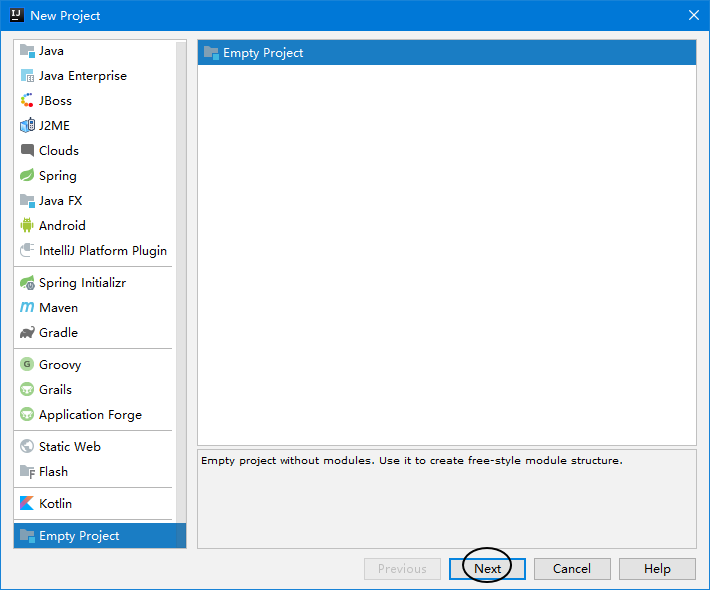


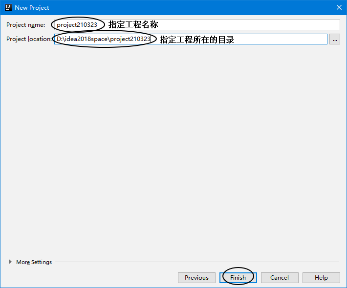

## 9、this关键字

### ①含义

- 类的方法中：代表调用当前方法的对象

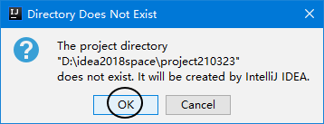

- 类的构造器中：代表当前构造器正在创建的对象

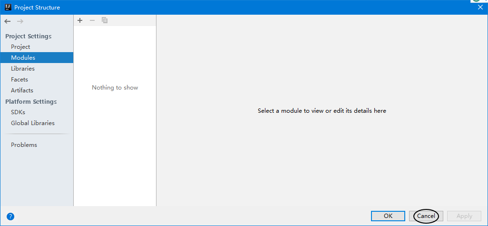

### ②this能干什么

#### [1]调用属性

```java
System.out.println("我的年龄：" + this.age);
System.out.println("我的姓名：" + this.soldierName);
System.out.println("我的武器：" + this.weapon);
```

#### [2]调用方法

```java
System.out.println("我的性别：" + this.getGender());
```

#### [3]调用构造器

在类中的某个构造器中调用这个类的其他构造器：

```java
public class Tiger {

    private String tigerName;
    private int tigerAge;

    public Tiger() {
        System.out.println("这里是Tiger类的无参构造器");
    }

    public Tiger(String tigerName) {

        this();

        this.tigerName = tigerName;

        System.out.println("这里是Tiger类的一参构造器");

    }

    public Tiger(String tigerName, int tigerAge) {

        this("aaa");

        this.tigerName = tigerName;
        this.tigerAge = tigerAge;

        System.out.println("这里是Tiger类的两参构造器");
    }
}
```

#### [4]this调用构造器的规则

- 在构造器中调用其他构造器，this()语句必须在第一行

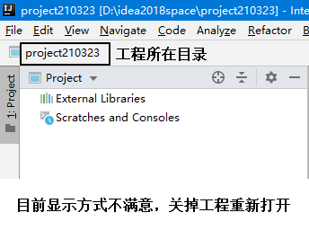

- 各个构造器之间调用不能形成闭环

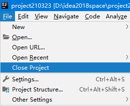

循环调用逻辑如下：

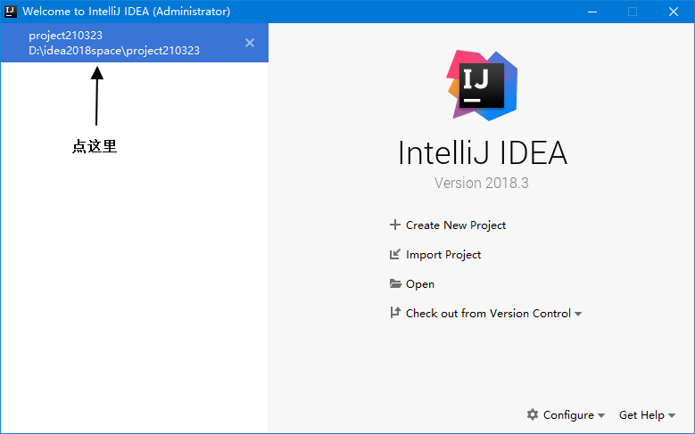

- 一个构造器中调用其他构造器的操作只能有一个

## 10、package关键字

用来声明当前类所在的包。package声明所在包的语句必须是在类的第一行。若缺省该语句，则指定为无名包。

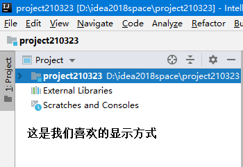

## 11、import关键字

在JDK编译Java源程序的时候，并不能保证所有的类都能够被JDK默认识别到。JDK无法默认识别的类就需要我们通过import语句导入。

- 精确导入：在import关键字后面指定全类名

```java
import java.util.Scanner;
```

- 全部导入：在import关键字后面指定包名.*

```java
import java.util.*;
```

语法规则：

- 使用的位置：在package声明和类声明之间
- 如果导入的类或接口是java.lang包下的，或者是当前包下的，则可以省略此import语句。
- 如果导入一个类之后，又需要用到另一个同名的类，那么就需要使用全类名来引用

```java
// 这里导入了一个Book类
import java.awt.print.Book;

public class ImportTest {

    public static void main(String[] args) {
        
        // 但是这里又要使用另外一个Book类
        // 为了区分二者，这里使用全类名来引用
        com.atguigu.object.test.Book book = new com.atguigu.object.test.Book();
    }
    
}
```

- 如果已经导入java.a包下的类。那么如果需要使用a包的子包下的类的话，仍然需要导入。
- import static组合的使用：静态导入。让当前类可以直接调用导入的类中的静态属性或方法，不必写类名了。