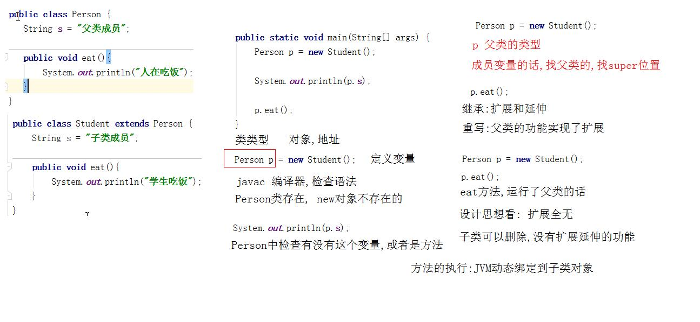
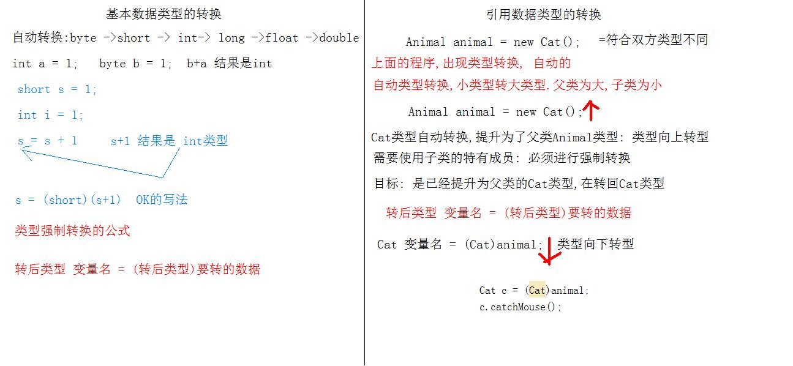

# day10面向对象多态

- 学习目标
  - 对象的多态性
  - 多态的必要因素
  - 多态的语法格式
  - 多态中成员的特性
  - 多态中的转型
  - 抽象类定义
  - 抽象方法定义
  - 抽象类使用
  - 抽象类的成员特点
  - 抽象类的多态调用
  - 抽象类的继承体系价值

## 1. 对象的多态性

>   引入 : 生活中的多态性! 你自己的身份是学生,你的身份职场精英,患者.在不同的时期不同环境,状态是不同的.

  生活中的多态性: 一个事物具备的不同形态.

### 1.1 对象多态性前提

- **必须有继承或者是接口实现**
- **必须有方法的重写**

**多态的语法规则:** 父类或者接口的引用指向自己的子类的对象

```properties
父类 变量(对象名)  =  new 子类对象(); //多态写法
```

> 对象调用方法,执行的子类的方法重写

### 1.2 多态中成员的特点

- 多态中成员变量的特点
  - 编译 : 父类中没有成员变量,编译失败
  - 运行 : 运行父类中的成员变量

- 多态中成员方法的特点

  - 编译 : 父类中没有成员方法,编译失败
  - 运行 :  运行子类的方法重写

- 简练 : 成员方法编译看左边,运行看右边.成员变量都是左边

  > Person p = new Student();

```java
public class Person {
   String s = "父类成员";

   public void eat(){
       System.out.println("人在吃饭");
   }
}
```

```java
public class Student extends Person {
    String s = "子类成员";

    public void eat(){
        System.out.println("学生吃饭");
    }
}
```

```java
    public static void main(String[] args) {
        Person p = new Student();
        //对象p,子类对象,调用成员变量s
        System.out.println(p.s);
        //子类对象调用方法
        p.eat();
    }
```



### 1.3 多态的转型

>  多态的程序中,不能调用子类的特有成员!!
>
>  只能调用子类父类的共有成员!!

```properties
转后类型 变量名 = (转后类型)要转的数据; //公式
```

```java
 public static void main(String[] args) {
     //创建对象,多态性
     //父类 = new 任意子类对象() 扩展
     Animal animal = new Cat();
     animal.eat();
     //Cat类的特有功能 catchMouse()方法
     //类型转换,强制
     //Cat提升为了Animal,转回Cat类型
     Cat c = (Cat)animal;
     c.catchMouse();
 }
```



补充: 多态性提升扩展性,是否需要强制转换,根据实际功能需求来决定.

### 1.4 多态中的转型异常

  异常ClassCastException 类型转换异常,在多态中经常发生.

  是在进行类型的强制转换的时候发生,我们现在的案例是Dog不能转成Cat.

  需要解决这个异常 :  `对象是Cat转Cat,是Dog换Dog`

  运算符 : 比较运算符,结果是boolean类型

  运算符是关键字 instanceof

  instanceof的语法格式:

```java
对象名 instanceof  类的名字
解析: 比较这个对象,是不是由这个类产生的
c instanceof Cat  解释: c对象是不是Cat类产生的,如果是结果就是true
```

强制类型转换之前的安全性判断

```java
public static void main(String[] args) {
    //多态创建对象
    Animal animal = new Dog();
    animal.eat();
    //判断 animal是不是Cat类的对象
    //boolean b = animal instanceof Dog ;
    //System.out.println(b);
    //调用子类的特有方法
    if (animal instanceof Cat){
        //if为true,强制转换为Cat
        Cat c = (Cat)animal;
        c.catchMouse();
    }
    if (animal instanceof Dog){
        Dog d = (Dog)animal;
        d.lookHome();
    }
}
```

### 1.5 多态的转型案例

```java
public static void main(String[] args) {
    //创建对象,多态
    Person p1 = new Faculty();
    //p1对象的属性,赋值本科 degree 子类的特有成员
    //判断p1对象是不是Faculty类产生
    if (p1 instanceof  Faculty){
        Faculty f = (Faculty)p1;
        f.setDegree("本科");
        System.out.println(f.getDegree());
    }
    Person p2 = new Staff();
    //判断p2对象是不是Staff类产生
    if (p2 instanceof  Staff){
        Staff s = (Staff)p2;
        s.setDuty("职员");
        System.out.println( s.getDuty());
    }
}
```

## 2. 抽象类 abstract

  抽象的概念 : 凡是说不清楚的都是抽象

  例子 : 我买了一台手机,买了一直笔,都是抽象概念.

  具体: 华为Meta40Pro ,金属, 16G+512

  程序中 : 我知道这个功能存在,但是怎么完成就说不清楚,程序中也出现了抽象.

### 2.1 抽象方法定义

  使用关键字 abstract定义抽象方法

```properties
权限修饰符 abstract 返回值类型 方法名字(参数列表) ;
abstract关键字
抽象方法没有方法体, 不需要{},直接分号结束
```

  当一个类中的方法是抽象方法的时候,这个类必须是抽象类,在类的关键字class前面使用abstract修饰.

```properties
public abstract class 类名{}
```

```java
public abstract class Animal {
    /**
     * 动物吃什么?
     * 说不清楚,抽象,可以不说
     */
    public abstract void eat();
}

```

### 2.2 抽象类的使用方式

- 抽象类不能实例化对象,不能new对象.
  - 为什么不能建立对象,类中有没有主体的方法存在,建立对象调用抽象方法是绝对的错误,因此不能建立对象.
- 需要子类继承抽象类,重写抽象方法.
- **创建子类对象**
- 使用多态性创建对象,调用方法执行子类的重写

```java
public class Cat extends Animal{

    /**
     * 重写父类的方法
     * 去掉修饰符 abstract
     * 添加主体 {}
     */
    public  void eat(){
        System.out.println("猫吃鱼");
    }
}
```

```java
public static void main(String[] args) {
    //创建Animal的子类对象
    Animal animal = new Cat();
    //eat方法不可能执行父类,运行子类的重写
    animal.eat();
}
```

### 2.3 抽象类中成员的定义

#### 2.3.1 抽象类中能否定义成员变量

  可以定义成员变量,成员变量私有修饰,提供方法 get/set,由子类的对象使用

```java
public abstract class Animal {
    //抽象类中能否定义成员变量
    private String name;
    public abstract void eat();

    public String getName() {
        return name;
    }

    public void setName(String name) {
        this.name = name;
    }
}
```

```java
public static void main(String[] args) {
    Animal animal = new Cat();
    animal.eat();
    //animal对象调用方法 get/ set
    animal.setName("tom");
    String name = animal.getName();
    System.out.println(name);
}
```

#### 2.3.2 抽象类中有构造方法吗

  抽象类中有构造方法,不写有默认的

```java
public abstract class Animal {

    public Animal(){
        System.out.println("Animal的构造方法");
    }

    public Animal(String name){
        this.name = name;
        System.out.println("有参数String的构造方法");
    }

    //抽象类中能否定义成员变量
    private String name;
    public abstract void eat();

    public String getName() {
        return name;
    }

    public void setName(String name) {
        this.name = name;
    }
}
```

```java
public class Cat extends Animal {

    public Cat(){
        //调用父类的有参数构造方法
        super("张三");
    }

    @Override
    public void eat() {
        System.out.println("猫吃鱼");
    }
}

```

#### 2.3.3 抽象中能否不定义抽象方法

  抽象类中,可以不定义出抽象方法.

  但是,如果有抽象方法存在,这个类必须是抽象类

### 2.4 子类还是抽象类的问题

  当一个子类继承一个抽象类的时候,子类必须重写全部的抽象方法.假如子类重写了部分抽象方法,这个子类依然还是抽象类.

```java
public abstract class Animal {
    public abstract void eat();
    public abstract void sleep();
}
```

```java
/**
 * Cat继承父类Animal,Cat类拥有了父类的成员
 * 父类有什么,我就有什么
 */
public abstract class Cat extends Animal {
    public  void eat(){}
    /**
     * 方法sleep没有重写
     * 还是一个抽象的方法
     */
//    public abstract void sleep();
} 
```

### 2.5 员工案例

```java
/**
 *  公司类
 *  定义的是所有员工的共性内容
 */
public abstract class Company {
    private String name; //员工姓名
    private String id; // 员工编号,唯一标识

    //工作行为,具体到某个岗位是不同,无法写出具体的工作内容
    public abstract void work();


    public String getName() {
        return name;
    }

    public void setName(String name) {
        this.name = name;
    }

    public String getId() {
        return id;
    }

    public void setId(String id) {
        this.id = id;
    }
}
```

```java
/**
 *  研发部类
 */
public class Development extends Company{
    //重写工作的抽象方法
    //work方法中,输出自己的姓名和工号呢
    @Override
    public void work() {
        //调用父类的方法
        System.out.println(super.getName()+"::"+super.getId()+"研发部的员工在开发程序");
    }
}
```

```java
/**
 *  定义财务部类
 */
public class Financial extends Company {
    @Override
    public void work() {
        System.out.println(super.getName()+"::"+super.getId()+"财务部员工在算账");
    }
```

```java
  public static void main(String[] args) {
        //创建对象,子类对象,多态性
        Company c1 = new Development();
        //父类的方法,属性赋值
        c1.setName("张三");
        c1.setId("研发部001");
        //System.out.println(c1.getName() +"::"+c1.getId());
        c1.work();

        Company c2 = new Financial();
        c2.setName("李四");
        c2.setId("财务部001");
        c2.work();
    }
```

## 3. 接口 interface

### 3.1 接口无处不在

  身边的接口有哪些,笔记本上USB接口,HDMI,TypeC接口,插座

  USB接口 : 连接鼠标,键盘,摄像头,手机,移动硬盘,电风扇.设备的工作原理不同,但是都可以连接到USB接口上,完成他的任务.说明了一个问题 : 这些设备都满足USB的接口规范!!

  **接口:就是一个规范,或者称为标准**  , 无论什么设备,只要符合接口标准,就可以正常使用.

  接口的扩展性很强大.

### 3.2 Java中接口定义

  当一个抽象类中的所有方法全部是抽象的时候,可以将这个抽象类换一个更加贴切的名词,叫他接口. 接口是特殊的抽象类.

  定义接口,使用关键字 interface

  语法规范:

```java
public interface 接口名{}
```

  接口在编译后,依然还是.class文件

### 3.3 接口中成员定义 (JDK1.7 版本)

- 成员变量

  - 成员变量的定义是具有固定格式

  - 成员变量的修饰符是固定 public static final

    ```java
    public static final 数据类型  变量名 = 值 ;
    ```

- 成员方法

  - 成员方法的定义是具有固定格式

  - 成员方法的修饰符固定为 public abstract 

    ```java
    public abstract 返回值类型 方法名(参数列表) ;
    ```

### 3.4 接口的使用方式

- 接口不能建立对象,不能new
- 需要定义类,实现接口(继承类,在接口中称为实现,理解为继承)
  - 实现接口,使用新的关键字 implements
  - 实现的格式 `class 类 implements 接口名{}`
- 重写接口中的抽象方法
- 创建子类的对象

```java
/**
 *  定义好的接口
 */
public interface MyInterFace {
    //接口的成员变量
    public static final int A = 1;
    //接口的成员方法
    public abstract void myInter();
}
```

```java
/**
 *  定义MyInterFace接口的实现类
 *  重写接口的抽象方法
 */
public class MyInterFaceImpl implements MyInterFace{
   public void myInter(){
       System.out.println("实现类实现接口,重写方法");
    }
}
```

```java
public static void main(String[] args) {
    //创建对象,多态性,创建接口实现类的对象
    MyInterFace my = new MyInterFaceImpl();
    my.myInter();
    //输出接口中的成员A的值
    System.out.println(my.A);
}
```

### 3.5 接口的多实现

  类和类之间单继承,局限性的问题.接口的出现,是对单继承的改良,允许一个类同时实现多个接口.

  语法格式:

```java
class 类名 implements 接口A,接口B{}
```

 实现类,重写实现的多有接口中的抽象方法

```java
public interface A {
    public abstract void a();
}
```

```java
public interface B {
    public abstract void b();
}
```

```java
/**
 *  实现接口A和B
 */
public class C implements A,B{
    @Override
    public void a() {
        System.out.println("重写A接口方法");
    }

    @Override
    public void b() {
        System.out.println("重写B接口方法");
    }
}

```

```java
public static void main(String[] args) {
    C c = new C();
    c.a();
    c.b();
}
```

