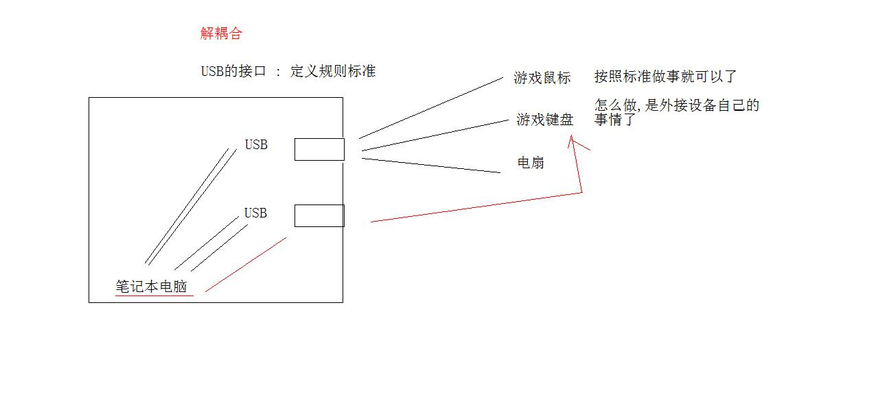
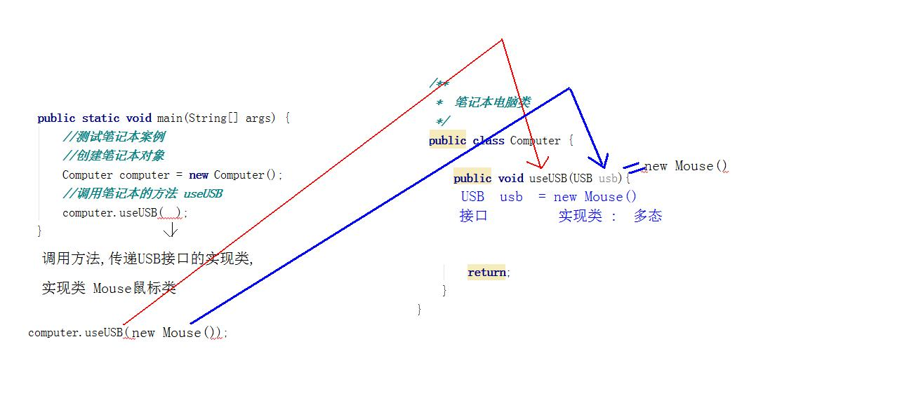
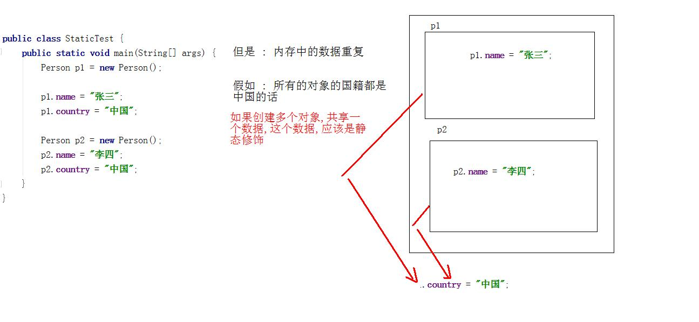
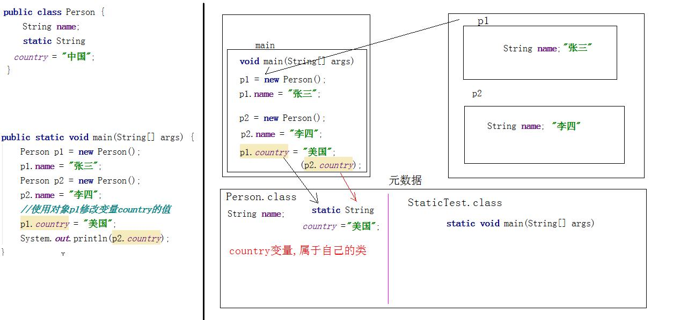

# day11面向对象接口

- 学习目标
  - 接口的多继承
  - 实现类实现接口后,还是抽象类
  - 接口的规则体系案例
  - static静态修饰符
  - static内存表现
  - main方法的定义解析
  - 四大权限修饰符
  - final修饰符
  - 内部类
  - 匿名内部类

## 1. 接口

### 1.1 接口之间的关系

  类和类之间是继承关系(单继承),类和接口之间是实现关系(多实现implements),接口和接口之间是继承关系,支持多继承,一个接口可以同时继承多个接口.  `interface A extends B,C,D{}`

### 1.2 实现类还是抽象类

  实现类实现接口,重写一部分抽象方法,实现类还是一个抽象类

```java
public interface A {
    public abstract void a1();
    public abstract void a2();
}
```

```java
public abstract class B implements A {
    public  void a1(){

    }
   // public abstract void a2();
}
```

### 1.3 接口规则案例



```java

/**
 *  笔记本电脑类
 */
public class Computer {
    /**
     *  笔记本电脑,通过USB接口,使用外接设备
     *  方法定义,实现设备的使用
     *  返回值类型 : 这个方法经过运算后的结果的数据类型
     *  参数 : 其实方法的参数,是方法运算过程中的未知数据,才是参数
     *
     *  笔记本电脑,通过USB接口,使用外接设备 这个功能的未知数据,就是外接设备
     *  核心 : 未知设备,都有共同特性 : 满足接口规则
     *
     *  问题 : 这个方法调用 : 传递他什么
     *  参数是引用类,要传递对象,传递接口实现类对象
     */
    public void useUSB(USB usb){
//        USB usb =  new Mouse();
        //接口引用调用方法
        usb.start();
        usb.end();
    }
}
```

```java
/**
 *  键盘类 : 满足接口标准
 */
public class KeyBoard implements USB{
    @Override
    public void start() {
        System.out.println("键盘工作");
    }

    @Override
    public void end() {
        System.out.println("键盘停止工作");
    }
```

```java
/**
 *  鼠标类 : 接入USB接口工作
 *  满足接口的规则 : 程序中就是实现接口
 */
public class Mouse implements USB{
    @Override
    public void start() {
        System.out.println("鼠标打开开关,按键,滚轮");
    }

    @Override
    public void end() {
        System.out.println("开关关了");
    }
}
```

```java
/**
 *  定义的USB接口 : 规则指定
 *  接口的规则 : 程序中的抽象方法
 */
public interface USB {
    //设备开始工作
    public abstract void start();
    //设备结束工作
    public abstract void end();
}
```

```java
public class USBTest {
    public static void main(String[] args) {
        //测试笔记本案例
        //创建笔记本对象
        Computer computer = new Computer();
        //调用笔记本的方法 useUSB
       /* Mouse m = new Mouse();
        computer.useUSB(m);*/
        computer.useUSB( new Mouse() );

        //调用笔记本的方法,传递键盘对象 (USB接口实现类对象)
        computer.useUSB( new KeyBoard());
    }
}
```



## 2. 静态修饰符

  static修饰符 : 最早出现在main方法中.只能修饰成员,不能写在方法的内部,被static修饰的成员,静态成员变量和静态的成员方法.

### 2.1 静态修饰成员变量

  static 修饰的成员变量,是被所有的对象共享的数据.没有被static修饰的成员变量,是每个对象的独享数据或者是特有数据.



```java
public class Person {
    String name;
    static String country = "中国";
}
```

```java
public class StaticTest {
    public static void main(String[] args) {
        Person p1 = new Person();
        p1.name = "张三";
        Person p2 = new Person();
        p2.name = "李四";
        //使用对象p1修改变量country的值
        p1.country = "美国";
        System.out.println(p2.country);
    }
}
```

### 2.2 静态内存

- 静态成员内存的特点
  - 静态成员跟随自己的类进入到元数据区(静态区域)
  - 静态成员属于自己的类,不属于对象
  - 静态成员进入内存后,赋默认值
  - 静态成员变量的初始化实际早于对象



### 2.3 静态成员的调用方式

  静态的内存图中,已经很明白了,静态属于自己的类,不是对象,静态的调用方式应该是`类名.静态成员`

```java
Person.country ;//调用静态成员
```

```java
public static void main(String[] args) {
    System.out.println(Person.country);
    Person p1 = new Person();
    p1.name = "张三";
    Person p2 = new Person();
    p2.name = "李四";
    //使用对象p1修改变量country的值
    Person.country = "美国";
    System.out.println(Person.country);
}
```

> 静态的调用方式是两种 : 类名调用,对象调用. 非静态成员调用只能对象.
>
> 静态成员调用方式只有类名.    非静态成员只能对象.   对象.静态调用方式,会被javac编译为类名调用.

### 2.4 静态方法

  静态方法直接类名调用. 静态方法中不能直接使用非静态成员.

  为什么不能调用非静态成员

> 静态是先人,非静态是后人. 静态出现在内存的时间早于非静态

```java
public class Person {
    String name;
    static String country = "中国";

    /**
     * 静态方法
     */
    public static void eat(){
        System.out.println("人在吃饭" + country);
        System.out.println(name); //错误写法,不允许
    }
}
```

> 静态内存优先于对象,在静态的方法中不能使用this和super

### 2.5 main方法

```java
public static void main(String[] args){
    
}
```

- main方法详解
  - public 最大权限 : main方法的调用者是JVM
  - static 无需对象,被类名直接调用,JVM启动的时候使用类名.main启动程序
  - void 无返回值,调用者是JVM,方法的返回值都是返回给调用者,JVM不需要返回值,没有意义
  - main 固定方法名称
  - args  字符串的数组,JVM调用方法main必须传递参数,后期对JVM设置参数

### 2.6 什么时候定义静态

- 静态成员变量 : 具体功能具体分析 .
  - 当你需要定义一个类的时候,分析这个类new出来的对象,是否存在共享数据,如果有共享数据,应该定义为静态变量
- 静态成员方法 :
  - 当你类中的方法,没有使用过非静态成员你的时候,应该定义为静态.

## 3. 四大权限

  四大权限 public protected default private

|              | private | default | protected | public |
| ------------ | ------- | ------- | --------- | ------ |
| 同一类       | OK      | OK      | OK        | OK     |
| 同一包       | NO      | OK      | OK        | OK     |
| 不同包子类   | NO      | NO      | OK        | OK     |
| 不同包非子类 | NO      | NO      | NO        | OK     |

- 受保护权限  protected
  - 权限的成员,为子类提供使用
  - Object类是所有类的父类,类中的方法权限有public,protected
  - 关键的方式受保护权限的方法只能是 子类中super调用!!
  - 子类对象不能调用,不出子类

## 4. final修饰符

  final修饰符是最终的意思,不可改变.final可以修饰类,修饰方法,修饰成员变量,修饰局部变量.

### 4.1 final修饰类

  被final修饰的类,称为最终类,不能被其他的类继承,无子类. 太监类.

  学过的final类有哪些, String,System,Scanner.

```java
public final class A{} //这个类A,不能出现子类,如果继承,直接报错
public class B extends A{} //错误,编译错误,最终类不能继承
```

### 4.2 final修饰方法

  被final修饰的方法,最终方法,不能被子类重写,和调用无关.

  一个类中的部分方法很完美,但是另一部分方法有待完成,设计为两个部分.完美的方法就是final   

```java
public class A{
    public final void a(){} //方法不能被子类重写
}
public class B extends A{
    public void a(){} //最终方法,不能重写
}
```

### 4.3 final修饰局部变量

  变量定义在方法的内部,是局部变量, 被final修饰后,一次赋值,终身不改变,锁死了变量的值,看做是常量.

- final修饰的基本类型,锁死值
- final修饰的引用类型,锁死内存地址 (引用类型中的成员不受影响)
- final修饰了方法的参数,调用者传递值后,方法的参数值就锁死

```java
public static void main(String[] args) {
    /**
    *   Student student 对象存储的是内存地址
    *   final修饰后,固定住的,不可改变是student变量保存的地址
    *   但是,Student对象中的成员,不受影响
    */
    final  Student student = new Student();
    student.age = 20;
    student.age = 30;
    System.out.println(student.age);

    final int[] arr = {1,2,3};//arr变量的值,固定为内存地址,不可改变
    arr[1] = 200;

    show(5);
    }

    public static void show(final int x){
    	x = 6; //final修饰,不可改变,报错
    }
}
```

### 4.4 final修饰成员变量

  成员变量的定义位置,是在类中,方法外面.成员变量在内存中有默认值.final修饰成员变量的时候,锁住的不是内存默认值,而是我们程序人员手动的赋值.

- 成员变量赋值,可以定义直接写值 ` int age = 0;`
- 成员变量赋值,可以使用构造方法 `public Student(int age){this.age=age;}`
- 成员变量赋值,可以使用set方法完成
  - final修饰的成员变量,可以构造方法赋值,不能set方法赋值
  - 构造方法在new对象的时候,执行一次,仅仅一次
  - 可set方法,反复执行!!

```java
public class Student {
    final int age ;

    public Student (int age ){
        this.age = age;
    }

   /*public void setAge(int age){
       this.age = age;
   }*/
}
```

## 5. 代码块

### 5.1 静态代码块

  写在类中方法外面 : static{} 

> 静态代码块的执行时机 : 只要使用了这个类的成员(new对象,调用静态方法,静态变量),静态代码块就会执行,而且就一次

  后面的课程会自己写静态代码块 : 数据库连接池 (C3P0,Druid)

  JDBC注册数据库驱动程序,使用代码块

### 5.2 构造代码块

  写在类中方法外面的 {}, 创建对象的时候运行,new一次,运行一次

### 5.3 局部代码块

  写在方法内部的 {}  局部代码块,没有用

## 6. 对象的初始化过程(子类和父类)

- 父类.class文件先进入内存
- 子类.class文件再进入内存
- 初始化父类的静态成员(变量,代码块,方法)
- 初始化子类的静态成员
- 运行父类的静态代码块
- 运行子类的静态代码块
- 运行父类的构造代码块
- 运行父类的构造方法
- 运行子类的构造代码块
- 运行子类的构造方法

## 7. 内部类

  概述 : 所谓内部类,就是在一个类的内部,定义了另外的一个类

```java
class A{ //外部类,封闭类
    class B{} //内部类,嵌套类
}
```

  对象是生活中的存在的事物,一个事物中还存在着另一个具体的事物

```java
class 大楼{
    class 电梯{}
}
```

### 7.1 成员内部类

  成员内部类,是一个类定义在了另一个类的成员位置.这个内部类可以使用成员修饰符,public static final private .

  对于内部来说 : 可以直接使用外部类的成员,如果外部类要使用内部类的成员,必须要创建对象.

> //公式 : 外部类名.内部类名 = new 外部类对象().new 内部类对象()

```java
//外部类
public class Outer {

    public void outer(){
        System.out.println("外部类的方法outer");
    }

    //内部类
    public class Inner{
       public void inner(){
           System.out.println("内部类的方法inner");
       }
    }
}
```

```java
public static void main(String[] args) {
    //调用内部类的方法inner()
    Outer.Inner oi = new Outer().new Inner();
    oi.inner();
}
```

问题 : 内部类Inner,编译后有class文件吗?有class文件,名字是外部类$内部类

内部类也是类,继承Object,可以实现接口

> 内部类是静态的调用方式 : 外部类名.内部类名 变量名 = new 外部类.内部类()

### 7.2 局部内部类

  局部内部类 : 要定义在方法里面. 方法里面是局部位置,不能使用成员修饰符,权限,静态不能用

```java
class A{
    public void a(){
        class B{} //局部内部类
    }
}
```

```java
public class Outer {
    /**
     *  Inner类,是方法Outer的局部
     *  依然方法,才能被外界访问
     */
    public void outer(){
        class Inner{
            public void inner(){
                System.out.println("局部内部类的方法!!");
            }
        }
        //方法,建立对象
        Inner inner = new Inner();
        inner.inner();
    }
}
```

```java
public static void main(String[] args) {
    //调用内部类的方法inner()
    //直接调用,不能调用
    Outer outer = new Outer();
    outer.outer();
}
```

> 局部内部类,访问局部变量,变量必须final修饰

### 7.3 匿名内部类

  匿名内部类,就是没有名字的内部类,只能写在方法中,为了简化代码书写.

  简化 : 实现类,实现接口,重写方法,创建对象. 或者是子类继承父类,重写方法,创建对象.代码上少内容.

- 匿名内部类使用的前提 :

  - 必须有接口实现,或者是类的继承

  - 格式 : 

    ```java
    new 接口或者父类(){
        //重写抽象方法
    };
    格式 == 实现类,实现接口,重写方法,创建对象
    ```

  ```java
  public interface MyInter {
      public abstract void inter();
      public abstract void inter2();
  }
  ```

  ```java
  public class InnerClassTest {
      public static void main(String[] args) {
          //匿名内部类,简化书写,不写实现类
          //同时调用多个重写方法
          /*
           *  new MyInter(){}; 是接口实现类的匿名对象
           * 多态 : 接口 变量 = 实现类对象
           */
         MyInter my =  new MyInter(){
  
              @Override
              public void inter() {
                  System.out.println("实现类实现接口重写方法");
              }
  
              @Override
              public void inter2() {
                  System.out.println("实现类实现接口重写方法2222");
              }
          };
         my.inter();
         my.inter2();
      }
  }
  ```

## 8. 非法修饰符组合

  非法的修饰符的组合,主要说的是抽象abstract

- abstract和private就是非法组合,抽象方法要重写,private不能继承
- abstract和final就是非法组合,抽象方法要重写,final修饰不能重写
- abstract和static就是非法组合,静态方法类名直接调用


