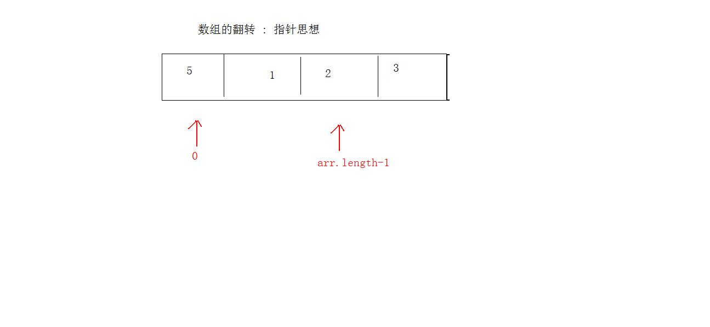
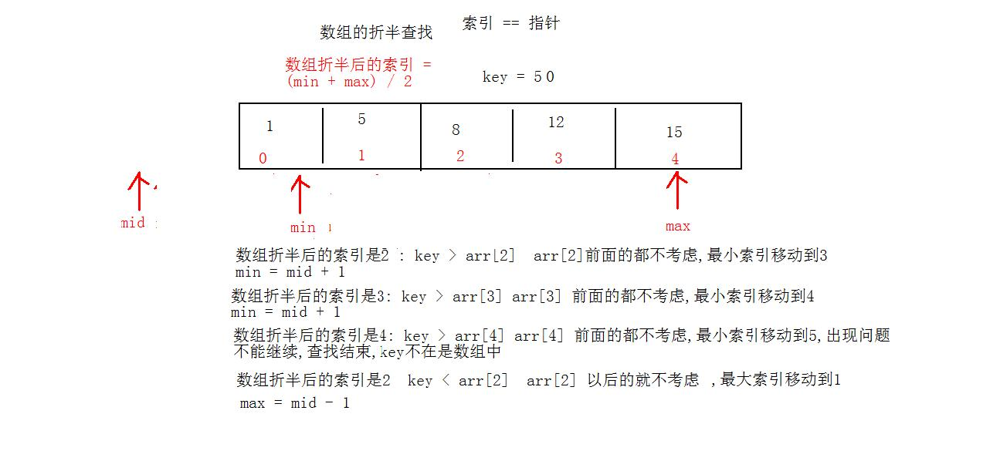
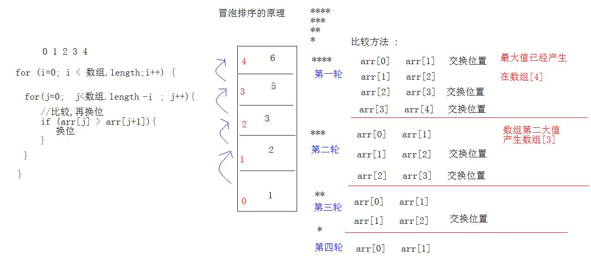

# day13 常用类 

- 学习目标
  - StringBuilder类的方法

  - 方法调用链

  - StringBuilder和String的互转

  - System类

  - Math类

  - 数组相关操作

    - 数组的翻转
    - 数组的最值
    - 数组的扩容
    - 数组二分查找
    - 冒泡排序
    - 直接选择排序

  - 字符串相关操作

    - 字符串翻转
    - 自定义trim
    - 字符串出现的次数
    - 字符出现的次数
    - 哪个字符出现的最多

## 1. StringBuilder类的常用方法

-  StringBuilder append(任意类型) 参数追加成字符串,无论参数写的是什么,变成字符串.相当于是字符串里面的 + 运算

 ```java
  public static void builderAppend(){
      StringBuilder builder = new StringBuilder();
      //方法append追加字符串
      builder.append(100);
      builder.append(5.8);
      builder.append(true);
      System.out.println("builder = " + builder);
  }
  ```

  - 方法调用链, 链式编程 :

    链式编程 : 保证一个方法的返回值是一个对象,再使用这个对象调用的调用方法 :`对象.方法().方法().方法()......`

    ```java
    public static void builderAppend2(){
        StringBuilder builder = new StringBuilder();
        //方法append() 返回值是StringBuilder
        //return this 返回值是this (谁调用,我是谁)
        builder.append("hehe").append(false).append(1.5).append(1); //执行的结果,是builder对象,继续使用builder对象调用方法
        System.out.println("builder = " + builder);
    }
    ```

- StringBuilder insert(int 索引, 任意类型) 可以将任意类型的参数,插入到字符串缓冲区,指定索引.

  ```java
  /**
       * StringBuilder类的方法insert,指定位置,插入元素
       */
  public static void builderInsert(){
      StringBuilder builder = new StringBuilder();
      builder.append("bcdef");
      //指定的索引上,添加字符串,原有字符,顺延
      builder.insert(2,"QQ");
      System.out.println("builder = " + builder);
  }
  ```

- StringBuilder类的其它方法

  - int length() 返回字符串缓冲区的长度
  - StringBuilder delete(int start,int end)删除缓冲区中的字符,包含开头索引,不包含结束索引
  - void setCharAt(int 索引,char ch)修改指定元素上的字符
  - StringBuilder reverse() 翻转字符串

### 1.1 StringBuilder对象和String对象的互转

- String对象转成StringBuilder对象 String --> StringBuilder
  - StringBuilder类的构造方法 StringBuilder(String str)
  - append方法  append(String str)

```java
  /**
     * String -> StringBuilder
     */
    public static void stringToStringBuilder(){
        //构造方法
        StringBuilder builder = new StringBuilder("abc");
        //对象的方法append
        builder.append("hello");
    }
```


- StringBuilder对象转成String对象  StringBuilder ->String
  - StringBuilder的方法toString()
  - String类的构造方法

```java
    /**
     *  StringBuilder -> String
     */
    public static void stringBuilderToString(){
        StringBuilder builder = new StringBuilder();
        builder.append("我是字符串的缓冲区");
        //builder对象转成String对象,调用builder对象的方法 toString()
        String str = builder.toString();
        System.out.println(str);

        //String类的构造方法
        String s = new String(builder);
        System.out.println(s);
   }
```

## 2. System类

  System系统类 : 定义在java.lang包中

  定义了大量常用的字段(成员变量)和方法,该类不能实例化对象,不能new,类中的成员全部是静态修饰,类名直接调用.

> 全部静态成员,无需对象创建,类名调用. 构造方法private修饰

### 2.1 System类的方法

- static long currentTimeMillis() 返回自1970年1月1日,午夜零时,到你程序运行的这个时刻,所经过的毫秒值 ,  1000毫秒=1秒

  ```java
  /**
  * static long currentTimeMillis()
  * 返回自1970年1月1日,午夜零时,到你程序运行的这个时刻,所经过的毫秒值 ,
  * 1000毫秒=1秒
  */
  public static void systemCurrentTimeMillis(){
      long timeMillis = System.currentTimeMillis();
      System.out.println("timeMillis = " + timeMillis); 
  }
  ```

- static void arrayCopy( Object src,int srcPos,Object dest, int destPos,int length  )复制数组的元素.

  - src : 要赋值的数据源,源数组
  - srcPos : 源数组的开始索引
  - dest : 要复制的目标数组
  - destPos : 目标数组的开始索引
  - length : 要复制的元素个数

```java
    public static void systemArraycopy(){
        int[] src = {1,3,5,7,9};
        int[] dest = {2,4,6,8,0};
        //数组元素的赋值 : src数组中的3,5 复制到dest数组中0索引开始
        System.arraycopy(src,1,dest,0,2);
        for(int x = 0 ;  x < src.length ;x++ ){
            System.out.println(dest[x]);
        }
    }
```

-  static Properties getProperties() 返回当前的操作系统属性

```java
    /**
     *  static Properties getProperties() 返回当前的操作系统属性
     *  System.getProperty(String 键名)
     */
    public static void systemGetProperties(){
        Properties properties = System.getProperties();
        System.out.println(properties);
        String str = System.getProperty("os.name");
        System.out.println(str);
    }
```

## 3. Math类

- static double PI  圆周率
- static double E 自然数的底数

- static int abs(int a) 返回参数的绝对值 

- static double ceil(double d)返回大于或者等于参数的最小整数
- static double floor(double d)返回小于或者等于参数的最大整数
- static long round(double d)对参数四舍五入
- static double pow(double a,double b ) a的b次幂
- static double random() 返回随机数 0.0-1.0之间
- static double sqrt(double d)参数的平方根

```java
public static void main(String[] args) {
// System.out.println("Math.PI = " + Math.PI);
//  System.out.println("Math.E = " + Math.E);

//static int abs(int a) 返回参数的绝对值
System.out.println(Math.abs(-6));

//static double ceil(double d)返回大于或者等于参数的最小整数
System.out.println(Math.ceil(12.3)); //向上取整数

//static double floor(double d)返回小于或者等于参数的最大整数
System.out.println("Math.floor(5.5) = " + Math.floor(5.5));//向下取整数

//static long round(double d)对参数四舍五入
long round = Math.round(5.5); //取整数部分  参数+0.5
System.out.println("round = " + round);

//static double pow(double a,double b ) a的b次幂
System.out.println("Math.pow(2,3) = " + Math.pow(2, 3));

//static double sqrt(double d)参数的平方根
System.out.println("Math.sqrt(4) = " + Math.sqrt(3));

// static double random() 返回随机数 0.0-1.0之间
for(int x = 0 ; x < 10 ; x++){
System.out.println(Math.random()); //伪随机数
}

}
```

## 4. 数组的相关操作

### 4.1 数组的翻转

  所谓的数组的翻转例子 : 原始数组 {1,2,3,4} 翻转后是 {4,3,2,1}

  数组的翻转不等于倒叙遍历

> 数组中元素位置的交换,数组的换位,借助一个变量
>
> 核心问题 : 数组中最远端的元素交换位置上



```java
/**
* 数组的翻转
*/
public static void arrayReverse(){
    int[] arr = {1,2,7,5,0,22,3,4};
    //最远的元素,交换位置 (使用第三方变量)
    for(int min = 0 , max = arr.length -1;  min < max ; min++ ,max-- ){
    int temp = arr[min] ;//记录数组的最小索引上的元素
    arr[min] = arr[max] ; //数组最大索引上的元素,赋值到最小元素的位置上
    arr[max] = temp;
    }
    //遍历看结果
    for (int i = 0; i < arr.length; i++) {
    	System.out.println(arr[i]);
    }
}
```

### 4.2 数组的二分(折半)搜索法

-  数组的基本搜索法 : 判断一个元素是否存在于数组中
  -  遍历数组,查找就可以
  -  二分搜索法提高效率 : 前提是数组必须是有序的.



```java
 /**
     * 数组的二分搜索法
     * 返回查找的元素在数组中的索引,没有呢返回负数
     */
    public static int binarySearch(int[] arr,int key){
        int min = 0 ; //数组的最小索引
        int max = arr.length - 1; //数组的最大索引
        int mid ;//数组折半后的,中间位置的索引
        //循环折半,次数不定,while循环
        //条件,,最小索引不能超过最大索引
        while (min <= max){
            //折半
            mid = (min + max) / 2;
            //折半后的mid作为索引,取出数组的元素,和关键字比较
            if (key > arr[mid])
                //移动最小索引
                min = mid + 1;
            else if (key < arr[mid])
                //移动最大索引
                max = mid - 1;
            else {
                //查找到了,返回索引
                return mid;
            }
        }
        return -1;
    }
```

### 4.3 数组的排序

  在无序的数组中,对元素进行排序,默认都是升序. 效率

> 数组排序 : 元素在内存中的位置交换,效率最低.
>
> 选择排序,冒泡 (选择优化),插入排序,折半排序,希尔排序,快速排序

#### 4.3.1 冒泡排序 (bubble)

> 核心思想 : 元素之间比较换位. 冒泡排序的比较方式 : **相邻元素比较**



```java
/**
* 排序实现
*/
public static void bubbleSort(int[] arr){
    //外循环,次数固定的
    for (int i = 0 ; i < arr.length ; i++){
    	//内循环,每次都要进行递减操作
    	for (int j = 0 ; j < arr.length - i - 1; j++){ //j 0-6
    		//比较换位
    		if (arr[j] > arr[j + 1]){
    			int temp = arr[j];
    			arr[j] = arr[j+1];
    			arr[j+1] = temp;
    		}
    	}
    }
}
```

#### 4.3.2 选择排序优化

> 优化 : 不是每次比较完成都要换位,获取到最值,用这个最值在换位值

```java
    /**
     * 选择排序的优化
     * 最值获取:
     *   利用元素
     *   用索引
     */
    public static void selectSort(int[] arr){
        //获取数组的最值
        for (int i = 1 ; i < arr.length ;i++){
            //定义变量,保存数组的第一个元素
            int min = arr[i-1]; //[1-1  = 0]
            //定义记录最小值索引
            int minIndex = i-1;
            for(int j = i ; j < arr.length ; j++){
                if (min > arr[j]){
                    //记录的索引
                    minIndex = j;
                    //记录最小值
                    min= arr[j];
                }
            }
            //位置交换
            if (minIndex != (i-1)){
                int temp = arr[i-1];
                arr[i-1] = arr[minIndex];
                arr[minIndex] = temp;
            }
        }
    }
```

### 4.4 Arrays工具类

  java.util包中定义了类Arrays,数组操作的工具类.类不能创建对象,直接静态调用

- Arrays类的静态方法
  - static void sort(数组) 对数组进行升序排列 (目前为止效率最快)
  - static int binarySearch(数组,查找的关键字) 对数组 进行二分搜索法
  - static void fill(数组,填充的元素)
  - static String toString(数组) 返回数组字符串表现形式
  - static List asList(T...t) 元素转成List集合

```java
    public static void main(String[] args) {
        int[] arr = {1,5,9,10,15,22,27,30};
        //arrayToString(arr);
       // arraySort(arr);
       // System.out.println(Arrays.toString(arr));

        int index = arrayBinarySearch(arr,5);
        System.out.println(index);

        arrayFill();
    }
    /**
     * fill填充数组
     */
    public static void arrayFill(){
        int[] arr = {1,2,3,4,5};
        Arrays.fill(arr,6);
        System.out.println(Arrays.toString(arr));
    }

    /**
     * static int binarySearch(数组,查找的关键字) 对数组 进行二分搜索法
     * 返回元素在数组中出现的索引
     * 如果元素不存在,返回 (-插入点-1)
     * key : 放在数组中,保证有序的
     */
    public static int arrayBinarySearch(int[] arr,int key){
        int index = Arrays.binarySearch(arr, key);
        return index;
    }

    /**
     *  static void sort(数组) 对数组进行升序排列 (目前为止效率最快)
     */
    public static void arraySort(int[] arr){
        Arrays.sort(arr);
    }

    /**
     * static String toString(数组) 返回数组字符串表现形式
     * toString内部自动遍历数组
     */
    public static void arrayToString(int[] arr){
        String str =  Arrays.toString(arr);
        System.out.println(str);
    }
```

## 5. 字符串相关操作

### 5.1 字符串翻转

>  数组可以转成字符串,字符串也能转成数组 (翻转数字)

```java
 /**
     * 翻转字符串的另一个实现
     */
    public static String  stringReverse2(String str){
        //str转成StringBuilder
        //StringBuilder builder = new StringBuilder(str);
       // builder.reverse();
        //字符串缓冲区转成字符串返回
        //return builder.toString();
       return   new StringBuilder(str).reverse().toString();
    }

    /**
     * 翻转字符串
     * 传递字符串,返回翻转后的字符串
     */
    public static String stringReverse(String str){
        //字符串转成数组
        char[] chars = str.toCharArray();
        //翻转数组
        for(int min = 0 ,max = chars.length - 1; min <= max ; max--,min++){
            char temp = chars[min];
            chars[min] = chars[max];
            chars[max] = temp;
        }
        //数组转成字符串
       return new String(chars);
    }
```

### 5.2 自定义trim()

  去掉字符串两边的空格

   "  abcd  efg     " ==>"abcd  efg"

```java
    /**
     *  自定义的方法trim()
     *  "    abcde  fg  "
     *  "abcde  fg  "
     */
    public static String myTrim(String str){
        //去掉字符串开头的空格,方法替换
        str = str.replaceFirst(" +","");
        //判断字符串,是不是以空格结尾
        while (str.endsWith(" ")){ //"abcde  fg1"
            //截取字符串
            str = str.substring(0,str.length()-1);
        }
        return str;
    }
```

### 5.3 字符出现的次数

  要求 : 指定字符串 "asdfg3435erAAEExc" , 统计处,小写字母,大写字母,数字,各自出现了多少次,不考虑其它字符.

> 统计的案例 : 计数器思想  变量++

实现思想 : **字符串换成数组,取出每个元素,分别统计**  ASCII码熟悉

```java
    /**
     *  统计字符串中字符和数字出现的次数
     */
    public static void stringCount(String str){
        if (str == null)
            return;
        //定义三个计数器变量
        int upper = 0 , lower = 0 , number = 0;
        //字符串转成数组
        char[] chars = str.toCharArray();
        for (int i = 0; i < chars.length; i++) {
            //取出每个元素
            char ch = chars[i];
            //判断ch字符的ASCII范围
            if ( ch >= 'A' && ch <= 'Z')
                //大写字母
                upper ++;
            else if ( ch >= 'a' && ch <= 'z')
                //小写字母
                lower ++;
            else if (ch >= '0' && ch <= '9'){
                //数字
                number ++;
            }
        }
        System.out.println("大写字母:"+upper);
        System.out.println("小写字母:"+lower);
        System.out.println("数字:"+number);
    }
```


毅