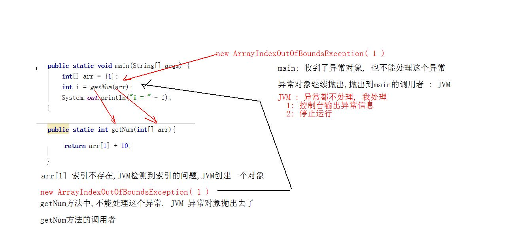

# day14 常用类 

- 学习目标
  - 字符串出现的次数
  - 哪个字符出现的最多
  - 大数运算类

  - Date日期类

  - Calendar日历类

  - LocalDate本地日期类

  - LocalTime本地时间类

  - LocalDateTime本地时间日期类

  - ZonedDateTime时区类

  - Period和Duration类

  - DateTimeFormatter时间日历格式化类

## 1. String相关的内容

### 1.1 字符串出现的次数

  字符串A,另一个字符串B,计算B字符串在A字符串中出现几次

  例子 :  dsabdnabdsnabeabiwpabekabd   **ab**

- 实现过程 
  - 对字符串进行索引查找 indexOf
  - 找到的字符串的索引记录,进行字符串的截取
  - 直到找打到未知, indexOf方法是-1
  - 一旦找到了,计数器++

```java
 /**
     * @param str  原始字符串
     * @param sub  要查找的字符串
     * @return  出现次数
     */
    public static int stringCount(String str ,String sub){
        //定义变量,计数器
        int count = 0;
        //定义变量,记录字符串查找后的索引
        int index = 0;

        //对字符串出现的位置,进行查询
        //反复查找,使用循环while
        //循环条件就是indexOf方法返回-1
        while ( (index=str.indexOf(sub))  != -1 ) {
            //执行了循环index !=-1 字符串出现了
            count ++;
            //截取字符串,开始索引 index+被查找字符串的长度
            str = str.substring(index + sub.length());
        }

        return count;
    }
```

### 1.2 哪个字符出现的最多

  要求 : 指定字符串自能是(小写)字母 abeegewff , 计算出哪个字符出现的次数最多

  限定字符串中字母只能有26个

> 找每个字符各自出现多少次,找出最大值

- 实现过程 :
  - 字符串转成数组 (单个字符操作)
  - 创建长度为26的数组,计数器使用
  - 取出数组中的字符, (字符-97)对应数组的索引,计数器++
  - 找出数组中的最大值

```java
    /**
     * 查找字符串中,哪个字符出现的次数最多
     * @param str  要查找字符串
     * @return  返回出现次数最多的字符
     */
    public static char charCount(String str){
        //字符串转成数组
        char[] chars = str.toCharArray();
        //定义26长度的数组,保存每个字符出现的次数
        int[] count = new int[26];
        //遍历数组
        for (int i = 0 ; i < chars.length; i++){
            //取出单个字符
            char ch = chars[i];
            //字符 - 97 作为数组的索引使用 (数组,计数器数组)
            count[ ch - 97 ] ++;
        }
        //System.out.println("Arrays.toString(count) = " + Arrays.toString(count));
        //取出count数组中的,最大值的索引
        int index = 0 ; //数组最大值索引
        int max = count[0];
        for(int i = 1 ; i < count.length ; i++){
            if (max < count[i]){
                index = i;
                max = count[i];
            }
        }
       //index索引,正好和字符相差97
        return (char) (index+97);
    }

```

## 2. 大数运算

  基本数据类型long ,double 都是有取值范围.遇到超过范围数据怎么办.引入了大数运算对象. 超过取出范围了,不能称为数字了,称为对象

  java.math包 : BigInteger大整数, BigDecimal大浮点(高精度,不损失精度)

- BigInteger类使用,计算超大整数的
  - 构造方法直接new BigInteger(String str) 数字格式的字符串,长度任意
  - BigInteger  add(BigInteger b)计算两个BigInteger的数据求和
  - BigInteger  subtract(BigInteger b)计算两个BigInteger的数据求差
  - BigInteger  multiply(BigInteger b)计算两个BigInteger的数据求乘积
  - BigInteger  divide(BigInteger b)计算两个BigInteger的数据求商

```java
public static void main(String[] args) {
        //创建大数据运算对象
        BigInteger b1 = new BigInteger("2345673456786554678996546754434343244568435678986");
        BigInteger b2 = new BigInteger("8765432345678987654323456787654");

        //b1+b2 求和
        BigInteger add = b1.add(b2);
        System.out.println("add = " + add);

        //b1 - b2 求差
        BigInteger subtract = b1.subtract(b2);
        System.out.println("subtract = " + subtract);

        //b1 * b2 求积
        BigInteger multiply = b1.multiply(b2);
        System.out.println("multiply = " + multiply);
        
        //b1 / b2 求商
        BigInteger divide = b1.divide(b2);
        System.out.println("divide = " + divide);
    }
```

- BigDecimal 类使用,计算超大浮点数
  - 构造方法,和BigInteger一样
  - 方法 + - * 和BigInteger一样
  - BigDecimal  divide除法运算
  - divide(BigDecimal  big,int scalar,int round)方法有三个参数
    - big 被除数
    - scalar 保留几位
    - round 保留方式
  - 保留方式 : 该类的静态成员变量
    - BigDecimal.ROUND_UP  向上+1
    - BigDecimal.ROUND_DOWN 直接舍去
    - BigDecimal.ROUND_HALF_UP 四舍五入

```java
public static void main(String[] args) {
    BigDecimal b1 = new BigDecimal("3.55");
    BigDecimal b2 = new BigDecimal("2.12");
    /* System.out.println(b1.add(b2));
    System.out.println(b1.subtract(b2));
    System.out.println(b1.multiply(b2));*/

    //b1 / b2
    /**
    * 1.674528301886792
    * 除不尽,出现异常
    * 高精度运算,不能产生无序循环小数,无限不循环
    * 保留几位,怎么保留
    *
    * BigDecimal.ROUND_UP  向上+1
    * BigDecimal.ROUND_DOWN 直接舍去
    * BigDecimal.ROUND_HALF_UP 四舍五入
    */
    BigDecimal divide = b1.divide(b2,3,BigDecimal.ROUND_HALF_UP);
    System.out.println("divide = " + divide);
    }
```

## 3. 日期和日历类

### 3.1 Date

  表示当前的日期对象,精确到毫秒值. java.util.Date类

- 构造方法
  - 无参数构造方法 new Date()
  - 有long型参数的构造方法  new Date(long 毫秒值)

- Date类没有过时的方法
  - long getTime() 返回当前日期对应的毫秒值
  - void setTime(long 毫秒值) 日期设定到毫秒值上 

```java
    /**
     *  创建对象,使用有参数的构造方法
     */
    public static void date2(){
        Date date = new Date(0);
        System.out.println("date = " + date);
    }

    /**
     * 创建对象,使用无参数的构造方法
     */
    public static void date1(){
        Date date = new Date();
        //Tue Apr 13 10:33:40 CST 2021
        System.out.println("date = " + date);
    }
    /**
     *  getTime()
     *  setTime()
     */
    public static void date3(){
        Date date = new Date();
        //获取毫秒值
        long time = date.getTime();
        System.out.println(time);

        //设置日期
        date.setTime(0);
        System.out.println(date);
    }
```

### 3.2 Date类最重要内容

- 日期对象和毫秒值之间的相互转换
- 日期对象,转成毫秒值
  - new Date().getTime()
  - System.currentTimeMillis()
- 毫秒值转成日期对象
  - new Date(毫秒值)
  - new Date().setTime(毫秒值)

> 日期是特殊的数据,不能数学计算,但是毫秒值能!!
>
> `24*60*60*1000` 一天的毫秒值

### 3.3 日历类 Calendar

  日历类 : java.util.Calendar

  日历字段 : 组成日历的每个部分,都称为日历字段 : 年,月,日,时分秒,星期

  Calendar抽象类,不能建立对象,子类继承 : GregorianCalendar (格林威治)

#### 3.3.1 获取Calendar类的对象

  由于创建日历对象的过程非常的繁琐,考虑语言,时区...  Sun公司工程师开发了一简单获取对象的方式,不要自己new

- Calendar类定义了静态方法 : static Calendar getInstance() 返回的是Calendar 的子类的对象 GregorianCalendar 

#### 3.3.2 日历类的方法

- int get(int field) 返回给定日历字段的值
  - 日历中的任何数据,都是int类型
  - 参数是具体的日历字段,传递年,月,日
  - 日历字段的写法,看Calendar类的静态成员变量

```java
   /**
     * Calendar类的方法get()
     * 获取日历字段
     */
    public static void calendarGet(Calendar calendar){
        //Calendar calendar =  Calendar.getInstance();//返回子类对象
       /* int year = calendar.get(Calendar.YEAR);
        System.out.println(year);*/
        System.out.println( calendar.get(Calendar.YEAR)+"年" + (calendar.get(Calendar.MONTH) +1)+"月" +
                calendar.get(Calendar.DAY_OF_MONTH)+"日" + calendar.get(Calendar.HOUR_OF_DAY)+"点" +
                calendar.get(Calendar.MINUTE)+"分"+calendar.get(Calendar.SECOND)+"秒");
    }
```

- void set() 修改日历的值
  - set(int field,int value)field要修改的字段,value具体的数据
  - set(int,int,int) 传递年月日

```java
/**
* Calendar类的方法set()
* 设置日历字段
*/
public static void calendarSet(){
    Calendar calendar = Calendar.getInstance() ; //和操作系统时间一样
    //自己设置日历,传递了年月日
    //calendar.set(2021,5,30);

    //设置某一个字段
    calendar.set(Calendar.DAY_OF_MONTH,30);
    //调用calendarGet,输出日历
    calendarGet(calendar);
}
```

- add() 设置日历字段的偏移量
  - add(int field,int value) field要修改的字段,value具体的数据

```java
/**
     * Calendar类的方法add()
     * 设置日历字段的偏移量
     */
public static void calendarAdd(){
    Calendar calendar = Calendar.getInstance() ; //和操作系统时间一样
    //日历向后,偏移180天
    calendar.add(Calendar.DAY_OF_MONTH,180);
    calendarGet(calendar);
}
```

### 3.4 日期格式化

  自定义日期的格式 : 自己的喜好,定义日期的格式

#### 3.4.1 DateFormat日期格式化

  java.text.DateFormat : 类的作用是格式化日期的,但是抽象类不能建立对象,需要创建子类的对象, SimpleDateFormat

#### 3.4.2 SimpleDateFormat子类使用

- 构造方法: 带有String参数的构造方法
  - 参数字符串 : 日期格式化后的样子
  - 调用SimpleDateFormat类的父类方法format
  - String format(Date date)传递日期对象,返回字符串

```java
/**
* 日期格式化,自定义格式
*/
public static void format(){
    SimpleDateFormat sdf = new SimpleDateFormat("yyyy年MM月dd日 HH点mm分ss秒");
    String str = sdf.format(new Date());
    System.out.println(str);
}
```

- 字符串转成日期对象
  - SimpleDateFormat调用方法Date parse(String str)

```java
    /**
     * 字符串转成日期对象
     */
    public static void parse() throws ParseException {
        SimpleDateFormat sdf = new SimpleDateFormat("yyyy-MM-dd");
        /**
         *  dateString用户输入的日期
         *  转成Date对象
         *  前提 : 格式必须和SimpleDateFormat("格式一致")
         */
        String dateString = "2021-04-13";
        //sdf对象的方法parse
        Date date = sdf.parse(dateString);
        System.out.println("date = " + date);
    }
```

## 4. JDK8新的时间日期对象

### 4.1 LocalDate 本地日期

- 获取该类的对象,静态方法
  - static LocalDate now() 获取LocalDate的对象,跟随操作系统
  - static LocalDate of() 获取LocalDate的对象,自己设置日期
    - of方法中传递年月日 of(int year,int month,int day)

```java
/**
* LocalDate的静态方法获取对象
*/
public static void getInstance(){
    //静态方法now()
    LocalDate localDate = LocalDate.now();
    System.out.println("localDate = " + localDate);

    //静态方法of()设置日期
    LocalDate of =  LocalDate.of(2022,5,10);
    System.out.println("of = " + of);
}
```

- 获取日期字段的方法 : 名字是get开头
  - int getYear() 获取年份
  - int getDayOfMonth()返回月中的天数
  - int getMonthValue() 返回月份

```java
/**
* LocalDate类的方法 getXXX()获取日期字段
*/
public static void get(){
    LocalDate localDate = LocalDate.now();
    //获取年份
    int year = localDate.getYear();
    //获取月份
    int monthValue = localDate.getMonthValue();
    //获取天数
    int dayOfMonth = localDate.getDayOfMonth();
    System.out.println("year = " + year);
    System.out.println("monthValue = " + monthValue);
    System.out.println("dayOfMonth = " + dayOfMonth);
}
```

- 设置日期字段的方法 : 名字是with开头

  - LocalDate withYear(int year)设置年份

  - LocalDate withMonth(int month)设置月份

  - LocalDate withDayOfMonth(int day)设置月中的天数

  - > LocalDate对象是不可比对象,设置方法with开头,返回新的LocalDate对象

```java
/**
     * LocalDate类的方法 withXXX()设置日期字段
     */
public static void with(){
    LocalDate localDate = LocalDate.now();
    System.out.println("localDate = " + localDate);
    //设置年,月,日
    //方法调用链
    LocalDate newLocal = localDate.withYear(2025).withMonth(10).withDayOfMonth(25);
    System.out.println("newLocal = " + newLocal);
}
```

- 设置日期字段的偏移量, 方法名plus开头,向后偏移
- 设置日期字段的偏移量, 方法名minus开头,向前偏移

```java
 /**
     * LocalDate类的方法 minusXXX()设置日期字段的偏移量,向前
     */
    public static void minus() {
        LocalDate localDate = LocalDate.now();
        //月份偏移10个月
        LocalDate minusMonths = localDate.minusMonths(10);
        System.out.println("minusMonths = " + minusMonths);
    }
    /**
     * LocalDate类的方法 plusXXX()设置日期字段的偏移量,向后
     */
    public static void plus(){
        LocalDate localDate = LocalDate.now();
        //月份偏移10个月
        LocalDate plusMonths = localDate.plusMonths(10);
        System.out.println("plusMonths = " + plusMonths);
    }
```

### 4.2 Period和Duration类

### 4.2.1 Period 计算日期之间的偏差

- static Period between(LocalDate d1,LocalDate d2)计算两个日期之间的差值.
  - 计算出两个日期相差的天数,月数,年数

```java
public static void between(){
    //获取2个对象,LocalDate
    LocalDate d1 = LocalDate.now(); // 2021-4-13
    LocalDate d2 = LocalDate.of(2022,4,13); // 2022-6-15
    //Period静态方法计算
    Period period = Period.between(d1, d2);
    //period非静态方法,获取计算的结果
    int years = period.getYears();
    System.out.println("相差的年:"+years);
    int months = period.getMonths();
    System.out.println("相差的月:"+months);
    int days = period.getDays();
    System.out.println("相差的天:"+days);
}
```

### 4.2.2 Duration计算时间之间的偏差

- static Period between(Temporal d1,Temporal d2)计算两个日期之间的差值.


```java
 public static void between(){
        LocalDateTime d1 = LocalDateTime.now();
        LocalDateTime d2 = LocalDateTime.of(2021,5,13,15,32,20);
       // Duration静态方法进行计算对比
        Duration duration = Duration.between(d1, d2);
        // Duration类的对象,获取计算的结果
        long minutes = duration.toMinutes();
        System.out.println("相差分钟:" + minutes);

        long days = duration.toDays();
        System.out.println("相差天数:"+days);

        long millis = duration.toMillis();
        System.out.println("相差秒:" + millis);

        long hours = duration.toHours();
        System.out.println("相差小时:"+hours);
    }
```

### 4.2.3 DateTimeFormatter

  JDK8中的日期格式化对象 : java.time.format包

- static DateTimeFormatter ofPattern(String str)自定义的格式
- String format(TemporalAccessor t)日期或者时间的格式化
- TemporalAccessor  parse(String s)字符串解析为日期对象

```java
/**
* 方法parse,字符串转日期
*/
public static void parse(){
    //静态方法,传递日期格式,返回本类的对象
    DateTimeFormatter dateTimeFormatter =
    DateTimeFormatter.ofPattern("yyyy-MM-dd HH:mm:ss");
    String str = "2021-04-13 15:55:55";
    //dateTimeFormatter调用方法parse转换
    //返回接口类型,接口是LocalDate,LocalDateTime 都实现了该接口
    TemporalAccessor temporalAccessor = dateTimeFormatter.parse(str);
    //System.out.println(temporalAccessor);
    LocalDateTime localDateTime = LocalDateTime.from(temporalAccessor);
    System.out.println(localDateTime);
}

/**
* 方法format格式化
*
*/
public static void format(){
    //静态方法,传递日期格式,返回本类的对象
    DateTimeFormatter dateTimeFormatter =
    DateTimeFormatter.ofPattern("yyyy-MM-dd HH:mm:ss");
    //dateTimeFormatter对象调用方法format
    String format = dateTimeFormatter.format(LocalDateTime.now());
    System.out.println(format);
}
```

## 5. 基本数据类型对象包装类

  基本数据类型,一共有8种. 可以进行计算,但是功能上依然不够用,JDK提供了一套基本数据类型的包装类,功能增强,全部在lang包

| 基本数据类型 | 对应的包装类 |
| :----------: | :----------: |
|     byte     |     Byte     |
|    short     |    Short     |
|   **int**    | **Integer**  |
|     long     |     Long     |
|    float     |    Float     |
|    double    |    Double    |
|   boolean    |   Boolean    |
|     char     |  Character   |

> 基本数据类型的包装类的最重要功能 : 实现类基本数据类型和String的互转 
>

### 5.1 基本类型int变成Integer类的对象

- Integer类的构造方法
  - Integer(int a) int类型转成Integer对象
  - Integer(String s)字符串转成Integer对象,字符串必须纯数字格式
  - static Integer valueOf(int a) int类型转成Integer对象
  - static Integer valueOf(String s) 字符串转成Integer对象,字符串必须纯数字格式

```java
/**
* 创建Integer类的对象
* 构造方法,new
* static方法 valueOf
*/
public static void getInstance(){
    Integer i1 = new Integer(100);
    Integer i2 = new Integer("120");
    System.out.println(i1);
    System.out.println(i2);

    Integer i3 = Integer.valueOf(200);
    Integer i4 = Integer.valueOf("220");
    System.out.println(i3);
    System.out.println(i4);
}
```

### 5.2 String对象转成基本数据类型int

- static int parseInt(String str) 参数字符串转成基本类型,字符串数字格式.
- int intValue() Integer对象构造方法中的字符串,转成基本类型

```java
/**
* 字符串转成基本类型int
* 静态方法parseInt()
* 非静态方法 intValue()
*/
public static void stringToInt(){
    int i = Integer.parseInt("100");
    System.out.println(i+1);

    Integer integer = new Integer("2");
    int j = integer.intValue();
    System.out.println(j+1);
}
```

### 5.3 自动装箱和拆箱

- 自动装箱 : 基本数据类型自动转成引用类型 int -> Integer
- 自动拆箱 : 引用类型自动转成基本数据类型 Integer ->int

```java
public static void auto(){
    //自动装箱  int类型自动转成Integer对象
    //javac编译特效 Integer integer = Integer.valueOf(1000) 本质还是new Integer
    Integer integer = 1000;
    System.out.println(integer);

    //自动拆箱 Integer类型自动转成int类型
    //javac编译特点  integer + 1;  integer.intValue()返回int类型  + 1 = 1001
    //Integer integer2 = 1001 装箱
    Integer integer2 = integer + 1;
    System.out.println(integer2);
}
```

```java
/**
* 自动装箱和拆箱中的问题
*/
public static void auto2(){
    Integer i1 = 1000; //new Integer(1000)
    Integer i2 = 1000; //new Integer(1000)
    System.out.println("i1==i2::" + (i1 == i2) ); // F
    System.out.println(i1.equals(i2)); // T

    System.out.println("=====忧郁的分割线======");

    Integer i3 = new Integer(1);
    Integer i4 = new Integer(1);
    System.out.println("i3==i4::"+(i3 == i4));// F
    System.out.println(i3.equals(i4)); // T

    System.out.println("=====忧郁的分割线======");

    Integer i5 = 127;
    Integer i6 = 127;
    System.out.println("i5==i6::"+(i5 == i6)); //true  数据不要超过byte
}

```

## 6. 异常

  异常 : 程序在运行中出现的不正常现象就是异常.

### 6.1 异常继承体系

  一切都是对象,异常也是对象,JDK为异常定义了大量的类,类之间产生继承关系

  异常中的顶级父类 : 

-   java.lang.Throwable : 所有异常和错误的父类
  - java.lang.Error : 所有错误的父类
  - java.lang.Exception : 所有异常的父类
    - java.lang.RuntimeExeption : 所有的运行异常父类

> 错误: 程序中出现了错误,程序人员只能修改代码,否则不能运行
>
> 异常: 程序中出现了异常,可以把异常处理调用,程序继续执行

### 6.2 Throwable 的方法

- String toString() 返回异常信息简短描述  (控制台红色部分)
- String getMessage() 返回异常信息的详细描述
- void printStackTrace() 异常信息追踪到标准的错误流

### 6.3 异常的产生和默认的处理方式

- JVM对异常进行了处理 : 输出信息,结束程序



- 处理异常,没有异常,继续执行程序

