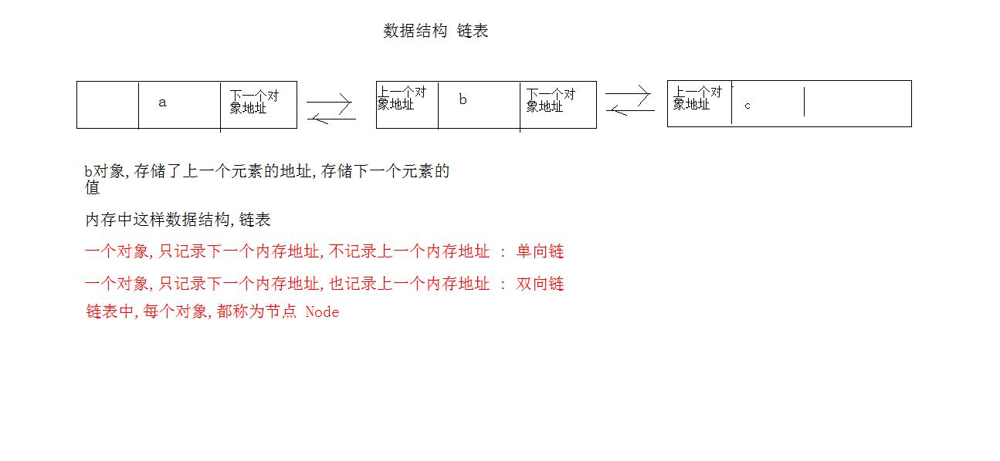

# day15 异常 集合 

- 学习目标
  - try catch 处理异常 
  - 多catch处理
  - throw和throws的使用
  - finally代码块
  - 自定义异常
  - 集合框架介绍
  - 集合的顶层接口Collection
  - 迭代器Iterator接口
  - 集合的接口List

## 1. 异常

   异常的知识点不好理解, 要求同学们学习异常,主要的目的记住使用格式.

### 1.1 try...catch异常处理

  try  catch的异常处理的格式写法 :

```java
try{
    被检测的代码
    可能发生异常的代码
}catch(异常类的类名  变量名){
    异常的处理方式 : 写什么都可以
    定义变量,创建对象,调用方法,循环,判断...
    只要写了catch,异常就被处理掉了
}
```

```java
public static void main(String[] args) {
        int[] arr = {1};
        //try  catch异常处理
        try {
            int i = getNum(arr);
            System.out.println("i = " + i);
        }catch (Exception ex){
            System.out.println("异常被处理掉");
        }
        System.out.println(111);
    }

    public static int getNum(int[] arr){
        return arr[1] + 10;
    }
```

### 1.2 多catch并行处理

  异常处理的代码中 :  try 可以跟随多个catch 

> 好处 : 不同的异常,可以区别对待,分开处理

```java
public static void main(String[] args) {
    /**
    *   myExec出现2个异常
    *   写2个catch分别捕获异常
    */
    try {
        	myExec(0);
        }catch (NullPointerException ex){
        	System.out.println("处理空指针异常");
        }catch (ArrayIndexOutOfBoundsException ex){
        	System.out.println("处理越界异常");
        }
    }

    /**
    * 定义方法,目的引发异常
    * 传递参数 : 对参数进行判断
    */
    public static void  myExec(int i){
    if ( i == 0){
        //引发空指针异常
        String s = null;
        int len = s.length();
    }else {
        //引发越界异常
        int[] arr = {};
        int a = arr[0];
    }
}
```

> 多个catch处理异常的时候,写法特别注意 : 如果catch中的异常类没有关系,先写后写没有区别, catch中的异常类有继承关系,**父类写在最下面**

### 1.3 throw和throws 关键字的使用

- throw关键字 : 只能写在方法内部, 关键字的后面跟随对象的创建
- throws关键字 : 只能写在方法的定义上,关键字后面跟随异常类名

```java
public static void main(String[] args) {
       /**
         *   getArea()调用方法,方法上有异常
         *   只能处理,不处理编译失败
         *   在main的方法上加throws 异常没有处理,交给JVM处理
         *   try catch处理
         */
    try {
        int area = getArea(-10);
        System.out.println(area);
    } catch (Exception e) {
        e.printStackTrace();
    }
}

/**
     * 功能: 计算正方形的面积
     * 需要参数 : 边长
     * 语法 : 方法的内部出现了异常,必须在方法定义上暴露
     */
public static int getArea(int length) throws  Exception{
    if (length <= 0)
        //数据错误,导致后面的计算不能进行
        //内部出现问题
        throw new Exception("边长不存在");
    return length * length;
}
```

### 1.4 finally代码块

  finally代码块跟随try ... catch使用,也有跟随try使用

  finally代码块里面的程序,无论是否出现异常,都会执行,必须执行

  结束JVM了,finally不执行. 

  **主要用于释放资源**

```java
public static void main(String[] args) {
    try {
        int[] arr = {1};
        System.out.println(arr[0]);
    }catch (Exception ex){
        ex.printStackTrace();
    }finally {
        //后期用于资源的释放
        System.out.println("这里的代码,必须执行");
    }
}
```

### 1.5 RuntimeException异常

  异常的父类是Exception,Exception类的子类RuntimeException,凡是RuntimeException和他的所有子类,都称为运行异常,非子类的称为编译异常

- 编译异常 : 方法出现编译异常,调用者必须处理,否则编译失败.处理方式可以是try catch或者是throws都可以
- 运行异常 : 方法出现运行异常,方法的定义上,不需要throws声明,调用者也不需要处理这个异常

> 不要处理运行异常 : 程序一旦发生运行异常,请程序人员修改源码

- 常见的运行异常
  - `NullPointerException`  空指针
  - `IndexOutOfBoundsException` 越界异常
  - `ClassCastException`  类型强制
  - `IllegalArgumentException` 无效的参数异常

### 1.6 自定义异常

  Java官方已经定义了大量的异常类,但是依然不够,以后做项目的时候,会出现的异常,在JDK中没有定义的,需要我们自己定义异常

- 自定义异常,入伙,继承Exception或者RuntimeException
  - 只有Exception和他的子类,才具有可抛出性
- 自定义的类中,构造方法,super调用父类构造方法,传递异常信息

```java
/**
 *  自定义的异常类
 *    成绩负数的异常
 *    继承哪个父类呢
 *
 *    自定义异常信息 : 继承父类 RuntimeException 带有String类型的构造方法 (String 异常信息)
 */
public class ScoreException extends RuntimeException{
    public ScoreException(String s){
        super(s);
    }
}
```

```java
    public static void main(String[] args) {
       // int[] arr = {1};
        //System.out.println(arr[2]);
        int avg = getAvg(-100,2);
        System.out.println("avg = " + avg);
    }

    /**
     * 计算成绩的平均分
     */
    public static int getAvg(int math,int chinese){
        //判断成绩的数值
        if ( math < 0 || chinese < 0)
            //手动抛出,自己定义的异常
            throw new ScoreException("成绩不存在");

        return  (math + chinese) / 2;
    }
```

## 2. 集合框架

### 2.1 集合框架由来

  JDK1.2版本后,出现这个集合框架,到JDK1.5后,大幅度优化.

- 集合本质上是存储**对象的容器**
- 数组也能存储对象,数组弊端就是定长
- 解决数组的问题,开发出来集合框架,集合框架无需考虑长度
- 集合和数组的区别与共同点
  - 集合,数组都是容器,都可以存储数据
  - 集合只存储引用数据类型,不存储基本数据类型
  - 数组可以存储基本类型,也可以存储引用类型
  - 数组定长,集合容器变成

> 牢记 : 数据多了存数组,对象多了存集合

- 集合学习的关键点
  - 怎么存储数据
  - 怎么取出数据
  - 选择哪种容器

### 2.2 集合框架的继承体系

- Collection (集合) 接口  单列集合,单身狗
  - List (列表) 接口
    - ArrayList (数组列表) 实现类
    - LinkedList (链表) 实现类
    - Vector(数组列表) 实现类,过时了
  - Set (集) 接口
    - HashSet(哈希表) 实现类
      - LinkedHashSet(链表哈希表) 实现类,继承HashSet
    - TreeSet(红黑树) 实现类
- Map (映射键值对) 接口  双列集合  虐狗的
  - HashMap(哈希表) 实现类
    - LinkedHashMap(链表哈希表) 实现类,继承HashMap
  - TreeMap(红黑树) 实现类
  - Hashtable(哈希表) 实现类,过时
    - Properties(哈希表)实现类, 继承Hashtable
  - ConCurrentHashMap (哈希表) 线程相关
- Iterator迭代器接口
- 泛型 Generic
  - 写法
  - 泛型类,泛型方法,泛型接口,泛型限定,泛型通配符
- for(:)循环

### 2.3 Collection接口

  是所有单列集合的顶级接口,任何单列集合都是他的子接口,或者是实现类, 该接口中定义的方法,是所有单列集合的共性方法.

  使用接口Collection的实现类ArrayList,创建对象.

   Collection<E>  尖括号就是泛型,E我们要写,集合存储的数据类型

#### 2.3.1 Collection接口的常用方法

|     方法的定义      |               方法作用                |
| :-----------------: | :-----------------------------------: |
|   boolean add(E)    |            元素添加到集合             |
|    void clear()     |         清空集合容器中的元素          |
| boolean contains(E) |         判断元素是否在集合中          |
|  boolean isEmpty()  |   判断集合的长度是不是0,是0返回true   |
|     int size()      |    返回集合的长度,集合中元素的个数    |
|  boolean remove(E)  | 移除集合中指定的元素,移除成功返回true |
| T[] toArray(T[] a)  |             集合转成数组              |

`add(E)`

```java
/**
*  boolean add(E) 元素添加到集合中
*  返回值,目前都是true
*/
public static void collectionAdd(){
    //接口多态创建集合容器对象,存储的数据类型是字符串
    Collection<String> coll = new ArrayList<>();
    //集合对象的方法add添加元素
    coll.add("hello");
    coll.add("world");
    coll.add("java");
    coll.add("money");
    coll.add("wife");
    /**
    *  输出语句中,输出集合对象,调用的是方法toString()
    *  看到的内容是一个完整的字符串, 不叫遍历
    */
    System.out.println(coll);
}
```

`void clear(), int size(), boolean isEmpty()`

```java
    /**
     *  void clear() 清空集合中的所有元素
     *  int size() 集合的长度
     */
    public static void collectionClear(){
        Collection<Integer> coll = new ArrayList<>();
        coll.add(1);
        coll.add(2);
        coll.add(3);
        System.out.println(coll);
        System.out.println("集合的长度::"+ coll.size());//长度
        coll.clear();
        System.out.println(coll);
        System.out.println("集合的长度::"+ coll.size());
        System.out.println("集合是空吗?" + coll.isEmpty());//长度=0,isEmpty()返回true
    }
```

`boolean contains(), boolean remove()`

```java
/**
     *  boolean contains(E) 判断是否包含
     *  boolean remove(E) 移除元素
     */
public static void collectionContains(){
    //接口多态创建集合容器对象,存储的数据类型是字符串
    Collection<String> coll = new ArrayList<>();
    //集合对象的方法add添加元素
    coll.add("hello");
    coll.add("wife");
    coll.add("world");
    coll.add("java");
    coll.add("money");
    coll.add("wife");
    //判断集合中是否包含某个元素
    boolean b = coll.contains("world");
    System.out.println("b = " + b);

    //移除集合中的元素
    //删除成功返回true,如果有多个相同的对象,删除最先遇到的那个
    boolean b1 = coll.remove("wife");
    System.out.println("b1 = " + b1);
    System.out.println(coll);
}
```

### 2.4 Iterator接口

  迭代器接口 Iterator , 为集合进行遍历的. 迭代器技术是所有Collection集合的通用遍历形式.

#### 2.4.1 Iterator接口的抽象方法

- boolean hasNext() 判断集合中是否有下一个可以遍历的元素,如果有返回true
- E next() 获取集合中下一个元素
- void remove() 移除遍历到的元素

#### 2.4.2 获取迭代器接口实现类

  迭代器就是为了遍历集合而产生. 集合的顶层接口Collection中定义了方法: 方法的名字就是 iterator() ,返回值是Iterator接口类型, 返回的是Iterator接口实现类的对象

```properties
Collection接口中的方法摘要 :
  public Iterator iterator() ; 返回迭代器接口实现类的对象
  
使用的对象ArrayList,实现接口Collection,重写方法iterator();
```

```java
public static void main(String[] args) {
    //迭代器遍历集合
    //接口多态创建集合容器对象,存储的数据类型是字符串
    Collection<String> coll = new ArrayList<>();
    //集合对象的方法add添加元素
    coll.add("hello");
    coll.add("world");
    coll.add("java");
    coll.add("money");
    coll.add("wife");
    //1 遍历 集合对象,调用方法iterator() 获取迭代器接口的实现类对象
    Iterator<String> it = coll.iterator();
    //2 迭代器对象的方法,判断集合是否有下元素
    //boolean b = it.hasNext();
    //System.out.println(b);
    //3 迭代器对象的方法,取出元素
    //String str = it.next();
    //System.out.println(str);
    //条件,集合中有下一个元素就可以
    while ( it.hasNext() ){
        String str =  it.next();
        System.out.println(str);
    }
}
```

#### 2.4.3 迭代器的实现原理

> 每个集合容器,内部结构不同,但是迭代器都可以进行统一的遍历实现

**结论 :**  迭代器是隐藏在集合的内部的, 提供公共的访问方式, Iterator接口

```java
interface Iterator{
    boolean hasNext();
    E next();
    void remove();
}

public class ArrayList {
    public Iterator iterator(){
        return  new Itr();
    }
    
    private class Itr implements Iterator{
         boolean hasNext(); //重写
    	 E next(); //重写
         void remove(); //重写
    }
    
}
```

#### 2.4.4 并发修改异常

  如何不发生这个异常

  异常的产生原因 : 在迭代器遍历集合的过程中,使用了集合的功能,改变了集合的长度造成

```java
public static void main(String[] args) {
    //迭代器遍历集合
    //接口多态创建集合容器对象,存储的数据类型是字符串
    Collection<String> coll = new ArrayList<>();
    //集合对象的方法add添加元素
    coll.add("hello");
    coll.add("world");
    coll.add("java");
    coll.add("money");
    coll.add("wife");
    //迭代器遍历集合
    Iterator<String> it = coll.iterator();
    while ( it.hasNext() ){
        String str = it.next();
        //判断,遍历到的集合元素是不是java
        if (str.equals("java")){
            //添加元素 出现并发修改异常
            coll.add("add");
        }
        System.out.println(str);
    }
}
```

#### 2.4.5 集合存储自定义对象并迭代

```java
public static void main(String[] args) {
    //创建集合,存储自定义的对象
    Collection<Person> coll = new ArrayList<>();
    //集合的方法add存储Person对象
    coll.add( new Person("张三",21) );
    coll.add( new Person("李四",22) );
    coll.add( new Person("王五",23) );
    //迭代器遍历集合

    Iterator<Person> iterator = coll.iterator();
    while (iterator.hasNext()){
        Person person = iterator.next();
        System.out.println(person);
        System.out.println(person.getName());
    }
}
```

```java
/**
 *  定义私有成员
 *  get set方法
 *  无参数构造方法
 *
 *  满足以上的三个条件 ,这个类,换一个名字,叫JavaBean
 */
public class Person   {
    private String name;
    private int age;
    public Person(){}

    public Person(String name, int age) {
        this.name = name;
        this.age = age;
    }

    public String getName() {
        return name;
    }

    public void setName(String name) {
        this.name = name;
    }

    public int getAge() {
        return age;
    }

    public void setAge(int age) {
        this.age = age;
    }

    @Override
    public String toString() {
        return "Person{" +
                "name='" + name + '\'' +
                ", age=" + age +
                '}';
    }
}
```

### 2.5 List接口

  List接口,继承Collection接口,是单列集合, Collection接口中的方法不需要在讲解了

#### 2.5.1 List接口的特点

- 这个接口的集合都具有**索引**
- 这个接口中的元素允许**重复**
- 这个接口中的元素是**有序**的
  - 元素不会排序 ,有序指的是 ,元素存储和取出的顺序是一致的

> List接口的所有实现类,都具有以上三个特征

#### 2.5.2 List接口自己的方法 (带有索引)

`add(int index ,E e)`

```java
/**
* List接口的方法 add(int index, E e)
* 指定的索引位置,添加元素
*
*   IndexOutOfBoundsException 集合越界异常  长度是size()
*     StringIndexOutOfBoundsException 字符串越界异常  长度是 length()
*     ArrayIndexOutOfBoundsException 数组越界异常  长度是 length
*/
public static void listAdd(){
    List<String> list = new ArrayList<>();
    list.add("a") ;//集合的尾部添加
    list.add("b");
    list.add("c");
    list.add("d");
    list.add("e");
    System.out.println(list);
    //指定的索引上,添加元素 ,3索引添加元素
    list.add(3,"QQ");
    System.out.println(list);
}
```

`get(int index)`

```java
    /**
     *  List接口的方法 E get(int index)
     *  返回指定索引上的元素
     *  List集合可以使用for循环像数组一样的方式遍历
     */
    public static void listGet(){
        List<String> list = new ArrayList<>();
        list.add("a") ;//集合的尾部添加
        list.add("b");
        list.add("c");
        list.add("d");
        list.add("e");
        //List接口方法get取出元素
        //String s = list.get(3);
        //System.out.println(s);
        for(int i = 0 ; i < list.size() ; i++){
            System.out.println(list.get(i));
        }
    }
```

`set(int index,E e),remove(int index)`

```java
/**
     * List接口方法
     *  E set (int index , E e) 修改指定索引上的元素,返回被修改之前的元素
     *  E remove(int index) 移除指定索引上的元素, 返回被移除之前的元素
     */
    public static void listSetRemove(){
        List<String> list = new ArrayList<>();
        list.add("a") ;//集合的尾部添加
        list.add("b");
        list.add("c");
        list.add("d");
        list.add("e");
        System.out.println(list);
        //修改指定索引上的元素,3索引
        String str = list.set(3,"https://www.baidu.com");
        System.out.println(list);
        System.out.println(str);
        //删除指定索引上的元素,删除3索引
        str = list.remove(3);
        System.out.println(list);
        System.out.println(str);
    }
```

#### 2.5.3 List集合的特有迭代器

  List接口中的方法 listIterator() 返回迭代器,迭代器的接口是ListIterator,集合的专用迭代器.

- ListIterator迭代器接口的方法
  - boolean hasNext()
  - E next()
  - boolean hasPrevious() 判断集合中是否有上一个元素,反向遍历
  - E previous() 取出集合的上一个元素

```java
    /**
     * List接口的方法:
     *   listIterator() List集合的特有迭代器
     *   反向遍历
     */
    public static void iterator(){
        List<String> list = new ArrayList<>();
        list.add("a") ;//集合的尾部添加
        list.add("b");
        list.add("c");
        list.add("d");
        list.add("e");
        //获取特有迭代器接口实现类对象
        ListIterator<String> lit = list.listIterator();
        //先要正向遍历
        while (lit.hasNext()){
            String s = lit.next();
            System.out.println(s);
        }
        System.out.println("=============");
        //判断上一个元素
        while (lit.hasPrevious()){
            //取出元素
            String s = lit.previous();
            System.out.println(s);
        }
    }
```

### 2.6 List接口的实现类的数据结构

链表结构



- 数组 :
  - 有索引,数组中元素的地址是连续,查询速度快
  - 数组的长度为固定,新数组创建,数组元素的复制,增删的效率慢
- 链表
  - 链表没有索引,采用对象之间内存地址记录的方式存储
  - 查询元素,必须通过第一个节点依次查询,查询性能慢
  - 增删元素,不会改变原有链表的结构,速度比较快

