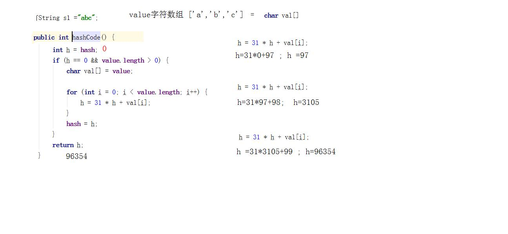
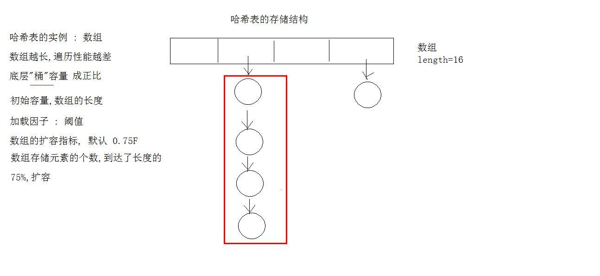
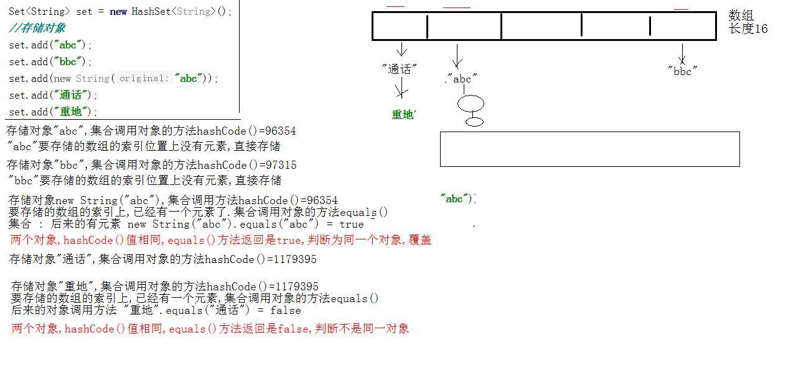

# day16 集合 

- 学习目标
  - ArrayList集合使用 
  - ArrayList源码解析
  - LinkedList集合使用
  - LinkedList源码解析
  - 对象的哈希值
  - 哈希表数据结构
  - 哈希表确定对象唯一性
  - HashSet源码解析
  - 红黑树结构https://www.cs.usfca.edu/~galles/visualization/RedBlack.html
  - 对象的自然顺序与比较器

## 1. ArrayList

### 1.1 ArrayList集合的特点

  ArrayList类实现接口List,ArrayList具备了List接口的特性 **(有序,重复,索引)**

- ArrayList集合底层的实现原理是数组,大小可变 (存储对象的时候长度无需考虑).
- 数组的特点 : 查询速度快,增删慢.
- 数组的默认长度是10个,每次的扩容是原来长度的1.5倍.

- ArrayList是线程不安全的集合,运行速度快.

### 1.2 ArrayList源码解析

#### 1.2.1 ArrayList类成员变量

```java
 private static final int DEFAULT_CAPACITY = 10; //默认容量
```

```java
 private static final Object[] EMPTY_ELEMENTDATA = {};//空数组
```

```java
transient Object[] elementData; //ArrayList集合中的核心数组
private int size; //记录数组中存储个数
```

```java
private static final int MAX_ARRAY_SIZE = Integer.MAX_VALUE - 8; //数组扩容的最大值
```

#### 1.2.2 ArrayList集合类的构造方法

```java
//无参数构造方法
public ArrayList() {
    this.elementData = DEFAULTCAPACITY_EMPTY_ELEMENTDATA;
}
private static final Object[] DEFAULTCAPACITY_EMPTY_ELEMENTDATA = {}; //数组没有长度
```

```java
//有参数的构造方法
public ArrayList(int 10) {
    if (initialCapacity > 0) {
        //创建了10个长度的数组
    	this.elementData = new Object[10];
    } else if (initialCapacity == 0) {
    	this.elementData = EMPTY_ELEMENTDATA;
    } else {
    	throw new IllegalArgumentException("Illegal Capacity: "+
    initialCapacity);
    }
}
```

#### 1.2.3 ArrayList集合类的方法add()

```java
new ArrayList<>().add("abc"); //集合中添加元素
public boolean add("abc") {
    //检查容量  (1)
    ensureCapacityInternal(size + 1); 
    //abc存储到数组中,存储数组0索引,size计数器++
    elementData[size++] = "abc";//数组扩容为10
    return true;
}
```

```java
//检查集合中数组的容量, 参数是1
private void ensureCapacityInternal(int minCapacity = 1) {
    //calculateCapacity 计算容量,方法的参是数组 , 1
    // ensureExplicitCapacity (10) 扩容的
    ensureExplicitCapacity(calculateCapacity(elementData, minCapacity));
}
```

```java
//计算容量方法, 返回10
private static int calculateCapacity(Object[] elementData, int minCapacity = 1) {
    //存储元素的数组 == 默认的空的数组  构造方法中有赋值
    if (elementData == DEFAULTCAPACITY_EMPTY_ELEMENTDATA) {
        //返回最大值   max(10,1)
    	return Math.max(DEFAULT_CAPACITY, minCapacity);
    }
    return minCapacity;
}
```

```java
//扩容 
private void ensureExplicitCapacity(int minCapacity = 10) {
    modCount++;
   // 10 - 数组的长度0 > 0
    if (minCapacity - elementData.length > 0)
        //grow方法(10) 数组增长的
    	grow(minCapacity);
}
```

```java
//增长的方法,参数是(10)
 private void grow(int minCapacity = 10) {
     //变量oldCapacity保存,原有数组的长度  = 0
     int oldCapacity = elementData.length; // 0
     //新的容量 = 老 + (老的 / 2)
     int newCapacity = oldCapacity + (oldCapacity >> 1);// 0
     // 0 - 10 < 0 新容量-计算出的容量
     if (newCapacity - minCapacity < 0)
     	newCapacity = minCapacity; //新容量 = 10
     //判断是否超过最大容量
     if (newCapacity - MAX_ARRAY_SIZE > 0)
     newCapacity = hugeCapacity(minCapacity);
     // minCapacity is usually close to size, so this is a win:
//数组的赋值,原始数组,和新的容量
     elementData = Arrays.copyOf(elementData, newCapacity);
 }
```

## 2. LinkedList集合使用

### 2.1 LinkedList集合的特点

  LinkedList类实现接口List,LinkedList具备了List接口的特性 **(有序,重复,索引)**

- LinkedList底层实现原理是链表,双向链表
- LinkedList增删速度快
- LinkedList查询慢
- LinkedList是线程不安全的集合,运行速度快

### 2.2 LinkedList集合特有方法

  集合是链表实现,可以单独操作链表的开头元素和结尾元素

- void addFirst(E e) 元素插入到链表开头
- void addLast(E e) 元素插入到链表结尾
- E getFirst() 获取链表开头的元素
- E getLast() 获取链表结尾的元素
- E removeFirst() 移除链表开头的元素
- E removeLast() 移除链表结尾的元素
- void push(E e)元素推入堆栈中
- E pop()元素从堆栈中弹出

```java
public static void main(String[] args) {
	linkedPushPop();
}
//- void push(E e)元素推入堆栈中
//- E pop()元素从堆栈中弹出

public static void linkedPushPop(){
    LinkedList<String> linkedList = new LinkedList<String>();
    //元素推入堆栈中
    linkedList.push("a"); //本质就是addFirst() 开头添加
    linkedList.push("b");
    linkedList.push("c");
    System.out.println("linkedList = " + linkedList);

    String pop = linkedList.pop(); // removeFirst()移除开头
    System.out.println(pop);
    System.out.println("linkedList = " + linkedList);
}

//- E removeFirst() 移除链表开头的元素
//- E removeLast() 移除链表结尾的元素
public static void linkedRemove(){
    LinkedList<String> linkedList = new LinkedList<String>();
    linkedList.add("a"); //结尾添加
    linkedList.add("b"); //结尾添加
    linkedList.add("c"); //结尾添加
    linkedList.add("d"); //结尾添加
    System.out.println("linkedList = " + linkedList);
    //移除开头元素,返回被移除之前
    String first = linkedList.removeFirst();
    //移除结尾元素,返回被移除之前的
    String last = linkedList.removeLast();
    System.out.println("first = " + first);
    System.out.println("last = " + last);
    System.out.println("linkedList = " + linkedList);
}

//- E getFirst() 获取链表开头的元素
//- E getLast() 获取链表结尾的元素
public static void linkedGet(){
    LinkedList<String> linkedList = new LinkedList<String>();
    linkedList.add("a"); //结尾添加
    linkedList.add("b"); //结尾添加
    linkedList.add("c"); //结尾添加
    linkedList.add("d"); //结尾添加
    System.out.println("linkedList = " + linkedList);
    //获取开头元素
    String first = linkedList.getFirst();
    //获取结尾元素
    String last = linkedList.getLast();
    System.out.println("first = " + first);
    System.out.println("last = " + last);
    System.out.println("linkedList = " + linkedList);
}

// void addFirst(E e) 元素插入到链表开头
// void addLast(E e) 元素插入到链表结尾
public static void linkedAdd(){
    LinkedList<String> linkedList = new LinkedList<String>();
    linkedList.add("a"); //结尾添加
    linkedList.add("b"); //结尾添加
    linkedList.add("c"); //结尾添加
    linkedList.add("d"); //结尾添加
    System.out.println("linkedList = " + linkedList);
    //结尾添加
    linkedList.addLast("f");
    linkedList.add("g");

    //开头添加
    linkedList.addFirst("e");
    System.out.println("linkedList = " + linkedList);
}
```

### 2.3 LinkedList源码解析

#### 2.3.1 LinkedList集合的成员变量

```java
transient int size = 0; //集合中存储元素个数计数器
```

```java
transient Node<E> first; //第一个元素是谁
```

```java
transient Node<E> last; //最后一个元素是谁
```

#### 2.3.2 LinkedList集合的成员内部类Node (节点)

```java
//链表中,每个节点对象
private static class Node<E> {
        E item; //我们存储的元素
        Node<E> next; // 下一个节点对象
        Node<E> prev; // 上一个节点对象
    //构造方法,创建对象,传递上一个,下一个,存储的元素
    Node(Node<E> prev, E element, Node<E> next) {
            this.item = element;
            this.next = next;
            this.prev = prev;
        }
}
```

#### 2.3.4 LinkedList集合的方法add()添加元素

```java
//添加元素 e 存储元素 abc
//再次添加元素 e
void linkLast(E "abc") {
    //声明新的节点对象 = last
    final Node<E> l = last; // l = null  l "abc"节点
    //创建新的节点对象,三个参数, 最后一个对象,"abc", 上一个对象null
    final Node<E> newNode = new Node<>(l, e, null);
    //新节点赋值给最后一个节点
    last = newNode;
    if (l == null)
        //新存储的几点赋值给第一个节点
    	first = newNode;
    else
    	l.next = newNode;
    size++;
    modCount++;
}
```

#### 2.3.5 LinkedList集合的方法get()获取元素

```java
//集合的获取的方法
//index是索引, size 长度计数器
Node<E> node(int index) {
    //索引是否小于长度的一半,折半思想
    if (index < (size >> 1)) {
    	Node<E> x = first;
    	for (int i = 0; i < index; i++)
        x = x.next;
   	 return x;
    } else {
   		 Node<E> x = last;
    	for (int i = size - 1; i > index; i--)
    	x = x.prev;
    	return x;
    }
}
```

## 3. Set集合

  Set集合,是接口Set,继承Collection接口. **Set集合不存储重复元素**

  Set接口下的所有实现类,都会具有这个特性.

  Set接口的方法,和父接口Collection中的方法完全一样

### 3.1 Set集合存储和遍历

```java
public static void main(String[] args) {
    //Set集合存储并迭代
    Set<String> set = new HashSet<String>();
    //存储元素方法 add
    set.add("a");
    set.add("b");
    set.add("c");
    set.add("d");
    set.add("d");
    System.out.println("set = " + set);

    Iterator<String> it = set.iterator();
    while (it.hasNext()){
        System.out.println(it.next());
    }
}
```

### 3.2 Set接口实现类HashSet类

- HashSet集合类的特点 :
  - 实现Set接口,底层调用的是HashMap集合
  - HashSet的底层实现原理是哈希表
  - HashSet不保证迭代顺序,元素存储和取出的顺序不一定
  - 线程不安全,运行速度快

### 3.3 对象的哈希值

  每个类继承Object类,Object类定义方法 : 

```java
public native int hashCode(); // C++语言编写,不开源
```

> 方法使用没有区别 : 方法返回int类型的值,就称为哈希值
>
> 哈希值的结果不知道是怎么计算的,调用toString()方法的时候,返回的十六进制数和哈希值是一样的, @1b6d3586叫哈希值 (根本和内存地址是无关的)

```java
public static void main(String[] args) {
    Person p = new Person();
    int code = p.hashCode();
    // int 变量 460141958 (是什么,无所谓, 数字就是对象的哈希值)
    System.out.println(code);
    // com.atguigu.hash.Person@1b6d3586
    System.out.println(p.toString());
 }
```

```java
   /**
     * 重写父类的方法
     * 返回int值
     */
    public int hashCode(){
        return 9527;
    }
```

### 3.4 String类的哈希值

  字符串类重写方法hashCode(),自定义了哈希值,哈希值的计算方法是 :

> h = 31 * 上一次的计算结果 + 字符数组中元素的ASCII码值
>
> *31 的目的,减少相同哈希值的计算



String类的哈希值

```java
    //字符串String对象的哈希值
    private static void stringHash(){
        String s1 ="abc";
        String s2 ="abc";
        System.out.println(s1 == s2); //T
        //String类继承Object,可以使用方法hashCode
        System.out.println(s1.hashCode() == s2.hashCode()); //T
        /**
         * String类继承Object类
         * String类重写父类的方法 hashCode() 自己定义了哈希值
         */
        System.out.println(s1.hashCode());
        System.out.println(s2.hashCode());
        System.out.println("=============");

        /**
         *  字符串内容不一样,有没有可能计算出相同的哈希值
         *    String s1 ="abc";
         *    String s2 ="abc";
         */
        String s3 = "通话";
        String s4 = "重地";
        //1179395
        //1179395
        System.out.println(s3.hashCode());
        System.out.println(s4.hashCode());

        System.out.println(s3.equals(s4));
    }
```

### 3.5 哈希值的相关问题

  问题 : 两个对象A,B    两个对象哈希值相同,equals方法一定返回true吗?

​             两个对象A,B   两个对象equals方法返回true,两个对象的哈希值一定相同吗

> 结论 : 两个对象的哈希值相同,不要求equals一定返回true. 两个对象的equals返回true,两个对象的哈希值必须一致

Sun 公司官方规定 : 上面的结论

### 3.6 哈希表的数据结构

  数组 + 链表的组合体

```java
class Node{
    E element; //存储的元素
    Node next; //下一个元素
}
main(){
    Node[] node = new Node[5];
}
```

- 哈希表的底层数组长度默认是16个,扩容为原来长度的2倍
- 加载因子默认是0.75F,数组中存储元素的个数达到长度的75%,扩容




### 3.7 哈希表存储对象的过程

```java
public static void main(String[] args) {
    Set<String> set = new HashSet<String>();
    //存储对象
    set.add("abc");
    set.add("bbc");
    set.add(new String("abc"));
    set.add("通话");
    set.add("重地");
    System.out.println("set = " + set);
}
```



### 3.8 哈希表存储自定义的对象

```java
public class Student {
    private int age;
    private String name;

    public Student(){}
    public Student( String name,int age) {
        this.age = age;
        this.name = name;
    }

    public int getAge() {
        return age;
    }

    public void setAge(int age) {
        this.age = age;
    }

    public String getName() {
        return name;
    }

    public void setName(String name) {
        this.name = name;
    }

    @Override
    public boolean equals(Object o) {
        if (this == o) return true;
        if (o == null || getClass() != o.getClass()) return false;

        Student student = (Student) o;

        if (age != student.age) return false;
        return name != null ? name.equals(student.name) : student.name == null;
    }

    @Override
    public int hashCode() {
        int result = age;
        result = 31 * result + (name != null ? name.hashCode() : 0);
        return result;
    }

    @Override
    public String toString() {
        return "Student{" +
                "age=" + age +
                ", name='" + name + '\'' +
                '}';
    }
}

```

```java
public static void main(String[] args) {
    Set<Student> set = new HashSet<Student>();
    //存储Student的对象
    set.add(new Student("a1",201));
    set.add(new Student("a2",202));
    set.add(new Student("a2",202));
    set.add(new Student("a3",203));
    set.add(new Student("a4",204));
    System.out.println("set = " + set);
}
```

### 3.9 哈希表源码

  HashSet集合本身不具备任何功能,内部调用了另一个集合对象HashMap

- 构造方法无参数

  ```java
  public HashSet() {
  	map = new HashMap<>();
  }
  ```

- HashMap类的成员变量

  ```java
  //哈希表数组的初始化容量,16
  static final int DEFAULT_INITIAL_CAPACITY = 1 << 4; // 16
  ```

  ```java
  static final int MAXIMUM_CAPACITY = 1 << 30; //最大容量
  ```

  ```java
  static final float DEFAULT_LOAD_FACTOR = 0.75f;//价值因子
  ```

  ```java
  static final int TREEIFY_THRESHOLD = 8;//阈值,转红黑树
  ```

  ```java
  static final int UNTREEIFY_THRESHOLD = 6;//阈值,解除红黑树
  ```

  ```java
  static final int MIN_TREEIFY_CAPACITY = 64;//阈值,转红黑树
  ```

- HashMap内部类Node

  ```java
  //节点
  static class Node<K,V> implements Map.Entry<K,V> {
          final int hash; //对象哈希值
          final K key; //存储的对象
          V value; //使用Set的集合,value没有值
          Node<K,V> next; //链表的下一个节点
  }
  ```

- Set集合存储方法add(),调用的是HashMap集合的方法put()

```java
//HashMap存储对象的方法put,Key存储的元素,V是空的对象
public V put(K key, V value) {
    //存储值,传递新计算哈希值,要存储的元素
	return putVal(hash(key), key, value, false, true);
}
```

```java
 //传递存储的对象,再次计算哈希值
 //尽量降低哈希值的碰撞
 static final int hash(Object key) { 
   int h;
   return (key == null) ? 0 : (h = key.hashCode()) ^ (h >>> 16);
}
```

```java
//存储值,重写计算的哈希值,要存储值
final V putVal(int hash, K key, V value, boolean false,
               boolean true) {
    //Node类型数组,     Node类型数组     n, i
     Node<K,V>[] tab; Node<K,V> p; int n, i;
     //tab =Node[]=null
    if ((tab = table) == null || (n = tab.length) == 0){
        //n=赋值为 tab数组=resize()方法返回数组,默认长度的数组16
          n = (tab = resize()).length;// 16
        //数组的长度-1 & 存储对象的哈希值,确定存储的位置
        //判断数组的索引上是不是空的
         if ((p = tab[i = (n - 1) & hash]) == null)
             //数组索引 赋值新的节点对象,传递计算的哈希值,存储的对象
             tab[i] = newNode(hash, key, value, null);
        else{
            //数组的索引不是空,要存储的对象,已经有了
            //判断已经存在的对象,和要存储对象的哈希值和equals方法
            if (p.hash == hash &&
                ((k = p.key) == key || (key != null && key.equals(k))))
                //遍历该索引下的链表,和每个元素比较hashCode和equals
        }
    }
}
```

```properties
 else if ((newCap = oldCap << 1) < MAXIMUM_CAPACITY &&
                     oldCap >= DEFAULT_INITIAL_CAPACITY)
                newThr = oldThr << 1; 
```

```

```

### 3.10 哈希表面试问题

  JDK7版本和JDK8版本的哈希表的区别

- JDK7没有转红黑树
- JDK8转成红黑树
  - 转成树的两个参数
    - 当一个数组中存储的链表长度>=8 转树
    - 数组的整体长度超过64
  - 树转回链表
    - 链表的长度 <=6
- JDK7元素采用头插法,JDK8元素采用尾插法

### 4. 红黑树

  红黑树(Red-Black-Tree)

- 二叉树,本质就是链表
  - 查询速度快
  - 每个一个节点,只有两个子节点,左和右
  - 树长偏了
- 自然平衡二叉树
  - 二叉树的基础上,改进,保证树是平衡的

- 红黑树
  - 每个节点有颜色,要么红,要么是黑
  - 根节点必须是黑色
  - 叶子节点必须是黑色
  - 变量表示颜色,true黑色,false红色

### 4.1 TreeSet集合使用

  TreeSet集合,底层是红黑树结构,依赖于TreeMap的实现

  红黑树特点查找速度快,线程不安全

> 可以对存储到红黑树的元素进行排序,元素的自然顺序 abcd.. 字典顺序

```java
   public static void treeSetString(){
       Set<String> set = new TreeSet<>();
       //存储元素
       set.add("abcd");
       set.add("ccdd");
       set.add("z");
       set.add("wasd");
       set.add("bbaa");
       System.out.println("set = " + set);
   }
```

### 4.2 TreeSet存储自定义对象

```java
/**
* TreeSet集合存储Student对象
*/
public static void treeSetStudent(){
    Set<Student> set = new TreeSet<Student>();
    set.add(new Student("a",10));
    set.add(new Student("b",20));
    System.out.println("set = " + set);
}
```

  程序出现了异常,类型的转换异常 ClassCastException

  异常原因,Student类不能进行类型的转换,有接口没有实现java.lang.Comparable.

  类实现接口Comparable,这个类就具有了自然顺序

- Student类具有自然顺序
  - 实现接口Comparable,重写方法compareTo

```java
    /**
     * 重写方法compareTo
     * 返回int类型
     * 参数 : 要参与比较的对象
     * this对象和student对象
     *
     * 红黑树,后来的对象是this,原有的对象是参数
     */
    public int compareTo(Student student){
        return this.age - student.age;
    }

```

- 自定义比较器
  - java.util.Comparator接口

```java
/**
 * 自定义的比较器
 * 实现接口,重写方法
 */
public class MyCom implements Comparator<Student> {
    @Override
    /**
     * TreeSet集合自己调用方法
     * 传递参数
     * Student o1, Student o2
     * o1是后来的对象
     * o2是已经有的对象
     */
    public int compare(Student o1, Student o2) {
        return o1.getAge() - o2.getAge();
    }
}
 Set<Student> set = new TreeSet<Student>( new MyCom());

```

### 5. LinkedHashSet

  底层的数据结构是哈希表,继承HashSet

  LinkedHashSet数据是双向链表, 有序的集合,存储和取出的顺序一样

```java
public static void main(String[] args) {
    Set<String> set = new LinkedHashSet<>();
    set.add("b");
    set.add("e");
    set.add("c");
    set.add("a");
    set.add("d");
    System.out.println("set = " + set);
}
```

## 6. Collections工具类

- java.util.Collection 集合的顶级接口
- java.util.Collections 操作集合的工具类
  - 工具类的方法全部静态方法,类名直接调用
  - 主要是操作Collection系列的单列集合,少部分功能可以操作Map集合

```java
/**
 *  集合操作的工具类
 *  Collections
 *  工具类有组方法: synchronized开头的
 *
 *  传递集合,返回集合
 *  传递的集合,返回后,变成了线程安全的集合
 */
public class CollectionsTest {
    public static void main(String[] args) {
        sort2();
    }
    //集合元素的排序,逆序
    public static void sort2(){
        List<Integer> list = new ArrayList<Integer>();
        list.add(1);
        list.add(15);
        list.add(5);
        list.add(20);
        list.add(9);
        list.add(25);
        System.out.println("list = " + list);
        //Collections.reverseOrder() 逆转自然顺序
        Collections.sort(list,Collections.reverseOrder());
        System.out.println("list = " + list);
    }
    //集合元素的排序
    public static void sort(){
        List<Integer> list = new ArrayList<Integer>();
        list.add(1);
        list.add(15);
        list.add(5);
        list.add(20);
        list.add(9);
        list.add(25);
        System.out.println("list = " + list);
        Collections.sort(list);
        System.out.println("list = " + list);
    }

    //集合元素的随机交换位置
    public static void shuffle(){
        List<Integer> list = new ArrayList<Integer>();
        list.add(1);
        list.add(15);
        list.add(5);
        list.add(20);
        list.add(9);
        list.add(25);
        System.out.println("list = " + list);
        Collections.shuffle(list);
        System.out.println("list = " + list);

    }

    //集合的二分查找
    public static void binarySearch(){
        List<Integer> list = new ArrayList<Integer>();
        list.add(1);
        list.add(5);
        list.add(9);
        list.add(15);
        list.add(20);
        list.add(25);
        int index = Collections.binarySearch(list, 15);
        System.out.println(index);
    }
}

```


