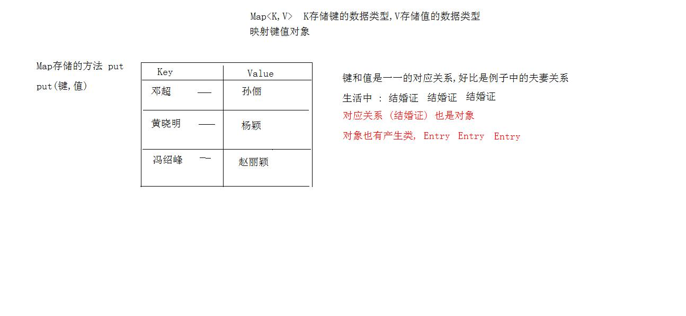

# day17 集合 

- 学习目标
  - 泛型
    - 泛型类,接口,方法
    - 泛型通配
    - 泛型限定
  - "foreach"循环
  - Map集合特点
  - HashMap集合特点
  - LinkedHashMap集合特点
  - TreeMap集合特点
  - Hashtable集合特点
  - Properties集合应用

## 1. 泛型 Generic

​    泛型技术是JDK版本一大升级,源自于JDK1.5

​    泛型就是集合类**<泛型>**

```java
//无泛型写法
public static void main(String[] args) {
    /**
       *  JDK没有泛型技术,就是这样写
       *  集合可以存储任何数据类型
       *  添加元素的数据类型是Object
       */
    List list = new ArrayList();
    list.add("a");
    list.add(1);
    Iterator it = list.iterator();
    while (it.hasNext()){
        Object obj = it.next();//不能类型转换
        System.out.println(obj);
    }
}
```

### 1.1 泛型的安全机制

  软件升级 : 安全性提高,修复Bug错误,改善用户体验,增加功能,提升性能

  JDK1.5里程碑版本

> 泛型作用 : 强制了集合存储固定的数据类型

  泛型的书写格式 :

```java
集合类<存储的数据类型>  变量名 = new 集合类<存储的数据类型>();
                                       类型可以不写:钻石操作符
```

  加入泛型后,程序的安全性提升了

```java
    public static void main(String[] args) {
        /**
         *  JDK没有泛型技术,就是这样写
         *  集合可以存储任何数据类型
         *  添加元素的数据类型是Object
         */
        List<String> list = new ArrayList<String>();
        list.add("a");
        list.add(1); //编译错误,数据类型不匹配

        Iterator<String> it = list.iterator();
        while (it.hasNext()){
            String obj =it.next(); //类型转换不需要
            System.out.println(obj);
        }
    }
```

- 使用泛型的好处 :
  - 安全性提高了
  - 程序的代码量减少
  - 避免了类型的强制转换
  - 程序的问题,由运行时期,提前到编译时期

### 1.2 泛型中的 E 问题

  E没有什么实际价值,只是一个变量而已

  特殊 : 等待接收指定的数据类型

```java
ArrayList<E>
//创建对象
ArrayList<String> al = new ArrayList<String>();
E 不在是E了,变成String

public boolean add(String e) {

}

```

### 1.3 自定义泛型类

```java
/**
 *  定义类,类名叫工厂
 *  自定义泛型类
 *  Factory<什么都可以写> 只是变量名而已
 */
public class Factory<QQ> {
    private QQ q;

    public void setQ(QQ q){
        this.q = q;
    }

    public QQ getQ(){
        return q;
    }
}
```

```java
public static void main(String[] args) {
    //创建对象Factory类对象
    // Factory factory = new Factory();//没有泛型,QQ就是Object

    Factory<String> factory = new Factory<String>();
    factory.setQ("abc");
    String s = factory.getQ();
    System.out.println(s);

    Factory<Double> factory2 = new Factory<Double>();
    factory2.setQ(1.5);
    Double q = factory2.getQ();
    System.out.println(q);
}
```

### 1.4 泛型方法

```java
/**
 * 泛型的方法,方法参数上
 */
public class Factory<Q> {

    /*
     * 静态方法
     * Q是非静态的, Q的数据类型,是new的时候指定的
     *
     * 静态方法参数中的泛型,不能和类一样
     * 静态方法的泛型,需要在方法上单独定义
     * 写在返回值类型的前面
     */
    public static <T> void staticMethod(T q){
        System.out.println(q);
    }

    public void print(Q q){
        System.out.println(q);
    }
}
```

### 1.5 泛型接口

- 实现类实现接口,不实现泛型
- 实现类实现接口,同时指定泛型

```j
//泛型接口
public interface Inter <T> {
    public abstract void inter(T t);
}

```

```java
/**
 * 实现接口,不理会泛型
 * 对象创建的时候,指定类型
 */
public class InterImpl<T> implements Inter<T>{
    public void inter(T t){
        System.out.println(t);
    }
}
```

```java
/**
 * 实现接口,同时指定泛型
 */
public class InterImpl2 implements Inter<String> {

    public void inter(String s) {
        System.out.println("s=="+s);
    }
}
```

```java
public class GenericTest {
    public static void main(String[] args) {
        Inter<String> in = new InterImpl<String>();
        in.inter("ok");

        Inter in2 = new InterImpl2();
        in2.inter("kkk");
    }
}
```

### 1.6 泛型通配符

```java
//泛型的通配符
public class GenericTest {
    public static void main(String[] args) {
        List<String> stringList = new ArrayList<String>();
        stringList.add("abc");
        stringList.add("bbc");

        List<Integer> integerList =  new ArrayList<Integer>();
        integerList.add(1);
        integerList.add(2);

        each(stringList);
        each(integerList);
    }
    /**
     * 定义方法,可以同时迭代器 遍历这两个集合
     * 方法的参数,是要遍历的集合,不确定是哪个集合
     * 定义参数,写接口类型,不要写实现类
     */
    public static void each(List<?> list){
        Iterator<?> it = list.iterator();
        while (it.hasNext()){
            Object obj = it.next();
            System.out.println(obj);
        }
    }
}
```

### 1.7 泛型限定

  泛型限定 : 限制的是数据类型

- <? extends Company> 传递类型可以是Company或者是他的子类
- <? extends E>传递E类型或者是E的子类,泛型上限限定
- <? super E >传递E类型或者是E的父类,泛型下限限定

```java
public static void main(String[] args) {
    //创建集合,存储员工对象

    //开发部的
    List<Development> devList = new ArrayList<Development>();
    //存储开发部员工对象
    Development d1 = new Development();
    d1.setName("张三");
    d1.setId("开发部001");

    Development d2 = new Development();
    d2.setName("张三2");
    d2.setId("开发部002");
    devList.add(d1);
    devList.add(d2);

    //财务部集合
    List<Financial> finList = new ArrayList<Financial>();
    Financial f1 = new Financial();
    f1.setName("李四");
    f1.setId("财务部001");

    Financial f2 = new Financial();
    f2.setName("李四2");
    f2.setId("财务部002");
    finList.add(f1);
    finList.add(f2);
    System.out.println(devList);
    System.out.println(finList);

    each(devList);
    each(finList);

    //        List<Integer> integerList = new ArrayList<>();
    //        integerList.add(1);
    //        each(integerList);
}
/**
     * 要求 : 定义方法
     * 同时遍历2个集合
     * 遍历的同时取出集合元素,调用方法work()
     * ? 接收任何一个类型
     * 只能接收 Company和子类对象
     * 明确父类,不能明确子类
     */
public static void each(List<? extends Company> list){
    Iterator<? extends Company> it = list.iterator();
    while (it.hasNext()){
        //取出元素
        Company obj =it.next();
        obj.work();
    }
}
```

## 2. 增强型的for循环

  JDK1.5出现的特性 : 循环的特性 (少些代码)

  Collection是单列集合的顶级接口,但是到JDK1.5后,为Collection找了个爹

  java.lang.Iterable接口 : 实现接口,就可以成为 "foreach"语句的目标

  Collection,List,Set都实现了接口,包括数组

### 2.1 for的格式

```java
for(数据类型 变量名 : 集合或者数组){}
```

- 遍历数组

```java
   /**
     * for循环遍历数组
     * for(数据类型 变量名 : 集合或者数组){}
     */
    public static void forArray(){
        int[] arr = {1,3,5,7,9};
        for(int i : arr){
            System.out.println(i+1);
        }
        System.out.println("arr=="+arr[0]);
    }
```

- 遍历集合

```java
     * for循环遍历集合
     */
    public static void forList(){
        List<String> list = new ArrayList<>();
        list.add("aaa");
        list.add("bbb");
        list.add("ccc");

        for(String s : list){
            System.out.println(s);
        }
    }
```

## 3. Map集合

  java.util.Map接口,是双列集合的顶级接口.

  Map集合容器每次存储2个对象,一个对象称为键(Key),一个对象称为值(Value)

> 在一个Map的集合容器中,键保证唯一性,不包含重复键,每个键只能对应一个值



### 3.1 Map接口方法

- V put(K,V)存储键值对,存储重复键,返回被覆盖之前的值

```java
/**
* put方法,存储键值对
* Map接口的实现类HashMap
*/
public static void mapPut(){
    //创建对象,指定键的数据类型,值的数据
    Map<String,Integer> map = new HashMap<String,Integer>();
    map.put("a",1);
    map.put("b",2);
    map.put("c",3);
    map.put("d",4);
    Integer value = map.put("c",5);
    System.out.println("map = " + map);
    System.out.println("value = " + value);
}
```

- V get(K)通过键获取值,参数传递键,找这个键对应的值,没有这个键返回null

```java
/**
* V get(K)通过键获取值,参数传递键,找这个键对应的值,没有这个键返回null
*/
public static void mapGet(){
    //创建对象,指定键的数据类型,值的数据
    Map<String,Integer> map = new HashMap<String,Integer>();
    map.put("a",1);
    map.put("b",2);
    map.put("c",3);
    map.put("d",4);
    //键找值
    Integer value = map.get("f");
    System.out.println(value);
}
```

- boolean containsKey(K)判断集合是否包含这个键,包含返回true
- boolean containsValue(V)判断集合是否包含这个值,包含返回true
- int size() 返回集合长度,Map集合中键值对的个数
- V remove(K)移除指定的键值对,返回被移除之前的值
- Collection<V> values() Map集合中的所有的值拿出,存储到Collection集合

```java
/*boolean containsKey(K)判断集合是否包含这个键,包含返回true
- boolean containsValue(V)判断集合是否包含这个值,包含返回true
- int size() 返回集合长度,Map集合中键值对的个数
- V remove(K)移除指定的键值对,返回被移除之前的值
- Collection<V> values() Map集合中的所有的值拿出,存储到Collection集合
*/
public static void mapMethod(){
    //创建集合,键是整数,值是String
    Map<Integer,String> map = new HashMap<Integer, String>();
    map.put(1,"a");
    map.put(2,"b");
    map.put(3,"c");
    map.put(4,"d");
    map.put(5,"e");
    //boolean containsKey(K)判断集合是否包含这个键,包含返回true
    boolean b = map.containsKey(1);
    System.out.println("集合中包含键:"+b);

    //boolean containsValue(V)判断集合是否包含这个值,包含返回true
    b = map.containsValue("c");
    System.out.println("集合中包含值:"+b);

    //size()返回集合的长度
    int size = map.size();
    System.out.println("集合长度:"+size);

    //V remove(K)移除指定的键值对,返回被移除之前的值
    String value =  map.remove(1);
    System.out.println("被删除之前的:"+value);
    System.out.println(map);

    //Collection<V> values() Map集合中的所有的值拿出,存储到Collection集合
    Collection<String> coll =  map.values();
    for(String s : coll){
    	System.out.println(s);
    }
}
```

### 3.2 Map集合的遍历-键找值

- 实现思想 :
  - Map接口定义了方法  keySet() 所有的键,存储到Set集合
  - 遍历Set集合
  - 取出Set集合元素 **Set集合的元素是Map集合的键**
  - Map集合方法get()传递键获取值

```java
    /**
     * - Map接口定义了方法  keySet() 所有的键,存储到Set集合
     * - 遍历Set集合
     * - 取出Set集合元素 **Set集合的元素是Map集合的键**
     * - Map集合方法get()传递键获取值
     */
public static void mapKeySet(){
    Map<String,String> map = new HashMap<String, String>();
    map.put("a","java");
    map.put("b","c++");
    map.put("c","php");
    map.put("d","python");
    map.put("e","erlang");
    //Map接口定义了方法  keySet() 所有的键,存储到Set集合
    Set<String> set = map.keySet();
    //遍历Set集合
    Iterator<String> it = set.iterator();
    //取出Set集合元素 **Set集合的元素是Map集合的键**
    while (it.hasNext()){
        String key = it.next();
        //Map集合方法get()传递键获取值
        String value =  map.get(key);
        System.out.println(key+"==="+value);
    }
}
```

### 3.3 Map集合的遍历-键值对映射关系

- 实现思想 :
  - Map接口的方法 Set< Map.Entry<Key,Value> > entrySet()
    - 方法返回Set集合,集合中存储的元素,比较特别
    - 存储的是Map集合中,键值对映射关系的对象 , 内部接口 Map.Entry
  - 遍历Set集合
  - 取出Set集合的元素
    - 是Map.Entry接口对象
    - 接口的对象方法: getKey() ,getValue()

```java
 public static void mapEntrySet(){
     Map<String,String> map = new HashMap<String, String>();
     map.put("a","java");
     map.put("b","c++");
     map.put("c","php");
     map.put("d","python");
     map.put("e","erlang");
     //Map接口的方法 Set< Map.Entry<Key,Value> > entrySet()
     Set<Map.Entry<String,String>>  set = map.entrySet();
     //- 遍历Set集合
     Iterator<Map.Entry<String,String>> it = set.iterator();
     while (it.hasNext()){
         //取出Set集合的元素
         Map.Entry<String,String> entry =  it.next();
         //- 接口的对象方法: getKey() ,getValue()
         String key = entry.getKey();
         String value = entry.getValue();
         System.out.println(key +"==="+ value);
     }
 }
```

## 4. HashMap

- HashMap集合特点
  - 是哈希表结构
  - 保证键唯一性,用于键的对象,必须重写hashCode,equals方法
  - 线程不安全集合,运行速度快
  - 集合运行使用null,作为键或者值

```java
  /**
     * HashMap集合
     * 键是Person,值是String
     */
    public static void hashMap2(){
        Map<Person,String> map = new HashMap<Person, String>();
        map.put(new Person("a",20),"广东");
        map.put(new Person("b",22),"香港");
        map.put(new Person("b",22),"贵港");
        map.put(new Person("c",24),"澳门");
        map.put(new Person("d",26),"深圳");
        System.out.println("map = " + map);
    }

    /**
     * HashMap集合
     * 键是字符串,值是Person
     */
    public static void hashMap1(){
        Map<String, Person> map =  new HashMap<String, Person>();
        map.put("a",new Person("张三",20));
        map.put("b",new Person("张三",20));
        map.put("c",new Person("张三",20));
        map.put(null,null);

        //Set<String> set = map.keySet();
        for(String key : map.keySet()){
            //Person person =  map.get(key);
            System.out.println(key+"==="+map.get(key));
        }
        System.out.println("==============");

        //Set<Map.Entry<String,Person>> set = map.entrySet();
        for(Map.Entry<String,Person> entry : map.entrySet()){
            System.out.println(entry.getKey()+"==="+entry.getValue());
        }
```

## 5. LinkedHashMap

  LinkedHashMap继承HashMap实现Map接口,LinkedHashMap底层实现原理是哈希表,双向链,存取有序. 其它的特性和父类HashMap一样.

```java
public static void main(String[] args) {
    Map<String,String> map = new LinkedHashMap<String, String>();
    map.put("aa","qq");
    map.put("123","qq");
    map.put("bbb","qq");
    System.out.println(map);
}
```

## 6. Hashtable集合类

  Map接口的实现类Hashtable, Hashtable类诞生于JDK1.0版本, Map接口诞生于JDK1.2版本.  Hashtable类从JDK1.2开始,改进为实现Map接口

- Hashtable类的特点
  - 底层数据结构是哈希表
  - 线程安全的,运行速度慢,被更加先进的HashMap取代
  - 不允许null值,null键, 存储null直接抛出空指针异常

## 7. Vector集合类

  List接口的实现Vector,命运和Hashtable一样.

- Vector类的特点
  - 底层实现结构是数组
  - 数组的默认容量是10,每次扩容是原来的长度*2
  - 线程安全,运行速度慢,被ArrayList取代

## 8. TreeMap集合

-  TreeMap集合的特点
  - 底层实现是红黑树结构 (添加查询速度比较快)
  - 存储到TreeMap中元素,对键进行排序
  - 排序依据 :
    - 对象的自然顺序,作为键的对象,实现了接口Comparable
    - 自己提供比较器,实现接口Comparator,优先级高
  - 线程不安全的,运行速度快

```java
 /**
     * TreeMap集合存储对象
     * Student作为键,字符串是值
     * 自定义的比较器排序
     */
    public static void treeMap2(){
        Map<Student,String> map = new TreeMap<Student, String>( new MyCom() );
        map.put(new Student("a",20),"广东");
        map.put(new Student("b",19),"广西");
        System.out.println("map = " + map);
    }

    /**
     * TreeMap集合存储对象
     * Person作为键,字符串是值
     */
    public static void treeMap1(){
        Map<Person,String> map = new TreeMap<Person, String>();
        map.put(new Person("a",20),"广东");
        map.put(new Person("b",19),"广西");
        System.out.println("map = " + map);
    }
```

```java
/**
 * 自定义的比较器,实现接口 Comparator
 */
class MyCom implements Comparator<Student>{
    /**
     *  方法compare 是TreeMap调用
     *  传递参数,后来的对象传递到s1, 已经有的对象传递到s2
     */
   public int compare(Student s1, Student s2){
       return s1.getAge() - s2.getAge();
   }

}
```

```java
 /**
     *  进行比较:
     *   compareTo方法由,集合TreeMap调用
     *   传递相关的参数 集合中后来的对象是this,先来的对象是参数 p
     */
    public int compareTo(Person p){
        return this.age - p.age;
    }
```

## 9. Properties

- Properties集合特点
  - 继承Hashtable,实现Map接口
  - 底层是哈希表结构
  - 线程是安全的,运行速度慢
  - 集合没有泛型的写法,键和值的数据类型锁定为String类型
  - 集合有自己的特有方法
  - **此集合可以和IO流对象结合使用,实现数据的持久存储**
  - 方法和IO相关 : load(输入流)

```java
 /**
     * 集合遍历
     *   Properties类的方法 stringPropertyNames() [等效于map.keySet()] 返回Set集合
     *   Set集合存储的是 Properties集合的所有键
     */
    public static void prop3(){
        Properties prop = new Properties();
        prop.setProperty("a","1");
        prop.setProperty("b","2");
        prop.setProperty("c","3");
        Set<String> set = prop.stringPropertyNames();
        for(String key : set){
            System.out.println(key +"=="+ prop.getProperty(key));
        }
    }

    /**
     * 集合取出元素
     *  Properties集合取出方法 getProperty(String key)
     */
    public static void prop2(){
        Properties prop = new Properties();
        prop.setProperty("a","1");
        prop.setProperty("b","2");
        prop.setProperty("c","3");
        System.out.println(prop);
        String value = prop.getProperty("a");
        System.out.println(value);
    }

    /**
     *  集合存储键值对
     *  Map接口,存储方法put
     *  Properties集合存储方法 setProperty(String key,String value)
     */
    public static void prop1(){
        Properties prop = new Properties();
        prop.setProperty("a","1");
        prop.setProperty("b","2");
        prop.setProperty("c","3");
        System.out.println(prop);
    }
```


