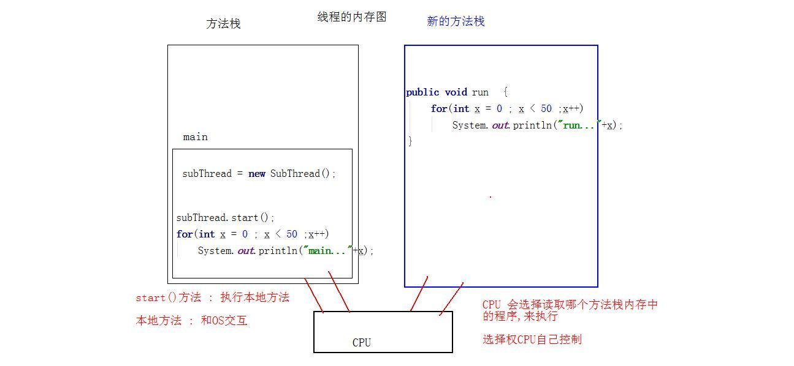
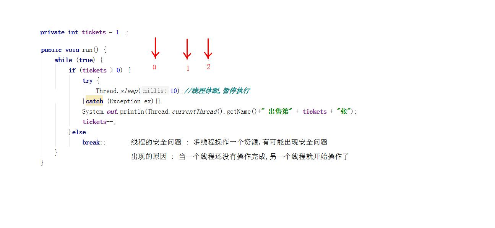
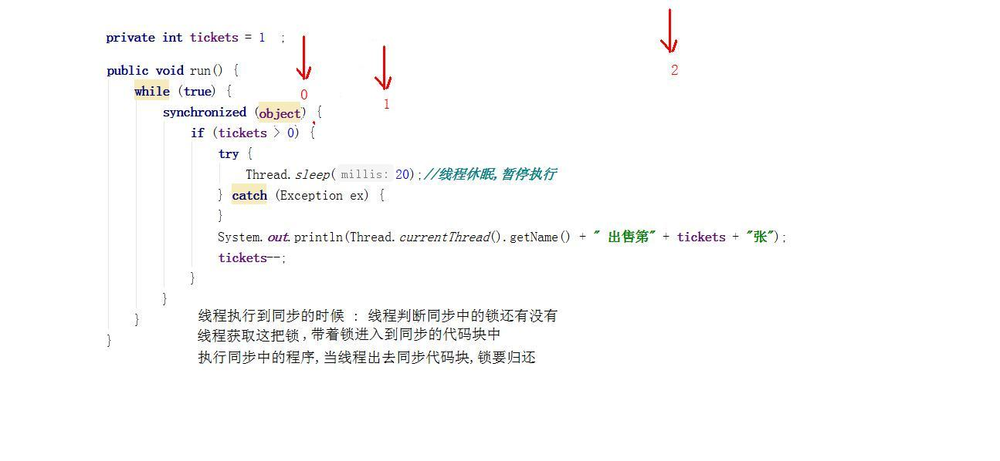
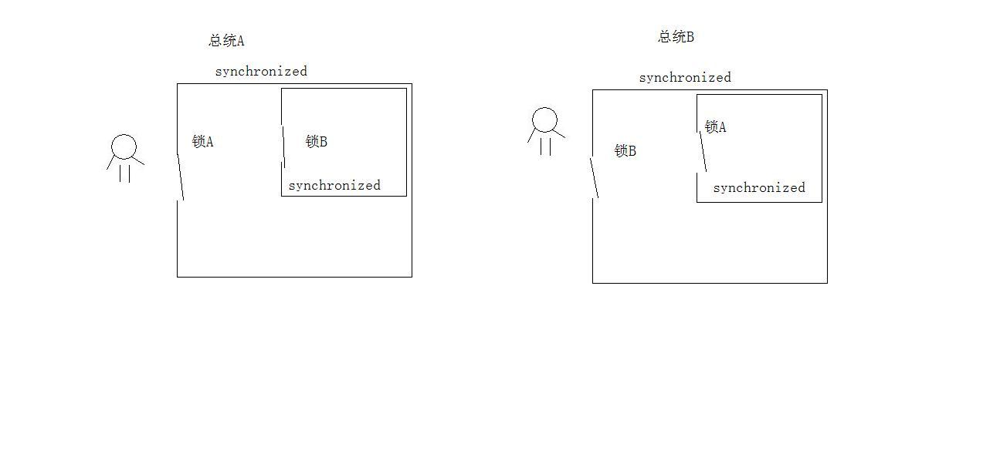
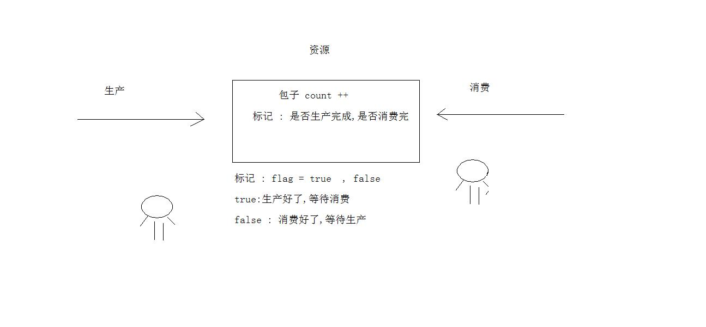

# day18 多线程 

- 学习目标
  - 线程概念
  - Java实现多线程程序一
  - Thread类的方法
  - Java实现多线程程序二
  - 线程安全问题
  - 同步synchronized使用
  - 锁对象的选择
  - 死锁案例
  - 生产者与消费者
  - JDK5特性JUC
  - 单例模式
  - 关键字volatile
  - 线程池
  - ConcurrentHashMap

## 1. 线程的基本概念

### 1.1 进程

 任何的软件存储在磁盘中,运行软件的时候,OS使用IO技术,将磁盘中的软件的文件加载到内存,程序在能运行。

  **进程的概念 ：** 应用程序(typerpa,word,IDEA)运行的时候进入到内存,程序在内存中占用的内存空间(进程).

### 1.2 线程

  线程(Thread) : 在内存和CPU之间,建立一条连接通路,CPU可以到内存中取出数据进行计算,这个连接的通路,就是线程.

  一个内存资源 : 一个独立的进程,进程中可以开启多个线程 (多条通路)

并发: 同一个时刻多个线程同时操作了同一个数据

并行: 同一个时刻多个线程同时执行不同的程序

## 2. Java实现线程程序

  今天之前的所有程序都有一个共性 : main启动之后,一条线走到底 (单线程)

### 2.1 java.lang.Thread类

  一切都是对象,线程也是对象,Thread类是线程对象的描述类

- 实现线程程序的步骤 :
  - 定义类继承Thread
  - 子类重写方法run
  - 创建子类对象 
  - 调用子类对象的方法start()启动线程

```java
//- 定义类继承Thread
//- 子类重写方法run
public class SubThread extends Thread {
    public void run(){
        for(int x = 0 ; x < 50 ;x++)
            System.out.println("run..."+x);
    }
}
```

```java
public static void main(String[] args) {
    //创建线程程序
    SubThread subThread = new SubThread();
    //调用子类对象的方法start()启动线程
    //启动线程,JVM调用方法run
    subThread.start();
    for(int x = 0 ; x < 50 ;x++)
    	System.out.println("main..."+x);
}
```

### 2.2 线程的内存图



### 2.3 Thread类方法

- Thread类的方法 getName()返回线程的名字,返回值是String类型

```java
public class ThreadName extends Thread {
    public void run (){
        System.out.println("线程名字:: "+ super.getName());
    }
}
```

```java
   public static void main(String[] args) {
        ThreadName threadName = new ThreadName();
        //threadName.setName("旺财");
        threadName.start();

        ThreadName threadName1 = new ThreadName();
        //threadName1.setName("小强");
        threadName1.start();
    }
```

- Thread类静态方法 : Thread currentThread()
  - 静态调用,作用是放回当前的线程对象
  - "当前" , 当今皇上. 本地主机

```java
//获取当前线程对象,拿到运行main方法的线程对象
Thread thread =  Thread.currentThread();
System.out.println("name::"+thread.getName());
```

- Thread类的方法 join()
  - 解释,执行join()方法的线程,他不结束,其它线程运行不了

```java
    public static void main(String[] args) throws InterruptedException {
        JoinThread t0 = new JoinThread();
        JoinThread t1 = new JoinThread();

        t0.start();
        t0.join();
        t1.start();
    }
```

- Thread类的方法 static yield()
  - 线程让步,线程把执行权让出

```java
    public void run() {
        for(int x = 0 ; x < 50 ;x++){
            Thread.yield();
            System.out.println(Thread.currentThread().getName()+"x.."+x);
        }
    }
```

## 3. Java实现线程程序

### 3.1 java.lang.Runnable接口

- 实现线程程序的步骤 :
  - 定义类实现接口
  - 重写接口的抽象方法run()
  - 创建Thread类对象
    - Thread类构造方法中,传递Runnable接口的实现类对象
  - 调用Thread对象方法start()启动线程

```java
//- 定义类实现接口
// - 重写接口的抽象方法run()
public class SubRunnable implements Runnable{
    @Override
    public void run() {
        for(int x = 0 ; x < 50 ;x++){
            System.out.println(Thread.currentThread().getName()+"x.."+x);
        }
    }
}

```

```java
    public static void main(String[] args) {
        //创建接口实现类对象
        Runnable r = new SubRunnable();
        //创建Thread对象,构造方法传递接口实现类
        Thread t0 = new Thread(r);
        t0.start();

        for(int x = 0 ; x < 50 ;x++){
            System.out.println(Thread.currentThread().getName()+"x.."+x);
        }
    }
```

### 3.2 实现接口的好处

  接口实现好处是设计上的分离效果 : 线程要执行的任务和线程对象本身是分离的.

  继承Thread重写方法run() : Thread是线程对象,run()是线程要执行的任务

  实现Runnable接口 : 方法run在实现类,和线程无关,创建Thread类传递接口的实现类对象,线程的任务和Thread没有联系, 解开耦合性

## 4. 线程安全

  出现线程安全的问题需要一个前提 : 多个线程同时操作同一个资源

  线程执行调用方法run,同一个资源是堆内存的

### 4.1 售票例子

  火车票的票源是固定的,购买渠道在火车站买,n多个窗口

```java

/**
 * 票源对象,需要多个线程同时操作
 */
public class Ticket implements Runnable {

    //定义票源
    private int tickets = 100;

    @Override
    public void run() {
        while (true) {
            if (tickets > 0) {
                try {
                    Thread.sleep(10);//线程休眠,暂停执行
                }catch (Exception ex){}
                System.out.println(Thread.currentThread().getName()+" 出售第" + tickets + "张");
                tickets--;
            }else
                break;;
        }
    }
}
```

```java
public static void main(String[] args) {
    Ticket ticket = new Ticket();
    //创建3个窗口,3个线程
    Thread t0 = new Thread(ticket);
    Thread t1 = new Thread(ticket);
    Thread t2 = new Thread(ticket);

    t0.start();
    t1.start();
    t2.start();
}
```

  解决线程的安全问题 : 当一个线程没有完成全部操作的时候,其它线程不能操作



### 4.2 同步代码块

同步代码块可以解决线程安全问题 : 格式  synchronized关键字

```java
synchronized(任意对象){
    //线程操作的共享资源
}
```

> 任意对象 : 在同步中这个对象称为对象锁,简称锁,官方的稳定称为 对象监视器
>

同步代码块,如何保证线程的安全性.

- 同步代码块的执行原理 : 关键点就是对象锁
  - 线程执行到同步,判断锁是否存在
    - 如果锁存在,获取到锁,进入到同步中执行
    - 执行完毕,线程出去同步代码块,讲锁对象归还
  - 线程执行到同步,判断锁所否存在
    - 如果锁不存在,线程只能在同步代码块这里等待,锁的到来



> 使用同步 : 线程要先判断锁,然后获取锁,出去同步要释放锁, 增加了许多步骤,因此线程安全运行速度慢. 牺牲性能,不能牺牲数据安全
>

### 4.3 同步方法

  当一个方法中,所有代码都是线程操作的共享内容,可以在方法的定义上添加同步的关键字 synchronized , 同步的方法,或者称为同步的函数.

- 同步方法中有对象锁吗 , this对象
- 静态同步方法中有对象锁吗,锁对象是本类.class属性. 这个属性表示这个类的class文件的对象.

```java
    @Override
    public void run() {
        while (true)
          sale();
    }

private static synchronized void sale(){
    //  synchronized (Ticket.class) {
    if (tickets > 0) {
    try {
        Thread.sleep(20);//线程休眠,暂停执行
        } catch (Exception ex) {
    }
    System.out.println(Thread.currentThread().getName() + " 出售第" + tickets + "张");
    tickets--;
    }
//  }
}
```

## 5. 死锁

  死锁程序 : 多个线程同时争夺同一个锁资源,出现程序的假死现象.

  面试点 : 考察开发人员是否充分理解同步代码的执行原理

> 同步代码块 : 线程判断锁,获取锁,释放锁,不出代码,锁不释放

  完成死锁的案例 : 同步代码块的嵌套



- 死锁代码

```java
/**
 * 实现死锁程序
 */
public class ThreadDeadLock implements Runnable{

    private boolean flag ;

    public ThreadDeadLock(boolean flag){
        this.flag = flag;
    }

    @Override
    public void run() {
        while (true){
            //同步代码块的嵌套
            if (flag){
                //先进入A锁同步
                synchronized (LockA.lockA){
                    System.out.println("线程获取A锁");
                    //在进入另一个同步B锁
                    synchronized (LockB.lockB){
                        System.out.println("线程获取B锁");
                    }
                }
            }else {
                //先进入B锁同步
                synchronized (LockB.lockB){
                    System.out.println("线程获取B锁");
                    //再进入另一个同步锁A锁
                    synchronized (LockA.lockA){
                        System.out.println("线程获取A锁");
                    }
                }
            }
        }
    }
}
```

```java
public class LockA {
    public static LockA lockA = new LockA();
}
```

```java
public class LockB {
    public static LockB lockB = new LockB();
}
```

```java
    public static void main(String[] args) {
        ThreadDeadLock threadDeadLock = new ThreadDeadLock(true);
        ThreadDeadLock threadDeadLock2 = new ThreadDeadLock(false);

        new Thread(threadDeadLock).start();
        new Thread(threadDeadLock2).start();
    }
```

## 6. JDK5新特性Lock锁

  JDK5新的特性 : java.util.concurrent.locks包. 定义了接口Lock.

  Lock接口替代了synchronized,可以更加灵活

-   Lock接口的方法
  - void lock() 获取锁
  - void unlock()释放锁
- Lock接口的实现类ReentrantLock

```java
/**
 *  优化为juc包的接口Lock
 */
public class Ticket implements Runnable {

    //定义票源
    private  int tickets = 100;
    //获取Lock接口的实现类对象
    private Lock lock = new ReentrantLock();

    @Override
    public void run() {
        while (true)
          sale();
    }

    private void sale(){
        //获取锁
        lock.lock();
        if (tickets > 0) {
            try {
                Thread.sleep(20);//线程休眠,暂停执行
            } catch (Exception ex) {
            }
            System.out.println(Thread.currentThread().getName() + " 出售第" + tickets + "张");
            tickets--;
        }
        //释放锁
        lock.unlock();
    }
}
```

## 7. 生产者与消费者

  创建2个线程,一个线程表示生产者,另一个线程表示消费者



```java
/**
 * 定义资源对象
 *   成员 : 产生商品的计数器
 *          标志位
 */
public class Resource {
    int count ;
    boolean flag ;
}

```

```java
/**
 * 生产者线程
 *   资源对象中的变量++
 */
public class Produce implements Runnable{

    private Resource r ;

    public Produce(Resource r) {
        this.r = r;
    }

    @Override
    public void run() {
        while (true){
            synchronized (r) {
                //判断标志位,是否允许生产
                //flag是true,生产完成,等待消费
                if (r.flag )
                    //无限等待
                   try{ r.wait();
                   }catch (Exception ex){}
                r.count++;
                System.out.println("生产第" + r.count + "个");
                //修改标志位,已经生产了,需要消费
                r.flag = true;
                //唤醒消费者线程
                r.notify();
            }
        }
    }
}
```

```java
/**
 * 消费者线程
 *   资源对象中的变量输出打印
 */
public class Customer implements Runnable{
    private Resource r ;

    public Customer(Resource r) {
        this.r = r;
    }

    @Override
    public void run() {
        while (true){
            synchronized (r) {
                //是否要消费,判断标志位 ,允许消费才能执行
                if (!r.flag )
                    //消费完成,不能再次消费,等待生产
                    try{r.wait();}catch (Exception ex){}
                System.out.println("消费第" + r.count);
                    //消费完成后,修改标志位,变成已经消费
                r.flag = false;
                //唤醒生产线程
                r.notify();
            }
        }
    }
}
```

```java
public static void main(String[] args) {
    Resource r = new Resource();
    //接口实现类,生产的,消费的
    Produce produce = new Produce(r);
    Customer customer = new Customer(r);
    //创建线程
    new Thread(produce).start();
    new Thread(customer).start();
}
```

- 线程通信的方法 wait() notify()
  - 方法的调用必须写在同步中
  - 调用者必须是作为锁的对象
  - wait(),notify()为什么要定义在Object类
    - 同步中的锁,是任意对象,任何类都继承Object

- 案例改为方法实现

```java
/**
 * 定义资源对象
 *   成员 : 产生商品的计数器
 *          标志位
 */
public class Resource {
   private int count ;
   private boolean flag ;

   //消费者调用
   public synchronized void getCount() {
         //flag是false,消费完成,等待生产
         if (!flag)
            //无限等待
            try{this.wait();}catch (Exception ex){}
         System.out.println("消费第"+count);
            //修改标志位,为消费完成
         flag = false;
         //唤醒对方线程
         this.notify();
   }
   //生产者调用
   public synchronized void setCount() {
         //flag是true,生产完成,等待消费
         if (flag)
            //无限等待
            try{this.wait();}catch (Exception ex){}
         count++;
         System.out.println("生产第"+count+"个");
         //修改标志位,为生产完成
         flag = true;
         //唤醒对方线程
         this.notify();
   }
}
```

```java
/**
 * 消费者线程
 *   资源对象中的变量输出打印
 */
public class Customer implements Runnable{
    private Resource r ;

    public Customer(Resource r) {
        this.r = r;
    }

    @Override
    public void run() {
        while (true) {
            r.getCount();
        }
    }
}
```

```java
/**
 * 生产者线程
 *   资源对象中的变量++
 */
public class Produce implements Runnable{

    private Resource r ;

    public Produce(Resource r) {
        this.r = r;
    }

    @Override
    public void run() {
        while (true) {
            r.setCount();
        }
    }
}
```

