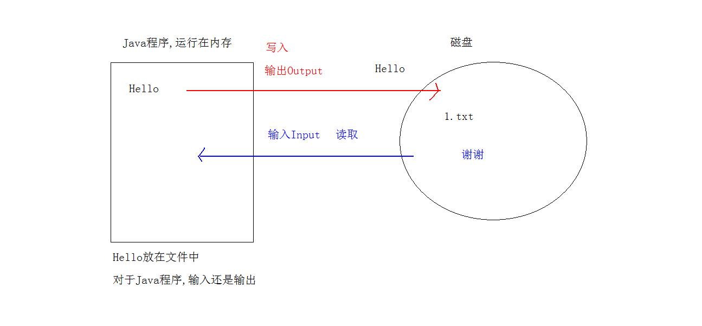
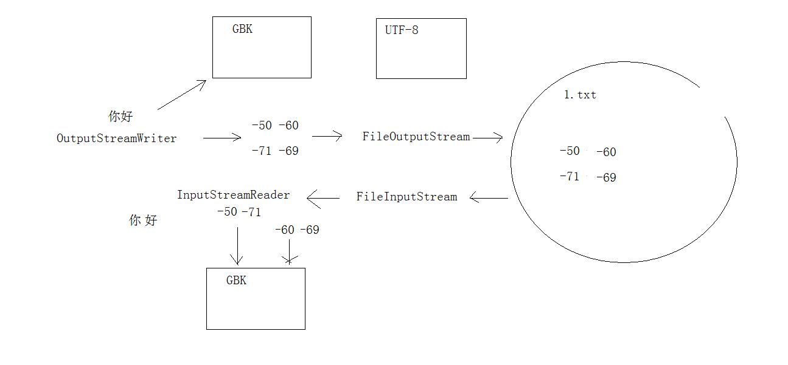

# day20 IO流对象 

- 学习目标
  - IO流对象的分类
  - 字节流
  - 字符流
  - 转换流
  - 打印流
  - 对象序列化
  - 基本数据类型操作流

## 1. File类的方法

### 1.1 File类获取的方法

- File getAbsoluteFile() 获取绝对路径,返回值是File类型
- File getParentFile() 获取父路径,返回值是File类型
- String getName() 获取名字,File构造方法中的路径的名字
- String getPath() 获取File构造方法中的路径,完整的路径转成String返回
- long length()获取文件的字节数

```java
/**
* File类的获取方法
* - File getAbsoluteFile() 获取绝对路径,返回值是File类型
* - File getParentFile() 获取父路径,返回值是File类型
*/
public static void fileMethod02(){
    File file = new File("C:\\Java\\jdk1.8.0_221\\bin\\java.exe");
    //获取绝对路径
    File absoluteFile = file.getAbsoluteFile();
    System.out.println("absoluteFile = " + absoluteFile);
    //获取父路径
    File parentFile = file.getParentFile().getParentFile();
    System.out.println("parentFile = " + parentFile);
    //文件的字节数
    long length = file.length();
    System.out.println("length = " + length);
}

/**
* File类获取方法
* - String getName() 获取名字,File构造方法中的路径的名字
* - String getPath() 获取File构造方法中的路径,完整的路径转成String返回
*/
public static void fileMethod(){
    File file = new File("C:\\Java\\jdk1.8.0_221\\bin\\java.exe");
    //getName()获取名字
    String name = file.getName();
    System.out.println("name = " + name);

    //getPath()构造方法参数,转成字符串
    String path = file.getPath();
    System.out.println("path = " + path);
}
```

### 1.2 File类的方法listFiles()

  返回值是File[] 数组 , 存储了多个File对象, 方法的作用是遍历当前的文件夹

```java
    public static void main(String[] args) {
        //fileMethod();

        foreachDir(new File("C:\\Java\\jdk1.8.0_221"));
    }
    /**
     * 目录的递归遍历 : 传递参数,遍历哪个路径,传递过来
     */
    public static void foreachDir(File dir){
        System.out.println(dir);
        //listFiles()遍历目录  C:\Java\jdk1.8.0_221
        File[] files = dir.listFiles();
        //遍历数组,取出数组中的File对象
        //是遍历到的所有文件的全路径 (绝对路径)
        for(File f : files){
            //判断遍历到的路径是不是文件夹
            if(f.isDirectory()) //C:\Java\jdk1.8.0_221\jre  ,进入继续遍历
                //递归调用自己,传递路径
                foreachDir(f);
            else
                System.out.println(f);
        }
    }

    /**
     * 遍历目录
     */
    public static void fileMethod(){
        File file = new File("C:\\Java\\jdk1.8.0_221");
        File[] files = file.listFiles();
        for(File f : files){
            System.out.println(f);
        }
    }
```

## 2. IO流对象

  IO :  Input Output  IO作用是将数据从一个设备中流入到另一个设备

  数据文件,从磁盘中流向内存中 , 从磁盘中流向移动存储设备 , 从一台计算机流向另一台计算机

  一切都是字节 : 任何数据文件都是字节组成, 字节是计算机中最小的存储单元 (Java源码,游戏,音乐,电影)



### 2.1 IO流对象的分类

#### 2.1.1 按照操作的文件类型分类

- 文本类型文件  -- 选择流对象字符流
  - 什么是文本文件 : 使用文本工具,记事本,notepad++ ,editplus 打开文件后人类可以直接阅读
- 非文本类型文件  -- 选择流对象字节流

#### 2.1.2 按照数据的流向分类

-  输入流 : Java程序从其它地方读取数据
-  输出流 : Java程序中的数据,写入到其它地方

#### 2.1.3 IO流对象的分类归纳

- 字节输出流 : OutputStream 抽象类
- 字节输入流 : InputStream 抽象类
- 字符输出流 : Writer 抽象类
- 字符输入流 : Reader 抽象类

## 3. 字节输出流

  java.io.OutputStream是所有字节输出流的超类 : 可以写入任何类型文件

- 写入字节的方法 write
  - void write(int b) 写入单个字节
  - void write(byte[] b)写入字节数组
  - void write(byte[] b,int off,int len) 写入数组的一部分,开始索引,写入的个数

### 3.1 FileOutputStream

- 构造方法 :  FileOutputStream(File file)
- 构造方法 :  FileOutputStream(String file)
  - 创建字节输出流对象,绑定参数就是要写入的数据目的

> JVM很聪明 : 任何一个操作系统都具备IO的能力, JVM依赖操作系统实现IO功能,IO流对象使用完毕后,要释放资源

### 3.2 字节输出流写入文件的步骤

- 创建字节输出流对象,构造方法中,绑定文件路径,写入目的
- 调用流对象的方法write写入数据
- 释放资源

### 3.3 写入单个字节

```java
    /**
     * 写入单个字节
     * new FileOutputStream("c:/1.txt"); 文件没有就创建,有了就覆盖
     */
    public static void writeByte() throws IOException {
        //创建字节输出流对象,构造方法中,绑定文件路径,写入目的
        FileOutputStream fos = new FileOutputStream("c:/1.txt");
        //写入单个字节
        fos.write(45);
        fos.write(49);
        fos.write(48);
        fos.write(48);
        //释放资源
        fos.close();
    }
```

### 3.4 写入字节数组

```java
    /**
     * 写入字节数组
     */
    public static void writeByteArray() throws IOException {
        //创建字节输出流对象,构造方法中,绑定文件路径,写入目的
        FileOutputStream fos = new FileOutputStream("c:/1.txt");
        byte[] bytes = {97,98,99,100,101,102};
        //写入字节数组
        fos.write(bytes);
        //写入字节数组中文
        fos.write("你好,我好,大家好".getBytes());
        //写入数组一部分
        fos.write(bytes,1,3);
        //释放资源
        fos.close();
    }
```

### 3.5 追加写入和换行

- 追加写入, FileOutputStream构造方法的第二个参数写true
- 换行写入, 使用Windows系统的换行符号 \r\n

```java
    /**
     * 追加写入和换行
     */
    public static void writeAppend()throws IOException {
        //创建字节输出流对象,构造方法中,绑定文件路径,写入目的
        FileOutputStream fos = new FileOutputStream("c:/1.txt",true);
        fos.write(65);
        //写入换行符号
        fos.write("\r\n".getBytes());
        fos.write(66);
        //释放资源
        fos.close();
    }
```

### 3.6 IO异常处理

```java

    /**
     *  try catch异常处理 : close()写在finally
     */
    public static void write2()  {
        //提升作用域 : try外定义变量,try创建对象
        FileOutputStream fos = null;
        FileOutputStream fos2 = null;
        try {
            //创建字节输出流对象,构造方法中,绑定文件路径,写入目的
            fos = new FileOutputStream("c:/1.txt");
            fos2 = new FileOutputStream("c:/2.txt");
            //写入单个字节
            fos.write(45);
            fos.write(49);
            fos.write(48);
            fos.write(48);
        }catch (IOException ex){
            ex.printStackTrace();
        }finally {
            //释放资源
            try {
                //流对象创建失败,fos变量的值是空,不能调用close
                if(fos != null)
                    fos.close();
            }catch (IOException ex){
                ex.printStackTrace();
            }

            //释放资源
            try {
                //流对象创建失败,fos变量的值是空,不能调用close
                if(fos2 != null)
                    fos2.close();
            }catch (IOException ex){
                ex.printStackTrace();
            }
        }
    }


    /**
     *  try catch异常处理 : close()写在finally
     */
    public static void write()  {
        //提升作用域 : try外定义变量,try创建对象
        FileOutputStream fos = null;
        try {
            //创建字节输出流对象,构造方法中,绑定文件路径,写入目的
            fos = new FileOutputStream("q:/1.txt");
            //写入单个字节
            fos.write(45);
            fos.write(49);
            fos.write(48);
            fos.write(48);
        }catch (IOException ex){
            ex.printStackTrace();
        }finally {
            //释放资源
            try {
                //流对象创建失败,fos变量的值是空,不能调用close
                if(fos != null)
                    fos.close();
            }catch (IOException ex){
                ex.printStackTrace();
            }
        }
    }
```

## 4.字节输入流

  java.io.InputStream是所有字节输入流的超类 : 可以读取任何类型文件

- 读取字节的方法 read()
  - int read() 读取单个字节, 读取到流的末尾返回 -1
  - int read(byte[] b)读取字节数组 , 读取到流的末尾返回 -1

### 4.1 FileInputStream

- 构造方法 :  FileInputStream(File file)
- 构造方法 :  FileInputStream(String file)
  - 创建字节输入流对象,绑定参数就是要读取的数据源文件

### 4.2 字节输入流读取单个字节

```java
    /**
     * 字节输入流,读取单个字节
     * int read() 读取单个字节
     */
    public static void readByte()throws IOException {
        //创建字节输入流对象,绑定数据源文件
        FileInputStream fis = new FileInputStream("c:/1.txt");
        //读取单个的字节
        //循环读取,条件 read()!=-1就行
        int r = 0;
        while ( (r = fis.read()) !=-1){
            System.out.print((char) r);
        }
        //释放资源
        fis.close();
    }
```

### 4.3 字节输入流读取字节数组

```
    /**
     * 字节输入流,读取字节数组
     * int read(byte[] b) 读取字节数组
     * 返回值 : 返回读取到的字节个数
     * String类的构造方法 new String(字节数组,开始索引,转换的个数)
     */
    public static void readByteArray()throws IOException{
        //创建字节输入流对象,绑定数据源文件
        FileInputStream fis = new FileInputStream("c:/1.txt");
        byte[] bytes = new byte[50];
        //定义变量,保存read方法的返回值
        int r = 0 ;
        while ( (r=fis.read(bytes)) !=-1){
            System.out.print(new String(bytes,0,r));
        }

        fis.close();
    }
```

## 5.文件复制

  实现文件的复制功能,操作系统中的Ctrl+C,Ctrl+V一样. 原理上就是字节搬家

```java
   /**
     * 文件复制,就是IO流对象的读写
     * 提高效率使用数组
     */
    public static void copy_1()throws IOException {
        //字节输入流,绑定数据源文件
        FileInputStream fis = new FileInputStream("c:/1.avi");
        //字节输出流,绑定要复制的目的文件
        FileOutputStream fos =  new FileOutputStream("e:/1.avi");
        //字节数组缓冲
        byte[] bytes = new byte[1024];
        //定义变量,保存读取方法read的返回值
        int r = 0;
        //循环读取数据源文件
        while ( (r=fis.read(bytes)) != -1){
            //字节输出流,写入字节数组,0索引开始,写入读取到的个数
            fos.write(bytes,0,r);
        }
        fos.close();
        fis.close();
    }
```

## 6. 字节流的缓冲流

  使用字节流的缓冲流,提高原有流对象的读写性能

  字节流缓冲区流,流的本质上也是字节流

- BufferedOuputStream 继承OutputStream
  - 方法write() 写入单个的字节,或者字节数组
- BufferedInputStream 继承InputStream
  - 方法read()读取单个字节,读取字节数组


### 6.1 BufferedOuputStream 构造方法

  BufferedOuputStream (OutputStream out) 传递字节输出流

  Buffered开头的流,称为缓冲流,  FileOutputStream基础流

  **new BufferedOuputStream (new FileOutputStream())** 传递哪个基础流,就对哪个基础流高效操作

### 6.2 BufferedInputStream构造方法

  BufferedInputStream(InputStream in) 传递字节输入流

  **new BufferedInputStream(new FileInputStream())**

```java
  /**
     *  文件复制,缓冲流实现,高效
     */
    public static void copy_2()throws IOException {
        //字节输入流,绑定数据源文件
        FileInputStream fis = new FileInputStream("c:/1.avi");
        //字节输出流,绑定要复制的目的文件
        FileOutputStream fos =  new FileOutputStream("e:/1.avi");
        //创建字节输入流的缓冲流,提高原有字节输入流的效率
        BufferedInputStream bis = new BufferedInputStream(fis);
        //创建字节输出流的缓冲流,提高原有字节输出流的效率
        BufferedOutputStream bos = new BufferedOutputStream(fos);
        //字节数组缓冲
        byte[] bytes = new byte[1024];
        //定义变量,保存读取方法read的返回值
        int r = 0;
        while ( (r = bis.read(bytes)) !=-1){
            bos.write(bytes,0,r);
        }
        bis.close();
        bos.close();
}

```

## 7. 字符流

  只能操作文本文件

- Writer类,是所有字符输出流的父类 (写入文本文件)
  - write(int c)写入单个字符
  - write(char[] ch)写入字符数组
  - write(char[] ch,int off,int len)写入字符数组一部分,开始索引,写入的个数
  - write(String str)写入字符串
  - void flush()  刷新该流的缓冲 (写入数据,先写入到内存), 只有刷新了数据才会到达目的文件
- Reader类,是所有字符输入流的父类 (读取文本文件)
  - int read()读取单个字符
  - int read(char[] ch)读取字符数组




### 7.1 OutputStreamWriter类

  OutputStreamWriter继承Writer,是字符的输出流,同时又是转换流

> 字符流 = 字节流 + 编码表

  OutputStreamWriter 转换流 : 字符流通向字节流的桥梁, 字符转成字节

- 构造方法:
  - OutputStreamWriter(OutputStream out)传递任意字节输出流
  - OutputStreamWriter(OutputStream out,String 编码表名)传递任意字节输出流

- 转换流写入字符文件,UTF-8编码

```java
    /**
     *  使用编码表,UTF-8
     */
     public static void writeUTF8()throws IOException {
         //创建字节输出流
         FileOutputStream fos = new FileOutputStream("c:/utf.txt");
         //创建转换流对象,构造方法传递字节的输出流
         OutputStreamWriter osw = new OutputStreamWriter(fos);
         //写入字符串
         osw.write("你好");
         //刷新流
         osw.flush();
         //资源是否
         osw.close();
     }
```

- 转换流写入字符文件GBK编码


```java
    /**
     * 使用编码表,GBK
     */
    public static void writeGBK()throws IOException{
        //创建字节输出流
        FileOutputStream fos = new FileOutputStream("c:/gbk.txt");
        //创建字符输出流,转换流,构造方法传递字节输出流,指定编码表名
        OutputStreamWriter osw = new OutputStreamWriter(fos,"gbk");
        //写入字符串
        osw.write("你好");

        osw.close();
    }
```

### 7.2 InputStreamReader

  InputStreamReader继承Reader,字符输入流,读取文本文件

  字节流通向字符流的桥梁, 字节流转成了字符流

- 构造方法:
  - InputStreamReader(InputStream out)传递任意字节输入流
  - InputStreamReader(InputStream out,String 编码表名)传递任意字节输入流

```java
    /**
     * 读取GBK文件
     */
    public static void readGBK() throws IOException{
        //创建字节流对象,绑定数据源
        FileInputStream fis = new FileInputStream("c:/gbk.txt");
        //创建转换流对象,绑定字节输入流,指定编码表
        InputStreamReader isr = new InputStreamReader(fis,"GBK");
        //读取字符数组
        char[] chars = new char[1024];
        //保存读取方法read的返回值
        int r = 0 ;
        r = isr.read(chars);
        //数组转成字符串
        System.out.println(new String(chars,0,r));

        isr.close();
    }

    /**
     * 读取UTF文件
     */
    public static void readUTF8()throws IOException {
        //创建字节流对象,绑定数据源
        FileInputStream fis = new FileInputStream("c:/utf.txt");
        //创建转换流对象,绑定字节输入流
        InputStreamReader isr = new InputStreamReader(fis);
        //读取字符数组
        char[] chars = new char[1024];
        //保存读取方法read的返回值
        int r = 0 ;
        r = isr.read(chars);
        //数组转成字符串
        System.out.println(new String(chars,0,r));

        isr.close();
    }
```

### 7.3 便捷类

- FileWriter 继承 OutputStreamWriter
  - 是字符的输出流,写入文本文件
  - 直接采用默认的编码表
  - FileWriter构造方法直接传递字符串的文件名即可

```java
public static void main(String[] args) throws IOException {
    //创建字符输出流的便捷类
    FileWriter fw = new FileWriter("day20/hehe.txt");
    //写入字符串
    fw.write("谢谢");
    fw.close();
}
```

- FileReader 继承 InputStreamReader
  - 是字符的输入流,读取文本文件
  - 直接采用默认的编码表
  - FileReader构造方法直接传递字符串的文件名即可

```java
public static void main(String[] args)throws IOException {
    //创建字符输入流对象,绑定数据源
    FileReader  fr = new FileReader("day20/hehe.txt");
    //读取字符数组
    char[] chars = new char[1024];
    int r = 0;
    while ( (r = fr.read(chars)) !=-1){
        System.out.print(new String(chars,0,r));
    }
    fr.close();
}
```

### 7.4 字符输出流的缓冲流

  BufferedWriter : 字符流的缓冲流,继承Writer,写入文本文件

- 特殊的方法 : newLine() 写入文本换行符,平台无关性
- 构造方法: BufferedWriter(Writer w)可以传递任意字符输出流

```java
    /**
     * 字符输出流的缓冲区,写入换行
     */
    public static void write() throws IOException {
        //创建字符输出流的便捷类
        FileWriter fw = new FileWriter("day20/xixi.txt");
        //创建字符输出流的缓冲流,构造方法传递 fw流
        BufferedWriter bfw = new BufferedWriter(fw);
        bfw.write("第一行");
        bfw.newLine();
        bfw.write("第二行");
        bfw.flush();
        bfw.close();
    }
```

### 7.5 字符输入流的缓冲流

  BufferedReader : 字符流的缓冲流,继承Reader,读取文本文件

- 特殊的方法 :String readLine() 读取文本一行,平台无关性


- 构造方法: BufferedReader (Reader r)可以传递任意字符输入流


```java
    /**
     * 字符输入流的缓冲区,读取文本行
     */
    public static void read() throws IOException {
        //创建字符输入流的便捷类
        FileReader fr = new FileReader("day20/xixi.txt");
        //创建字符输入流的缓冲区流对象
        BufferedReader bfr = new BufferedReader(fr);
        //定义字符串,保存读取到的文本行
        String line = null;
        while ( (line = bfr.readLine()) != null){
            System.out.println(line);
        }
        bfr.close();
    }
```

### 7.6 字符流复制文本文件

  错误的应用,不能保证复制后和源文件是一致的

## 8. 打印流

- PrintStream : 字节输出流
- PrintWriter : 字符输出流
- 打印流特性 :
  - 打印流负责输出打印,不关心数据源
  - 方便的打印各种形式数据
  - 打印流永远不会抛出IOException
  - 具有自动刷新

```java
/**
* 打印流输出,在打印流的构造方法中,传递流(字节,字符)
* 自动刷新 : 构造方法第二个参数写true,第一个参数必须是IO流对象,不能是字符串
* 调用方法: println,printf,format 三个其中的一个,启用自动刷新
*/
public static void print()throws IOException {
    //便捷类
    FileWriter fw = new FileWriter("day20/print.txt");
    //创建打印流对象,传递便捷类
    PrintWriter pw = new PrintWriter(fw,true);
    pw.println(1.5); //方便打印,原样输出
}
```

## 9.基本数据类型流

- DataInputStream
  - 基本数据类型读取流
  - 构造方法,传递字节输入流

- DataOutputStream
  - 基本数据类型的写入流
  - 构造方法,传递字节输出流

```java
 public static void main(String[] args) throws IOException {
        read();
    }
    /**
     * DataInputStream读取基本类型
     * readInt() 读取到文件结束 : 抛出 EOFException
     */
    public static void read()throws IOException{
        //创建基本类型输入流,构造方法绑定字节输入流
        DataInputStream dis = new DataInputStream(new FileInputStream("day20/data.txt"));
        //读取基本类型
        while (true) {
            try {
                int i = dis.readInt();
                System.out.println("i = " + i);
            }catch (IOException ex){
                //ex.printStackTrace();
                break;
            }
        }
        dis.close();
    }

    /**
     *  DataOutputStream写入基本类型
     */
    public static void write()throws IOException {
        //创建基本数据类型输出流
        DataOutputStream dos = new DataOutputStream(new FileOutputStream("day20/data.txt"));
        //写入基本数据类型
        dos.writeInt(6);
        dos.writeInt(16);
        dos.writeInt(26);
        dos.writeInt(-1);
        dos.writeInt(100);

        dos.close();
    }
```

